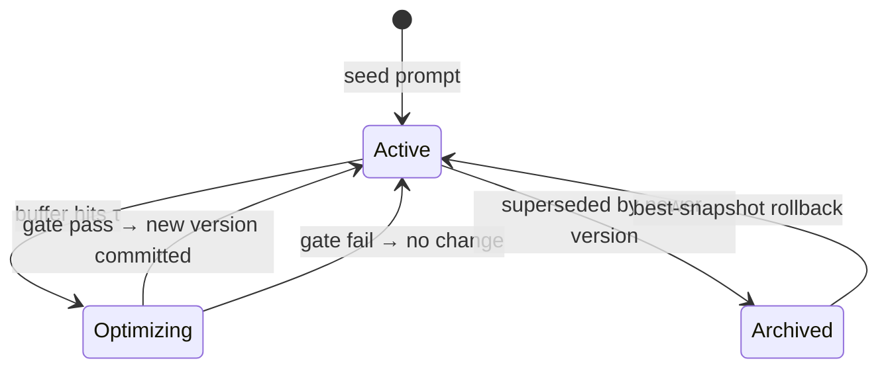
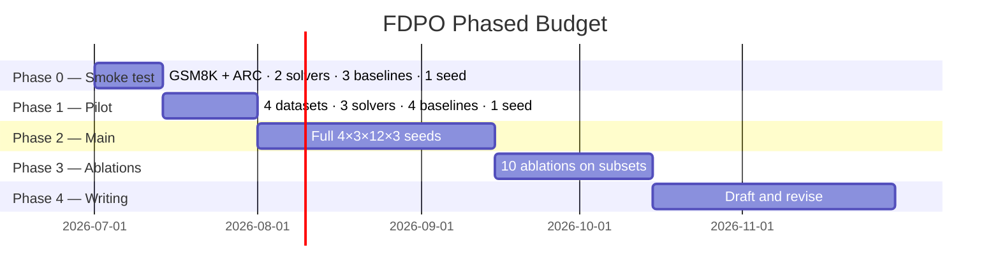

# FDPO — Experiment Plan (Concise Reference)

**Date:** July 2026 | **Status:** Pre-experiment  
**Based on:** [proposal.md](proposal.md)

---

## 1. What FDPO Is (One Paragraph)

FDPO treats a prompt as **K semantic sections** (Role / Context / Task / Constraints / Output Format). When the system fails, an LLM Judge attributes the failure to a specific section. Failures accumulate in a per-section buffer; once the buffer hits threshold τ, only that section is rewritten using the failed examples. Before committing, a **regression gate** checks that the rewrite doesn't break previously-correct cases. If it does, it rolls back. No other APO method combines all three: modular decomposition + judge-routed attribution + per-section regression gate.

---

## 2. Architecture

### 2.1 Runtime Loop

```mermaid
flowchart TD
    Q[User Query] --> EX[Execute with Active Prompt P]
    EX --> O[Model Output]
    O --> J[LLM Judge\nverdict · critique · section_k]
    J -- correct --> Q
    J -- incorrect --> BUF[Append to buffer F_k]
    BUF --> TAU{|F_k| ≥ τ ?}
    TAU -- no --> Q
    TAU -- yes --> OPT[Rewrite section k only\nusing failures + gold examples]
    OPT --> GATE{Regression Gate\nnew acc ≥ old acc − ρ ?}
    GATE -- pass --> COMMIT[Archive old · activate new]
    GATE -- fail --> ROLLBACK[Restore previous version]
    COMMIT --> Q
    ROLLBACK --> Q
```

### 2.2 Six Components

| # | Component | Role | Model |
|---|---|---|---|
| 1 | **Prompt Registry** | Stores K sections; each has active version, archive, buffer F^(k) | — |
| 2 | **Execute** | Runs query against active full prompt | Solver (under test) |
| 3 | **LLM Judge** | Returns `{verdict, critique, section_k, error_type}` | GPT-4o |
| 4 | **Feedback Buffer** | Accumulates failures per section; triggers at \|F^(k)\| ≥ τ | — |
| 5 | **Section Optimizer** | Rewrites only section k using failure + gold examples | GPT-4o |
| 6 | **Regression Gate** | Eval old vs new on validation batch; reject if drop > ρ; best-snapshot rollback after 3 stagnant rounds | Solver |

### 2.3 Section Registry State Machine



### 2.4 Judge Output Schema

```json
{
  "verdict":    "correct | incorrect",
  "critique":   "<one sentence>",
  "section":    "1 | 2 | 3 | 4 | 5 | multiple | none",
  "error_type": "MISSING | WRONG | CONFLICT"
}
```

---

## 3. Experimental Setup

### 3.1 Datasets — 4 Benchmarks

| ID | Dataset | Task type | Test size | Metric | Competitor targeted |
|---|---|---|---|---|---|
| D1 | **GSM8K** | Math reasoning | 1,319 | Exact Match | OPRO, ProTeGi, PromptWizard |
| D3 | **ARC-Challenge** | Multi-choice science | 1,172 | Exact Match | **MPO** (direct) |
| D4 | **MMLU** (6 subjects) | Knowledge | ~1,400 | Accuracy | **MPO** (direct) |
| D7 | **LegalBench hearsay** | Legal reasoning | ~200 | Accuracy | **Trace2Policy** (direct) |

ARC + MMLU → beat MPO on its own turf.  
GSM8K → establish breadth MPO skipped.  
LegalBench → prove per-section gate beats flat-rule gating.

### 3.2 Models

#### Solvers (the model being prompted)

| Model | Type | Size | Why |
|---|---|---|---|
| **Qwen3-8B** | Open, small | 8B | Standard small-open benchmark; size-parity with MPO's LLaMA-3-8B |
| **DeepSeek-V3** | Open, frontier | MoE (~37B active) | Dominant open frontier in 2025 papers; cheap API |
| **GPT-4o** | Closed | — | Closed-model anchor; most referenced in APO literature |

#### Optimizer + Judge (fixed, dual-LLM discipline)

| Role | Model | Note |
|---|---|---|
| Optimizer (rewrites sections) | **GPT-4o** | Separate from solver; prevents self-optimization bias |
| Judge (verdict + attribution) | **GPT-4o** | Same; ablate with open judge in A7 |

### 3.3 Baselines — 11 Methods

| # | Method | Family |
|---|---|---|
| B1 | Manual / zero-shot CoT | Reference |
| B2 | Few-shot CoT | Reference |
| B3 | APE | Foundational APO |
| B4 | ProTeGi | Mechanism ancestor |
| B5 | TextGrad | Gradient family |
| B6 | OPRO | LLM-as-optimizer |
| B7 | PromptWizard | Iterative SOTA |
| B8 | **MPO** | Direct modular competitor |
| B9 | **aPSF** | Direct auto-discovery competitor |
| B10 | **Trace2Policy / Auto-EISR** | Direct regression-gate competitor |
| B11 | APEX | Data-aware comparison |

### 3.4 Reporting Discipline

- 3 random seeds, mean ± std
- McNemar's paired test for every "FDPO > baseline" claim
- Bootstrap 95% CIs on all accuracy numbers
- Cost line-items per experiment (tokens, $, wall-clock)

---

## 4. Novel Metrics

| Metric | Why it matters |
|---|---|
| **Regression rate** | % of previously-correct cases broken per round — the failure MPO ignores |
| **Section-attribution accuracy** | Does fixing section k actually recover the failure? Validates judge routing |
| **Time-to-stabilization** | Rounds until Δacc < ε for 3 consecutive rounds |
| **Cost per accuracy point** | Optimizer + judge tokens per pp gained |

---

## 5. Ablations — 10 Planned

| # | What's toggled | Tests |
|---|---|---|
| A1 | Modular vs monolithic rewrite | Value of section decomposition |
| A2 | With / without judge-routed attribution | Core novel mechanism |
| A3 | With / without regression gate | Operational core |
| A4 | With / without failure examples | Failure-driven signal |
| A5 | Fixed 5-section vs auto-discovered schema | Schema choice |
| A6 | With / without de-duplication | MPO's claim |
| A7 | Judge model: GPT-4o vs DeepSeek-V3 | Judge sensitivity |
| A8 | τ ∈ {5, 10, 25, 50, 100} | Trigger frequency |
| A9 | ρ ∈ {0.01, 0.02, 0.05, 0.10} | Gate sensitivity |
| A10 | Online τ-trigger vs offline batch | Deployment mode |

---

## 6. Cost Estimate

API rates: GPT-4o $2.50/M in · $10/M out · DeepSeek-V3 $0.27/M in · $1.10/M out · Qwen3-8B ~$0.10/M

| Item | Detail | Cost |
|---|---|---|
| GPT-4o as solver | 48K calls × ~800 avg tokens | ~$170 |
| DeepSeek-V3 as solver | 48K calls × ~800 avg tokens | ~$18 |
| Qwen3-8B as solver | 48K calls × ~800 avg tokens | ~$4 |
| GPT-4o as Judge | 36 FDPO runs × ~1,000 calls × ~1,700 tokens | ~$250 |
| GPT-4o as Optimizer | 36 FDPO runs × 25 calls × ~3,800 tokens | ~$20 |
| Ablations (10, subset) | 2 datasets × 1 solver × 1 seed each | ~$100 |
| Retries / buffer | 15% | ~$85 |
| **Total** | | **~$650** |

48K calls per solver = 4 datasets × avg 1,000 items × 12 conditions × 3 seeds ÷ 3 solvers.

### Phased Spend



| Phase | Scope | Cost |
|---|---|---|
| Phase 0 | Smoke test | ~$25 |
| Phase 1 | Pilot | ~$100 |
| Phase 2 | Full experiment | ~$420 |
| Phase 3 | All 10 ablations | ~$100 |
| **Total** | | **~$645** |

---

## 7. What This Beats and By How Much (Projected)

| Comparison | Expected Δ | Key claim |
|---|---|---|
| FDPO vs MPO (ARC + MMLU) | +1 to +3 pp | Regression gate prevents whack-a-mole |
| FDPO vs aPSF (GSM8K, ARC) | +1 to +3 pp | Judge routing is more precise than interventional scoring |
| FDPO vs Trace2Policy (LegalBench) | −1 to +2 pp | Per-section gate ≥ whole-doc gate on structured tasks |
| FDPO vs zero-shot CoT (all) | +5 to +13 pp | — |

---

*See [proposal.md](proposal.md) for full algorithm pseudocode, system diagrams, and risk table.*
