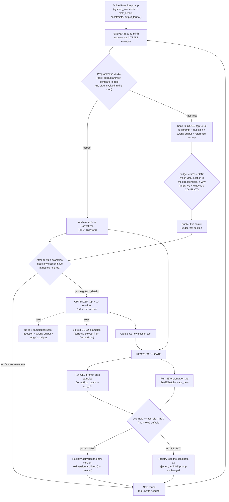
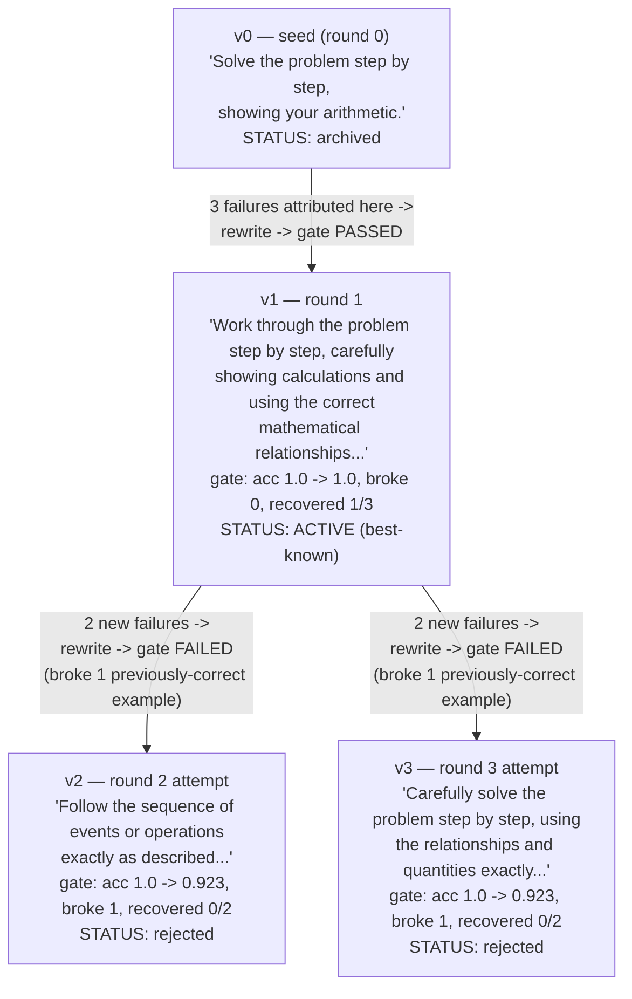

# FDPO Mechanism: Root-Cause Attribution and Section Rewriting

This diagrams exactly how the system decides *what's wrong with the prompt*
and *how it fixes it*, using real output from a completed run
(`results/00_smoke/gsm8k_fdpo_gpt-4o-mini_s1_20260705-133900/`) as the
worked example — not a hypothetical.

## 1. The per-round loop

**Where "root cause" actually gets found**: step **E → F**. The judge isn't
guessing blindly — it's shown all 5 sections, the exact question, the
model's full wrong output, and the reference answer, then forced (via
JSON-mode + a retry-on-malformed-JSON loop) to name exactly one section as
most responsible, plus a category:
- **MISSING** — the section should have said something and didn't
- **WRONG** — the section said something, but it was incorrect/misleading
- **CONFLICT** — two parts of the prompt contradict each other

This is the entire "diagnosis" step. Nothing more sophisticated than one
well-structured LLM call per failure — the intelligence is in constraining
what it's allowed to answer with (one of exactly 5 section names, or
`"multiple"`, or `"none"`), not in any custom heuristic.

**Where the "update" happens**: step **I**. The optimizer is shown *only*
the implicated section's current text, the other 4 sections as read-only
context (explicitly told not to touch them), the failing examples with the
judge's critiques attached, and a few gold (correctly-solved) examples for
contrast. It returns plain rewritten text for that one section — nothing
else changes.

**Where safety comes from**: step **K → L**. The rewrite is never trusted
just because the optimizer produced it — it's *tested* against a batch of
examples the model was already getting right, before and after the edit. If
it would knock previously-correct examples below the `acc_old - ρ`
tolerance, it's discarded and the old text keeps running. This is why a
"real run" can never make the prompt worse than best-known — only sideways
(rejected) or forward (committed).

## 2. A real version tree (GSM8K, `task_details` section)

This is exactly what happened in the completed run — 1 commit, 2 rejects,
all attempts branching off whatever was *active* at the time (not off each
other):

Notice v2 and v3 both branch from **v1**, not from each other — every
rewrite attempt always starts from whatever is currently *active*, and a
rejected candidate has zero effect on what the next round sees. The solver
only ever runs v1 after round 1, regardless of how many rejected candidates
pile up in the registry. All 4 versions (including the 2 dead ends) are
preserved in `registry.json` for post-hoc analysis — nothing is thrown away,
only "not activated."

## 3. Why this specific run showed the mechanism working

- 3 failures in round 1 → all attributed to `task_details` → one rewrite →
  gate passed (didn't break anything, fixed 1 of 3) → **committed**.
- Rounds 2–3 tried to push further on the same section, but with only 15
  train examples there wasn't enough new failure signal to justify another
  change — both attempts made things measurably worse on the held-out batch
  (broke 1 example each time) → correctly **rejected** both times.
- Net effect: the prompt ended the run strictly better than or equal to
  where it started (train accuracy 80% → 86.7%, never regressed), which is
  the entire point of the regression gate.

The large-scale run in progress (150 train / 200 test / 5 rounds) will
produce the same kind of trace, just with enough failures per round for the
loop to plausibly keep finding new things to fix across more rounds instead
of stalling after round 1.
