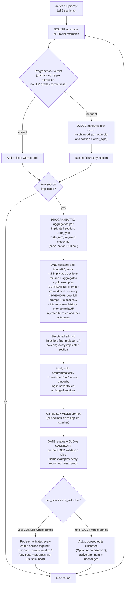
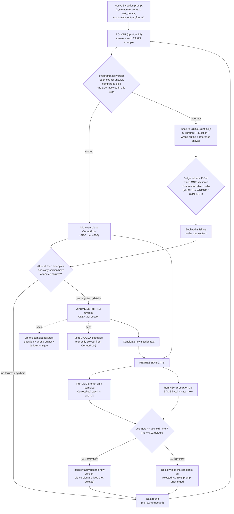
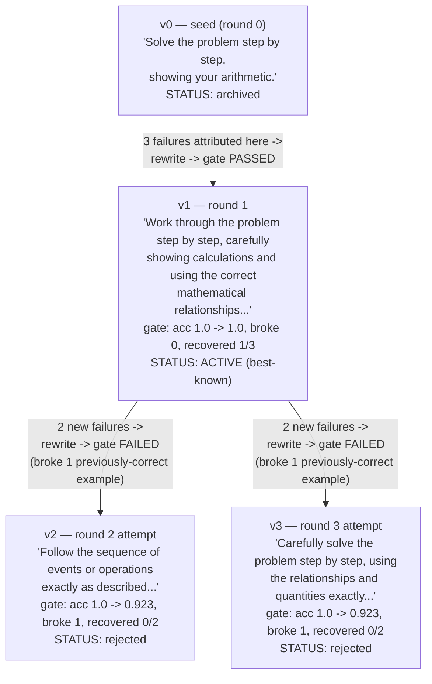

# FDPO Mechanism v2: Whole-Prompt Edit Application with Modular Attribution

> Supersedes the v1 mechanism (sequential per-section rewrite, described in
> §9 as an appendix). This redesign is a direct response to bugs and design
> weaknesses found empirically on real runs — not a theoretical exercise.
> Next step after this doc: implement it, rerun `legalbench_hearsay`.

## 1. Why v1 needed to change (the evidence)

Three concrete problems, each observed on real completed runs, not
hypothesized:

1. **The stagnation/tie bug erased real progress.** In the
   `legalbench_hearsay` run (`gsm8k_fdpo_gpt-4o-mini_s0_20260705-180022`
   dataset), `context` committed two genuinely validated, zero-regression
   improvements (v2, v4) — then got rolled all the way back to the original
   seed text, because `record_round_acc()` only counts *strict* improvement
   over a historical best as progress. A commit that merely *ties* the best
   (extremely likely, since gate batches are resampled) counts as a
   "stagnant round." Three ties in a row triggered a full rollback,
   discarding both validated wins. The final prompt for that run ended up
   byte-for-byte identical to the seed — meaning the observed 72.9%→69.5%
   accuracy "regression" wasn't caused by FDPO at all; it was pure inference
   non-determinism on an unchanged prompt.
2. **Full-regeneration-at-temp-1.0 produces lexical noise, not semantic
   progress.** Across every run so far, a section rewritten multiple times
   (e.g. GSM8K's `task_details`, 6 versions) converges on
   different-wording-same-idea text rather than qualitatively different
   strategies. The optimizer has no mechanism forcing minimal, targeted
   change — it regenerates the whole section fresh every call.
3. **Sequential per-section processing has an arbitrary-ordering artifact.**
   Within one round, whichever section had more failures gets rewritten
   first, and every subsequent section's gate check runs against a prompt
   that already includes the first section's just-applied change. This
   makes the round's outcome depend on an incidental sort order, not on the
   sections' actual independence.

## 2. What changes, in one paragraph

The judge's root-cause attribution stays exactly as it is today — per
failure, per section, LLM-based, unchanged mechanism and schema. What
changes is everything **after** attribution: instead of processing
implicated sections one at a time with separate rewrite→gate→commit cycles,
the loop now collects every implicated section's evidence for the round,
makes **one** optimizer call that proposes small, targeted edits (not full
rewrites) across *all* flagged sections at once, applies them together, and
gate-checks the resulting **whole prompt** as a single candidate against a
**fixed** (not resampled) held-out validation slice. The whole bundle is
committed or rejected atomically — no bisection (Option A: a rejected
bundle discards all its edits, even good ones, at least for now).

## 3. The new per-round flow



## 4. The fixed held-out validation slice

Carved **once**, at run start, from the train pool — never touched by the
judge's failure sampling or the optimizer's gold-example sampling. Used for
two things every round:

- **The gate comparison** (old vs. candidate whole prompt) — the *same*
  examples every round, not a fresh random sample. This directly fixes
  problem #1's root cause: an unchanged prompt's measured accuracy can no
  longer drift round-to-round from resampling noise, because there's no
  resampling.
- **"How is the current full prompt actually doing"** — a real number the
  optimizer gets to see (§5), not a hypothetical.

The true **test set remains completely untouched** until the single final
evaluation, exactly as before — this slice is carved from train, never from
test, so nothing here weakens the "final accuracy is on truly unseen data"
guarantee.

## 5. What the optimizer sees now (vs. v1)

| Context given to the optimizer | v1 | v2 |
|---|---|---|
| Target section(s) | one, pre-selected by judge | all implicated sections at once |
| Other sections | read-only, no accuracy attached | full current prompt **with its validation accuracy** |
| Historical comparison | none | previous best full prompt **with its accuracy** |
| Failure evidence | up to 5 raw examples | raw examples **+ programmatic aggregate** (error_type histogram, keyword clusters) |
| Its own past attempts | invisible | full history of this run's committed/rejected bundles |
| Output format | free-form full section text | structured `{section, find, replace}` edit list |
| Temperature | 1.0 | 0.3 |

The judge's attribution mechanism (schema, JSON validation, retry-on-malformed-output,
MISSING/WRONG/CONFLICT taxonomy) is **unchanged** — this is deliberate. It's
what preserves FDPO's actual claimed contribution (judge-routed,
section-level attribution) rather than collapsing into a global-feedback
method like TextGrad/ProTeGi. Only what happens *after* attribution changes.

## 6. The structured edit format

Optimizer output, one JSON object per call:

```json
{
  "edits": [
    {"section": "context", "find": "<exact substring of context's current text>", "replace": "<new text>"},
    {"section": "constraints", "find": "<exact substring>", "replace": "<new text>"}
  ]
}
```

Applied programmatically, per edit:
- `find` must be an **exact substring match** of the named section's
  current text. If it doesn't match, that specific edit is skipped and
  logged as `edit_failed_to_apply` — the rest of the bundle still proceeds.
- Edits never touch a section that wasn't flagged as implicated this round.
- This is why temperature drops to 0.3 (§5 table): at temp 1.0, exact
  substring reproduction becomes unreliable, and a misquoted `find` is a
  silent no-op instead of the intended fix.
- No de-duplication/consolidation pass is needed (unlike MPO's additive
  `s ⊕ Δ` + dedup design) — find/replace is inherently bounded, not
  accretive, so there's nothing to clean up after.

## 7. Commit/reject semantics (Option A — no bisection)

The whole edited prompt is gated as **one candidate**. If it passes, every
edit in the bundle commits together. If it fails, every edit in the bundle
is discarded together — including any individually-good edits mixed in with
a bad one. This is a deliberate simplification: bisecting to find which
specific section's edit caused a bundle rejection is a real option (test
each edit in isolation) but adds gate calls exactly when something's
already going wrong, and it's not yet known empirically whether bundling
causes enough cross-section "drag-down" to justify that cost. If legalbench
data shows good edits repeatedly getting killed by unrelated bad ones in the
same bundle, that's the trigger to build bisection — not before.

## 8. The stagnation fix

`record_round_acc()` changes from *"strictly beat the historical best to
count as progress"* to *"any gate pass resets `stagnant_rounds` to 0 and
updates `best_version`/`best_acc`, tie or not."* A commit that merely holds
steady (zero regressions, same accuracy) is no longer treated as identical
to doing nothing — it's kept, not reverted. Best-snapshot restore still
exists for genuine stagnation (repeated *rejections*, not repeated *ties on
success*).

## 9. What stays exactly the same

- Programmatic verdicts (regex extraction, exact/case-insensitive match) —
  no LLM ever grades correctness.
- The judge's per-example attribution call, schema, and retry logic.
- Registry persistence — every version (including rejected bundles) is
  still recorded in full; nothing is thrown away, only "not activated."
- Solver role and model assignment (gpt-4o-mini solver, gpt-4.1 judge +
  optimizer).
- Baselines (`zeroshot_cot`, `fewshot_cot`, `monolithic`) are unaffected —
  this redesign only touches the `fdpo`/`monolithic` optimization loop.

## 10. Tunable parameters reference

Every parameter below is a `--flag` on `scripts.run_experiment` /
`scripts.run_smoke` (see `src/fdpo/config.py`). Grouped by what they actually
affect, with tuning guidance — this is the section to come back to when
deciding what to change between runs.

### Data / scale

| Parameter | Flag | Default | Controls | Tuning notes |
|---|---|---|---|---|
| `n_train` | `--n-train` | 150 | Train pool size, before the validation slice is carved out of it | Too small (e.g. <30) starves both failure-finding and the validation slice; watch `legalbench_hearsay`-style tiny datasets — see `val_size` below |
| `n_test` | `--n-test` | 200 | Held-out **test** set size (never touched during optimization) | Bigger = tighter standard error on the final number. At n=59 (legalbench run), SE was ~6pp — big enough to swallow real effects. Prefer the dataset's full test set when affordable |
| `n_shots` | `--n-shots` | 4 | Few-shot exemplar count, `fewshot_cot` baseline only | Doesn't affect `fdpo`/`monolithic` |
| `seed` | `--seed` | 0 | Controls data sampling AND optimizer/gate RNG | Same seed ⇒ fully reproducible run; vary across repeats to separate real effect from noise |

### The optimization loop

| Parameter | Flag | Default | Controls | Tuning notes |
|---|---|---|---|---|
| `max_rounds` | `--max-rounds` | 5 | Optimization rounds before stopping | More rounds = more chances to fix things, but also more chances to exhaust `stagnation_limit` and more cost. Early-stop can cut this short (see `eps`) |
| `rho` (ρ) | `--rho` | 0.02 | Regression gate tolerance — reject if `acc_new < acc_old - ρ` | Lower ρ = stricter (harder to commit anything); higher ρ = more permissive, risks accepting real regressions |
| `eps` (ε) | `--eps` | 0.01 | Stabilization threshold: early-stop once 3 consecutive train-accuracy deltas are `< ε` | Lower ε = harder to trigger early stop (runs longer); only checked after ≥4 rounds of history |
| `stagnation_limit` | `--stagnation-limit` | 3 | Consecutive **rejected/no-edit** rounds before restoring the whole-run best-known snapshot | Lower = reverts to best-known faster after a run of bad luck; higher = gives the optimizer more rope before giving up on the current direction |
| `early_stop` | `--no-early-stop` (disables) | on | Whether stabilization actually stops the run, or just gets recorded | Disable to force all `max_rounds` regardless of stabilization, e.g. for a fixed-cost-comparison across datasets |

### What the optimizer sees (v2 context)

| Parameter | Flag | Default | Controls | Tuning notes |
|---|---|---|---|---|
| `n_fail` | `--n-fail` | 20 | Max failures per section shown to the optimizer, before aggregation | Soft cap, not a hard truncation to a handful — raise further for datasets with very high per-round failure counts; lower to control prompt-token cost |
| `n_gold` | `--n-gold` | 3 | Correctly-solved exemplars shown alongside failures | More gold examples = more "what's already working" context, at the cost of prompt length |
| `val_size` | `--val-size` | 20 | Size of the **fixed** held-out validation slice, carved once from train | This is the gate's entire comparison set every round — too small (e.g. <10) reintroduces noisy accept/reject decisions; too large starves the train-for-failures pool (especially on tiny datasets — see `legalbench_hearsay`'s 99-example corpus, where 20 is already a meaningful fraction) |
| `history_window` | `--history-window` | 3 | How many past round outcomes (section, committed/rejected, before/after accuracy) the optimizer sees | More history = better chance of avoiding repeated failed ideas, at the cost of prompt length; 0 disables history entirely |
| `pool_cap` | `--pool-cap` | 200 | FIFO cap on the gold-example correct-pool (separate from the validation slice) | Rarely needs tuning; matters only for very large `n_train` |

### Generation

| Parameter | Flag | Default | Controls | Tuning notes |
|---|---|---|---|---|
| `solver_temperature` | `--solver-temperature` | 0.0 | Solver decoding temperature | Kept at 0 for reproducible verdicts; raising it reintroduces the inference-non-determinism noise documented in §1 |
| `solver_max_tokens` | `--solver-max-tokens` | 1024 | Solver response length cap | Raise for reasoning-heavy tasks that get truncated mid-answer |
| `optimizer_temperature` | `--optimizer-temperature` | **0.3** (was 1.0 in v1) | Optimizer decoding temperature | Kept low because the optimizer must reproduce exact substrings for `find`/`replace` edits (§6) — at 1.0, misquoted `find` strings silently fail to apply. Only raise this if edit-application-failure logs show the optimizer struggling to propose *any* valid edit, not to chase "diversity" |

### Cost / infrastructure

| Parameter | Flag | Default | Controls | Tuning notes |
|---|---|---|---|---|
| `budget_usd` | `--budget-usd` | 4.0 | Hard spend cap for this run; `≤0` disables the guard | Verify the model is in `PRICE_TABLE` (`src/fdpo/utils/budget.py`) first — an unpriced model silently costs $0 in the ledger and the guard becomes a no-op |
| `price_in` / `price_out` | `--price-in` / `--price-out` | 0.0 / 0.0 | Fallback $/M-token price for models missing from `PRICE_TABLE` | Set explicitly for any model not already in the table |
| `max_workers` | `--max-workers` | 8 | Concurrent solver calls per eval batch | Bounded by the deployment's RPM (not just TPM) — see §"Concurrency" in `Codebase.md`. Existing retry/backoff absorbs occasional 429s, so erring slightly high is safe, just noisier logs |

## Appendix: the v1 mechanism (superseded, kept for historical reference)

<details>
<summary>v1 diagrams and worked example (GSM8K, single-section sequential rewrite)</summary>

### v1 per-round loop



### v1 real version tree (GSM8K, `task_details` section)



v2 and v3 both branch from v1, not from each other — in v1 of the
mechanism, every rewrite attempt starts from whatever is currently active.
This ordering/branching behavior is exactly what §1 problem #3 describes and
what v2 of the mechanism (this document) removes by processing all
implicated sections in one pass instead of sequentially.

</details>
