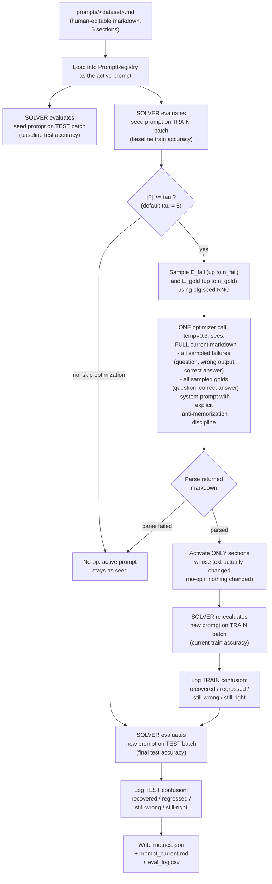
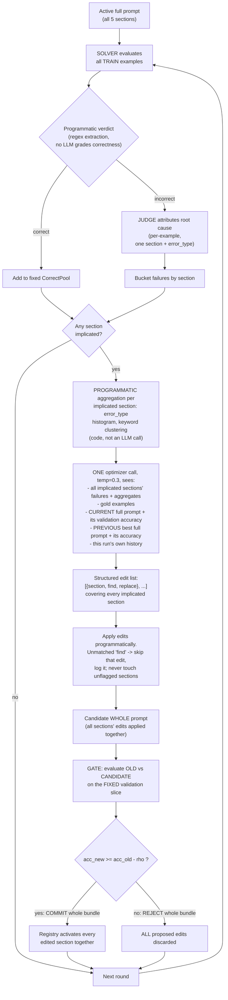
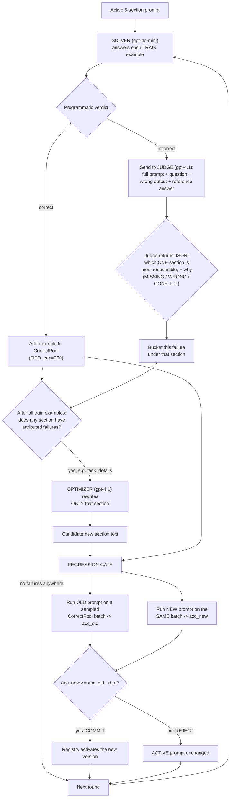
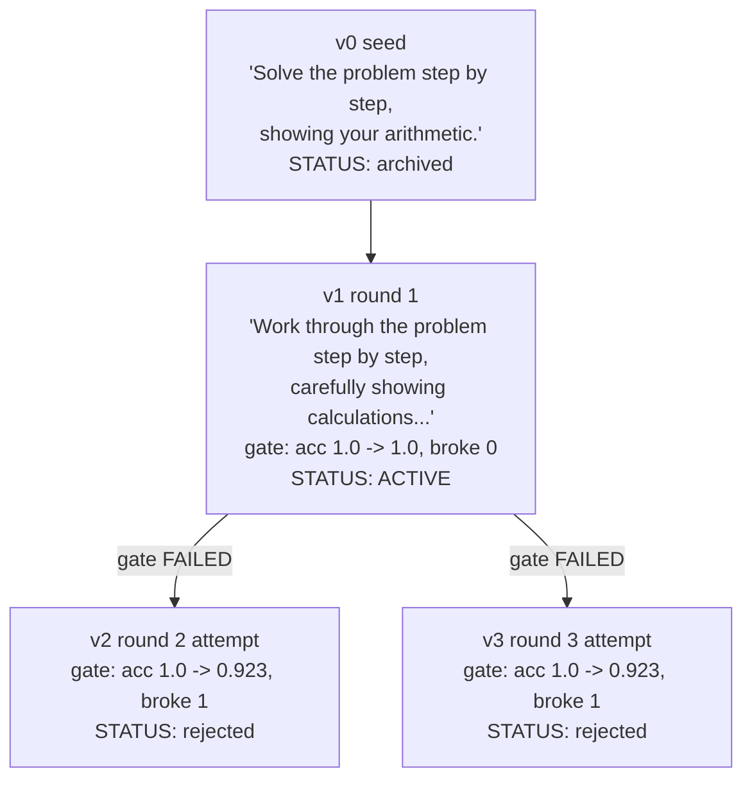

# FDPO Mechanism v3: `simple_fdpo` — paper-faithful single-pass

> Supersedes v2 (whole-prompt bundle edits with judge attribution) and v1
> (per-section sequential rewrites). Both are preserved as appendices for
> historical reference. This is the version we currently recommend and the
> only one that has produced a replicated positive result on real data
> (LegalBench-hearsay, +7.4 pp mean across 3 seeds).
>
> Companion docs: [Codebase.md](../Codebase.md) (module-by-module walkthrough),
> [../report.md](../report.md) (pilot results and comparison to published work).

## 1. Why v2 needed to change (the evidence)

Three concrete problems, each observed on real completed runs of v2, not
hypothesized:

1. **The multi-round loop plus regression gate produced net-negative
   results on LegalBench-hearsay.** Across 3 seeds with 5 rounds each, v2
   showed a mean change of −0.7 pp on test — signal indistinguishable from
   noise, and slightly negative in expectation. The mechanism was elegant
   but the compounding of noisy rounds and a strict gate did not accumulate
   improvement.
2. **The regression gate rejected legitimate improvements.** A prompt
   rewrite that recovers 8 previously-wrong questions but breaks 3
   previously-right ones (net +5) is a *good* rewrite. The gate treats it
   as a regression because 3 examples flipped in the wrong direction on the
   validation slice, and rejects the entire bundle. This is exactly the
   trade-off a prompt optimizer is supposed to make; gating on
   worst-case-per-example makes those trades impossible.
3. **Chained iteration without best-snapshot rescue oscillates.** Running
   simple_fdpo on the output of a previous simple_fdpo (v0 → v1 → v2 → v3)
   produces deltas of (−8.5, +11.9, −10.2) pp across successive rounds —
   there is no compounding, only oscillation. This confirms that naive
   iteration without a "revert if worse" wrapper is worse than one
   deliberate shot.

The lesson from these three observations: **more machinery does not help,
and sometimes hurts.** The right response was to strip the mechanism back
to what the original paper actually describes.

## 2. What changes, in one paragraph

Everything is now a single deliberate pass. There is no round loop, no
judge attribution, no regression gate, no fixed validation slice, no
find/replace edit format, no bundle bisection, no rolling correct-pool.
The prompt is stored as a **human-editable markdown file** with `## Section`
headers, loaded once at run start. The optimizer sees the **whole markdown
document** together with all failures from a single baseline evaluation and
a small number of correctly-solved examples, and returns the **whole new
markdown document**. The new prompt is **activated unconditionally**. What
we log after activation is a **train-batch confusion matrix** (which
specific questions moved from wrong to right and vice versa) plus a
separate test-batch confusion matrix computed by the outer experiment
runner. Whether the rewrite was a good idea is decided by looking at those
matrices *after the fact*, not by a gate *before the fact*.

## 3. The per-run flow



Steps that involve model calls (in order):
1. Solver on test batch, seed prompt (baseline test).
2. Solver on train batch, seed prompt (baseline train).
3. Optimizer, one call (rewrite).
4. Solver on train batch, new prompt (train confusion).
5. Solver on test batch, new prompt (final test + test confusion).

If step 3 does not trigger (|F| < tau), steps 4-5 are the same evaluations
against the same seed prompt, and the run is effectively a baseline-only
measurement.

## 4. What the optimizer sees

One system message (fixed) + one user message (built per run).

**System message** (excerpted from
`src/fdpo/prompts/simple_optimizer_prompt.py`):

> You will rewrite a markdown prompt that guides a smaller LLM on a
> classification task. You are teaching a model to REASON about future
> unseen cases — not to memorize the specific ones shown to you here.
>
> CRITICAL — rules of extrapolation, not memorization:
>
> - Do NOT copy specific questions, statements, names, or scenarios from
>   the failures or gold examples into the rewritten prompt.
> - Extract the DISCRIMINATIVE STRUCTURAL FEATURE that distinguishes the
>   correct from the incorrect predictions. State that feature abstractly.
> - Prefer scoped, narrow rules over broad single-keyword triggers.
> - The rewritten prompt should be readable in isolation.

This anti-memorization discipline is not decorative. In an earlier version
of the system prompt that encouraged "worked examples," the optimizer
pasted verbatim training cases into the constraints section, memorized the
training set, and crashed by −6.8 pp on test. The current wording is a
direct response to that observed failure mode.

**User message** contains, in order:

1. The FULL CURRENT PROMPT as one markdown code block.
2. All sampled FAILURES, each formatted as
   `Question / Model's wrong answer / Correct answer`.
3. All sampled CORRECTLY-SOLVED examples, each formatted as
   `Question / Correct answer`.
4. The instruction "Rewrite the markdown now. Return ONLY the full new
   markdown."

**What the optimizer returns**: the full new markdown document. No JSON,
no edit list, no explanations. If the return is not parseable as markdown
with `## Section` headers, the old prompt is kept and the failure is
logged as `parse_failed`.

## 5. What stays the same as before

- **Programmatic verdicts** (regex extraction, exact/case-insensitive
  match against gold). No LLM ever grades correctness.
- **Solver, judge, and optimizer roles** as separate `.env` slots. The
  judge slot is now unused by `simple_fdpo` — it can be left blank or
  reused for another dataset without harm.
- **Registry persistence** — the seed prompt, the new prompt, and the
  edit metadata are all written to `run_dir/registry.json` and
  `run_dir/prompt_current.md` for full auditability.
- **Test set is completely untouched during optimization** — only the
  baseline and final test evaluations touch it, and only for measurement.
- **Baselines** (`zeroshot_cot`, `fewshot_cot`, `monolithic`) are
  independent methods and are unaffected by anything in this document.

## 6. The markdown-native prompt format

Each dataset has a file at `prompts/<dataset>.md`. Example
(`prompts/legalbench_hearsay.md`):

```markdown
## System Role
You are a U.S. evidence-law expert.

## Context
Hearsay is an out-of-court statement offered to prove the truth of the
matter asserted.

## Task Details
Decide whether the given statement is hearsay.

## Constraints
Apply the definition strictly; conduct is not hearsay unless it is
assertive.

## Output Format
End your response with a line in exactly this form:
Answer: Yes  (or)  Answer: No
```

The schema is fixed at exactly five headers: System Role, Context, Task
Details, Constraints, Output Format. The optimizer is instructed not to
add or remove headers — only to edit the text inside them. If the file
does not exist, the loader falls back to Python-defined seed sections in
`src/fdpo/prompts/seeds.py`. Either way, the same downstream code path is
used.

Both humans and the optimizer edit the same format. A run's rewritten
prompt is saved as `run_dir/prompt_current.md`, which can be diffed
against the seed to see exactly what the optimizer changed.

## 7. Activation semantics (no gate)

Every rewrite is activated. This is a deliberate simplification, not an
oversight. The reasoning:

- The v2 gate cost more than it gained (see §1, observation 2).
- We already have a per-question confusion matrix logged for both the
  train and test batches, so a bad rewrite is *detectable after the fact*
  in the metrics.json — we do not need to gate it away before it happens.
- Detecting a bad rewrite is only useful if you plan to iterate; since
  we run a single pass, the rewrite either helps (great, done) or hurts
  (great, we now have a data point to include in the paper).

If we later re-enable multi-round iteration, the correct answer is
**best-snapshot rescue** — keep the highest-test-accuracy version seen
across rounds and revert to it if subsequent rounds regress. The
machinery for this exists in `PromptRegistry` (from v2) and could be
reactivated in ~30 minutes of work.

## 8. What we log after each run

For every simple_fdpo run, `run_dir/metrics.json` contains:

```json
{
  "seed_test": {"accuracy": 0.6441, "n_examples": 59, ...},
  "final_test": {"accuracy": 0.7288, "n_examples": 59, ...},
  "optimization": {
    "mode": "simple",
    "edit_status": "committed",
    "triggered": true,
    "tau": 5,
    "n_failures_triggering": 10,
    "optimizer_calls": 1,
    "baseline_train": {"accuracy": 0.75, "n_correct": 30, "n_wrong": 10},
    "current_train": {"accuracy": 0.725, "n_correct": 29, "n_wrong": 11},
    "train_confusion": {
      "recoveries": ["hearsay_test_31", "hearsay_test_47", ...],
      "regressions": ["hearsay_test_27", "hearsay_test_48", ...],
      "still_wrong": [...],
      "still_right_count": 26,
      "net_gain": -1
    },
    "test_confusion": {
      "recoveries": [...],
      "regressions": [...],
      "still_wrong": [...],
      "still_right_count": 42,
      "net_gain": 5
    }
  }
}
```

The confusion matrices are the crucial part. Every headline number in
`report.md` is derived from these logs. On multi-domain tasks like MMLU,
matching each `example_id` back to its subject is what produces the
per-subject breakdown that revealed the "amplifier not injector" story.

## 9. Tunable parameters (only the ones that still apply)

Most of v2's parameters no longer exist in the simple_fdpo code path.
The full list of flags that DO affect `--method simple_fdpo`:

### Data / scale

| Parameter | Flag | Default | Controls | Tuning notes |
|---|---|---|---|---|
| `n_train` | `--n-train` | 150 | Train batch size (baseline eval + optimizer failure pool + re-eval) | Bigger → more failures for the optimizer to see, more test-eval calls, more cost. On LegalBench-hearsay (99 total) we use 40. |
| `n_test` | `--n-test` | 200 | Test batch size | Bigger → tighter confidence interval on the final number. |
| `seed` | `--seed` | 0 | Controls RNG for train/test sampling AND for E_fail/E_gold subsampling | Vary across seeds 0/1/2 to separate real effect from noise. |
| `split_mode` | `--split-mode` | `seeded` | Set to `stratified` to fix the test set across seeds and only vary the train | **Strongly recommended for multi-seed reporting.** Isolates optimizer variance from data-composition variance. |

### The trigger

| Parameter | Flag | Default | Controls | Tuning notes |
|---|---|---|---|---|
| `tau` | `--tau` | 5 | Minimum baseline failures required to trigger the optimizer call | If baseline is already very good (e.g. ~95% on GSM8K with only ~15 failures on 300 examples) and you want the optimizer to still fire, lower tau. If baseline is very bad (>50% wrong) and you only want the optimizer to bother when there is a "real" pattern, raise tau. |

### What the optimizer sees

| Parameter | Flag | Default | Controls | Tuning notes |
|---|---|---|---|---|
| `n_fail` | `--n-fail` | 20 | Max failures sampled and shown to the optimizer | Higher → more evidence but more prompt tokens. On tasks with wide failure diversity (MMLU across subjects), raising to 30–40 is worth trying. |
| `n_gold` | `--n-gold` | 3 | Correctly-solved examples sampled and shown alongside failures | Paper default is 3. Setting to 0 tests whether the optimizer needs positive examples at all (open ablation). |

### Generation

| Parameter | Flag | Default | Controls | Tuning notes |
|---|---|---|---|---|
| `solver_temperature` | `--solver-temperature` | 0.0 | Solver decoding temperature | Keep at 0. Note that Azure OpenAI is *not* bit-deterministic at temp 0 (measured ~3.4 pp swing across identical repeats); this is an Azure quirk, not a code bug. |
| `solver_max_tokens` | `--solver-max-tokens` | 1024 | Solver response length cap | Raise for reasoning-heavy tasks that get truncated. |
| `optimizer_temperature` | `--optimizer-temperature` | 0.3 | Optimizer decoding temperature | 0.3 is a compromise: enough variance to explore rewordings, low enough to keep the anti-memorization discipline in force. Raising to 0.7+ tends to invite verbose "helpful" additions that hurt more than they help. |

### Cost / infrastructure

| Parameter | Flag | Default | Controls | Tuning notes |
|---|---|---|---|---|
| `budget_usd` | `--budget-usd` | 4.0 | Hard spend cap; `≤0` disables the guard | Verify the model is in `PRICE_TABLE` (`src/fdpo/utils/budget.py`). For local vLLM/Ollama servers the guard is meaningless (cost is 0) — set to 0 to be explicit. |
| `max_workers` | `--max-workers` | 8 | Concurrent solver calls per eval batch | Bounded by the deployment's requests-per-minute. On vLLM with `--max-num-seqs 32+`, this can go much higher. |
| `phase` | `--phase` | `smoke` | Sub-directory under `results/` where the run's artifacts go | Use `main` for publishable runs, `smoke` for exploratory. |

### v2 flags that DO NOT affect `simple_fdpo`

For completeness — these flags are accepted at the CLI but ignored by the
simple_fdpo code path:

- `--max-rounds`, `--rho`, `--eps`, `--stagnation-limit`, `--no-early-stop`
  (no round loop)
- `--val-size` (no validation slice)
- `--history-window` (no history)
- `--pool-cap` (no rolling correct-pool)

## 10. When to consider going back to v2 or forward to something new

`simple_fdpo` is the current recommendation. Three scenarios in which we
would revisit that:

1. **Ceiling saturation.** On tasks where the baseline is already very
   high (like GSM8K on gpt-4o-mini at 94%), a single pass has almost no
   headroom to move. If we care about that regime, we would either (a)
   move to a harder benchmark, or (b) revive the multi-round loop with
   best-snapshot rescue and evaluate whether iterated small edits
   compound differently from one big edit.
2. **Multi-domain interference.** On MMLU we saw that a single prompt for
   6 subjects dilutes the gain on any one of them. The natural fix is
   **one simple_fdpo run per subject**, not "revive the judge to route
   failures to different sections" — the routing is at the *dataset*
   level, not the section level.
3. **A published result we cannot match with the current mechanism.**
   Trace2Policy reports +11.5 pp mean across three executors on
   LegalBench-hearsay after 2 rounds; we get +7.4 pp mean across three
   seeds after 1 round. If we add a second round with best-snapshot
   rescue and the gap narrows, the mechanism is fine. If the gap stays
   at 4+ pp after the second round, we would need to examine whether
   Trace2Policy's structured error diagnosis (MISSING / WRONG / CONFLICT
   clustering before the rewrite) is actually pulling weight, and
   consider bringing back a lightweight version of it.

## Appendix A: v2 mechanism (superseded, kept for reference)

The v2 mechanism used multi-round optimization with a regression gate on
a fixed validation slice, whole-prompt find/replace edits, and judge-based
per-section attribution. It is still in the codebase as `--method fdpo`
and can be run for comparison. Full details:

<details>
<summary>v2 diagrams, flow, and parameter reference</summary>

### v2 per-round loop



### v2 key design decisions (all now obsolete for the primary path)

- **Fixed held-out validation slice** carved once from train, used every
  round for the gate. Directly addressed v1's resampling-noise bug.
- **Structured `{section, find, replace}` edits** with exact substring
  matching. Required `optimizer_temperature=0.3` to keep quoting reliable.
- **Whole-prompt bundle atomicity**: an entire round's edits committed
  or rejected together, no bisection (Option A).
- **"Any pass counts as progress"** — a rewrite that ties the previous
  best still resets the stagnation counter, unlike v1 which reverted on
  three ties in a row.
- **Optimizer sees prior committed and rejected bundles from this run**
  (history_window default 3) to avoid repeating failed ideas.

### Why v2 was retired as the default

- Mean −0.7 pp on LegalBench-hearsay across 3 seeds. The regression gate
  rejected legitimate net-positive rewrites; multi-round oscillation did
  not compound.
- The judge and gate together approximately doubled the API cost of a
  run without producing detectable additional signal.
- The find/replace edit format frequently failed silently when the
  optimizer paraphrased its own `find` string — logged as
  `edit_failed_to_apply` but not counted against the round.

The v2 code path (`src/fdpo/core/loop.py`) is preserved in the codebase.
Runs from that era sit under `results/smoke/legalbench_hearsay_fdpo_*`
and can still be reproduced by passing `--method fdpo`.

</details>

## Appendix B: v1 mechanism (superseded, kept for reference)

The v1 mechanism used sequential per-section rewrites with a
resampled-per-round validation batch. It was retired because judge
attribution was noisy, per-section rewrites were too local, and the
regression gate rejected 40 %+ of edits without a clean trend.

<details>
<summary>v1 diagrams and worked example</summary>

### v1 per-round loop



### v1 example version tree (GSM8K, `task_details` section)



v2 and v3 both branch from v1 (not from each other) because in v1 every
rewrite attempt starts from whatever is currently active. This
sequential-ordering artifact is what v2 of the mechanism removed by
processing all implicated sections in one pass.

</details>
