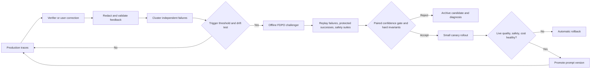

# Four-Paper Review, FDPO Grilling, and Finish Plan

**Date:** 2026-08-27  
**Scope:** PromptWizard, the automatic prompt engineering survey, EvoPrompt,
GEPA, and the current FDPO implementation and results in this repository.
**Related doc:** the broader literature review (ProTeGi, Trace2Policy, MPO,
aPSF, SAMMO, OPRO, DSPy/MIPROv2, and every other method these four papers cite
or compete with, plus SANER 2027 venue fit) lives in
[`literature_review.md`](literature_review.md), and the dataset-by-dataset
result tables (one table per benchmark, every paper that reported on it) live
in [`datasets_and_benchmarks.md`](datasets_and_benchmarks.md). This file stays
focused on the deep critique of the four newest papers and the
experiment/finish plan.

## 1. Executive verdict

The new papers support the central change in direction: **the optimizer should
see the failures**. PromptWizard explicitly mines negative examples and critiques
failed cases. GEPA goes further and gives the reflection model full execution
traces, evaluator feedback, and scores. The 2025 survey places failure-driven
methods such as ProTeGi, AutoHint, StraGo, and AMPO inside an established branch
of automatic prompt optimization. EvoPrompt is the useful counterexample: it
uses scalar fitness and population search without showing individual failures to
the proposer.

That means failure use is necessary and well-supported, but it is **not the
novelty**. The strongest defensible thesis for FDPO is:

> A small number of whole-prompt reflective updates, conditioned on raw solver
> failures and protected successes, can cheaply redistribute errors without
> changing model weights. The important scientific object is not only aggregate
> accuracy, but the recovery-regression trade-off and how it changes across task
> regimes.

The current evidence does **not** support saying that the algorithm is perfected,
model-general, production-ready, self-healing, or monotonically improving. It
does support saying that:

1. prompt rewrites cause real, auditable behavior changes;
2. some changes recover failures while simultaneously breaking prior successes;
3. task type and baseline headroom strongly affect the sign of the result;
4. a failure-conditioned rewrite can be dramatically cheaper than population or
   Pareto search;
5. aggregate accuracy alone hides the mechanism.

The right experimental economy is not 5-10 models. It is **broad task coverage,
two strategically different solver families, and one cross-model transfer
test**. One solver is insufficient for an SLM or model-general claim; ten are
unnecessary.

## 2. The four papers at a glance

| Paper | Status | Primary role in this review | Core contribution |
|---|---|---|---|
| **PromptWizard: Optimizing Prompts via Task-Aware, Feedback-Driven Self-Evolution** | Findings of ACL 2025 | Closest predecessor for failure-aware instruction plus example optimization | Mutate, score, critique, synthesize, select failed examples, synthesize examples, add reasoning, validate, and add intent/persona |
| **A Survey of Automatic Prompt Engineering: An Optimization Perspective** | arXiv:2502.11560v1, 2025; survey, not a new optimizer | Taxonomy and positioning | Organizes discrete, continuous, and hybrid prompt variables and FM-based, evolutionary, gradient, and RL optimizers |
| **Connecting Large Language Models with Evolutionary Algorithms Yields Powerful Prompt Optimizers (EvoPrompt)** | ICLR 2024 | Strong score-only evolutionary baseline | Uses an LLM to implement GA or DE operators over a prompt population, retaining candidates by development-set fitness |
| **GEPA: Reflective Prompt Evolution Can Outperform Reinforcement Learning** | ICLR 2026 | Strongest current threat and clearest support for trajectory/failure feedback | Reflective prompt mutation from traces and textual evaluator feedback, instance-wise Pareto candidate selection, and optional system-aware merge |

The survey predates GEPA and should not be presented as an empirical competitor.
Its value is to establish that failure-based, evolutionary, RL-based, and hybrid
optimization are already recognized categories.

## 3. Mechanism comparison

### 3.1 What is optimized and what signal reaches the proposer

| Dimension | PromptWizard | EvoPrompt | GEPA | Current `simple_fdpo` |
|---|---|---|---|---|
| Prompt unit | Instruction, synthetic/few-shot examples, CoT, intent, persona | Instruction text | One or more module instructions in a compound AI system | One five-section markdown prompt |
| Underlying model weights | Frozen | Frozen | Frozen for GEPA; compared with GRPO weight tuning | Frozen |
| Candidate proposer sees current prompt | Yes | Yes, through selected parents | Yes, plus candidate lineage and traces | Yes, full markdown |
| Sees individual failed inputs | **Yes** | **No**; primarily scalar dev fitness | **Yes** | **Yes** |
| Sees solver's wrong output | In critique/error analysis | Not as the evolutionary signal | **Yes**, in execution traces | **Yes** |
| Sees correct answer/evaluator explanation | Ground truth and LLM critique | Scalar task score | Score plus textual evaluator feedback; gold/rubric when available | Correct reference answer; no separate natural-language evaluator critique |
| Sees successful examples | Positive examples plus selected examples | Indirectly through aggregate fitness | Minibatch may contain successes and failures | Random sample of currently correct cases |
| Uses synthetic examples | **Yes** | No | No demonstrations in the reported GEPA configuration | No |
| Explicit anti-memorization rule | Validation filters synthetic reasoning, but no equivalent central constraint | No central failure-copying risk because failures are not passed | Reflection meta-prompt asks for general rules | **Yes**, but typed task hints introduce a separate confound |

### 3.2 Search, selection, and safety

| Dimension | PromptWizard | EvoPrompt | GEPA | Current `simple_fdpo` |
|---|---|---|---|---|
| Search topology | Sequential mutation, critique, synthesis, then instruction/example co-optimization | Population search with GA or DE | Genetic tree with reflective mutation; optional crossover | Default one child from one parent; optional chained rounds |
| Exploration mechanism | Thinking styles and synthetic examples | Mutation/crossover over population | Pareto sampling across per-instance winners | Optimizer sampling temperature; no population |
| Exploitation mechanism | Best-scored prompt plus targeted critique | Fitness-based selection | Minibatch improvement and validation/Pareto scores | Best validation candidate across rounds |
| Per-candidate evaluation | Small train minibatches | Development set | Training minibatch, then `D_pareto` validation | Mining and validation split |
| Rejects a locally worse candidate | Filters by score during search | Yes | Yes, if minibatch score does not improve | No within the trajectory; every parsed rewrite becomes the next parent |
| Final selection | Optimized composed prompt | Best final-population prompt | Best aggregate validation candidate | Best structured validation candidate |
| Default deployment guard | No explicit non-inferiority or statistical guard | Best-by-fitness | Validation selection, not a production canary gate | `accept_margin=1.0`, effectively always ship |
| Per-item recovery/regression reported | No | No | Search trees and per-instance Pareto scores, but not the FDPO churn decomposition | **Yes** |

### 3.3 Cost and search scale

| Method | Reported proposal/reflection work | Reported solver evaluation work | Cost caveat |
|---|---:|---:|---|
| PromptWizard | 69 total LLM calls on BBII and 129 on arithmetic tasks | Included in the paper's call accounting | The 69-call derivation uses 3 sequential iterations while the hyperparameter table lists `max_seq_iter=5`; this should be treated as an internal reporting ambiguity |
| EvoPrompt | Population 10 x 10 generations, roughly 100 proposal calls | `N*T*dev_size`; about 5,000 calls for BBH and about 5.4-5.9M tokens in two analyzed tasks | One GPT-3.5 seed due budget; token accounting depends heavily on dev-set size |
| GEPA | 17-92 reflection calls depending on task/model | About 1,839-7,051 rollouts per task in the main table | Most budget is validation; rich feedback-function engineering is not free |
| FDPO default | **One optimizer call** | Roughly two passes over train and two over test for a one-round before/after experiment | "One-call" must always be written as **one optimizer call**, not one total LLM call |

FDPO's credible efficiency claim is therefore: **one or a few reflection calls,
not one total rollout**.

## 4. Experimental evidence comparison

| Method | Breadth | Solver/model breadth | Repetition | Selected headline result | Main validity limitation |
|---|---|---|---|---|---|
| PromptWizard | 45 tasks: 19 BBII, 23 BBH, 3 arithmetic; extra ablations on 5 datasets | GPT-3.5-Turbo, GPT-4; Llama-70B prompt generation study | Reported averages over 3 runs | BBH 88.1 vs EvoPrompt 75.03 and APE 71.85; GSM8K 90.0; best/tied on 13/19 BBII zero-shot and 16/19 one-shot | Several comparisons reuse reported/implemented baselines under heterogeneous protocols; no per-item regression analysis |
| EvoPrompt | 31 datasets spanning classification, summarization, simplification, and BBH | Alpaca-7B and GPT-3.5; GPT-3.5 is also the evolutionary operator | 3 seeds for Alpaca; 1 seed for GPT-3.5 | Alpaca classification average 77.05 vs APE 73.80; BBH 75.03 vs 71.49 baseline | Expensive dev fitness; API result has one seed; many "optimal" BBH prompts are generic or task-mismatched despite being score-effective |
| GEPA | 6 task families: multi-hop QA, instruction following, fact verification, privacy delegation, and two math sets | Qwen3-8B and GPT-4.1 Mini; one-direction cross-model transfer | Seed count is not clearly stated in the supplied experimental section | Qwen aggregate 54.85 vs 45.23 baseline and 48.91 GRPO; GPT aggregate 65.22 vs 53.03 baseline; Qwen-optimized prompts score 62.03 on GPT | More complex system and feedback functions; repeated validation selection can overfit; merge hurts several Qwen results |
| Current FDPO evidence | LegalBench hearsay, GSM8K, and 6 MMLU subjects; ARC only at toy ceiling | Mostly gpt-4o-mini; one substantive Claude Haiku 4.5 run | Mostly 3 seeds in older GPT-4.1-optimizer runs; 2 seeds in newer GPT-5 runs; Claude result is 1 seed | Heterogeneous: useful gains in some MMLU subjects, losses in others; one Claude hearsay run +4.7 pp | Protocol and optimizer changes prevent pooling; repeated reuse of the same small test sets; no external optimizer baseline under a matched protocol |

These headline numbers are **not directly rank-comparable**. The datasets,
solver models, prompt seeds, examples, development sizes, and rollout budgets
differ. They compare scope and evidence quality, not a universal leaderboard.

## 5. How each paper uses failures

| Stage | PromptWizard | EvoPrompt | GEPA | FDPO |
|---|---|---|---|---|
| Detect a failure | Programmatic/LLM scoring against ground truth | Development-set task metric | Metric `mu` and feedback function `mu_f` | Programmatic answer extraction against gold |
| Show failure to proposer | Yes, through critique and negative examples | **No** | Yes, full module trace and feedback | Yes, question + raw wrong output + reference answer |
| Learn a general rule | Critique then synthesis | Evolutionary operator infers from parent wording and fitness only | Reflection explicitly attributes success/failure to prompt elements | Optimizer directly rewrites the whole prompt |
| Protect existing success | Positive examples and candidate scoring | Population fitness | Minibatch check plus Pareto validation | Random correct examples; permissive final gate |
| Use failure as a demonstration | Failed examples are selected and later synthesized into few-shot examples | No | No reported demo optimization | No; current prompt requests abstract rules or invented examples |
| Module-level credit assignment | No, single prompt pipeline | No | **Yes** for compound systems | No in `simple_fdpo`; the older `fdpo` path used judge-routed sections |

**Conclusion:** Our prior restraint was counterproductive. Showing failures is
standard and often central in the strongest relevant methods. The scientifically
useful question is not "may we show failures?" but:

> Which part of the failure trace is causally useful, how many failures are
> needed, which successes must be shown to bound regressions, and how much search
> is needed beyond one reflective rewrite?

That question is testable and can distinguish FDPO from the papers.

## 6. Paper-by-paper grilling

### 6.1 PromptWizard

**What we should copy**

- Treat negative examples as information, not contamination.
- Preserve positive examples alongside failures.
- Separate instruction optimization from example selection/synthesis in the
  ablation, even if FDPO ultimately chooses the simpler design.
- Validate generated reasoning/examples rather than trusting synthesis blindly.
- Test broad task diversity and limited-data regimes.

**What we should challenge**

- Its pipeline has many components, so the marginal contribution of "failure
  feedback" is hard to isolate despite its ablations.
- Synthetic examples can encode an LLM's misconception; LLM validation is not
  independent ground truth.
- The reported 69-call calculation and `max_seq_iter` default appear internally
  inconsistent (3 in the calculation, 5 in the hyperparameter table).
- Cost comparisons use estimated calls/tokens and old API prices, not a single
  reproducible cost-matched harness.
- It reports accuracy but not how many prior successes each rewrite destroys.

**Threat to FDPO novelty**

PromptWizard already combines failure analysis, positive/negative examples, and
whole-prompt refinement. FDPO cannot claim to invent failure-conditioned prompt
optimization. It can claim a simpler mechanism only after a cost-matched test.

### 6.2 EvoPrompt

**What we should copy**

- Explicitly balance exploration and exploitation.
- Keep a score history and do not trust one local rewrite.
- Test sensitivity to population/search budget.
- Include both task breadth and at least two target model families.

**What we should challenge**

- Scalar fitness discards the richest information in a failed rollout.
- The method pays for every prompt on every development example; the cost is
  dominated by evaluation, not evolutionary generation.
- Several best BBH prompts are generic, incomplete, or semantically mismatched
  (for example, a math instruction for `ruin_names`). This undermines the claim
  that readability implies meaningful task understanding.
- The GPT-3.5 results use one seed.
- The initial population includes manual prompts and generated variants, so it
  is not a clean "one vague seed to optimized prompt" comparison.
- The wording around sampling a development subset from the BBH test set should
  be clarified before treating its test number as strictly untouched.

**Opportunity for FDPO**

Compare a score-only proposer against the same proposer given raw failures. If
failure traces reach the same or better score with far fewer candidates, that is
a clean result against EvoPrompt's information-poor search.

### 6.3 GEPA

**What we should copy**

- Treat execution and evaluation traces as learning signal.
- Separate training feedback from validation-based candidate selection.
- Maintain diverse candidate strategies instead of always mutating one global
  best.
- Report performance against rollout budget.
- Run a cross-model transfer test.
- For compound systems, assign feedback to the module that produced the relevant
  trace.

**What we should challenge**

- GEPA requires a useful textual feedback function. Many production failures do
  not arrive with gold answers, compiler traces, or module-specific diagnoses.
- Pareto selection repeatedly observes validation-instance scores. It is better
  than greedy selection, but it can still adapt to the validation set and needs a
  genuinely untouched final test.
- `GEPA+Merge` is not uniformly beneficial: it sharply hurts Qwen IFBench and
  reduces aggregate Qwen performance relative to GEPA. Crossover is not a free
  improvement.
- "Outperforms RL" is benchmark- and budget-specific; prompt search and GRPO
  optimize different parameter spaces and incur different kinds of compute.
- The method is an offline optimizer. Inference-time search on a fixed code set
  is not the same thing as safe online self-healing in production.
- The paper alternates between "less than 33% of MIPROv2's size" and "33%
  shorter," which are materially different claims.

**Threat to FDPO novelty**

GEPA already owns the broad claim that natural-language reflection over failures
and evaluator traces can be sample-efficient. FDPO must be positioned as a
minimal, auditable alternative and/or as a study of recovery-regression dynamics,
not as a less complete GEPA.

### 6.4 The 2025 survey

**What it settles**

- FDPO is discrete instruction optimization in the survey's taxonomy.
- If examples become optimized variables, the method becomes hybrid
  instruction/exemplar optimization.
- Failure-driven meta-prompting, evolutionary search, and RL prompt editing are
  established categories.
- Online optimization, multi-task negative transfer, multi-objective selection,
  constraints, and agent-oriented prompts remain open research directions.

**What it does not settle**

- It provides no empirical evidence that one algorithm is best.
- It predates GEPA and cannot be used to validate GEPA-style Pareto reflection.
- A taxonomy entry is not evidence of production readiness or generalization.

## 7. Grilling our current implementation

The active implementation facts come from
[`simple_loop.py`](../src/fdpo/core/simple_loop.py),
[`simple_optimizer_prompt.py`](../src/fdpo/prompts/simple_optimizer_prompt.py),
[`config.py`](../src/fdpo/config.py), and
[`run_experiment.py`](../scripts/run_experiment.py).

| Current fact | Scientific consequence | Required correction |
|---|---|---|
| Default `method` is still `fdpo`, not `simple_fdpo` | "Current algorithm" depends on an explicit CLI flag | Make the paper method explicit in every manifest; change the default only after freezing the protocol |
| `simple_max_rounds=1` by default | The nominal method is one-shot, while several reports discuss 2- or 3-round search | Name variants `FDPO-1` and `FDPO-K`; never pool them |
| Failures contain question, current wrong output, and reference answer | The desired failure signal is already present | Keep it; ablate each field |
| `n_fail=100` and `n_gold=10` | Nearly all failures but only random successes are shown | Compare all-failure vs cluster-balanced failure sampling and random vs matched successes |
| `simple_val_frac=0.35` but `accept_margin=1.0` | In one-round mode, 35% of train is withheld while validation cannot reject a parsed rewrite | For scientific measurement, evaluate all candidates; for deployment, use a real conservative gate |
| Every parsed intermediate rewrite becomes the next parent | A bad round can contaminate later rounds even if final best-snapshot rescue exists | Add a branch-from-best or Pareto/beam ablation; do not describe the trajectory as gated |
| Best structured validation candidate is restored at the end | Multi-round final selection is held-out from failure mining | Keep, but reserve a new untouched test after protocol freeze |
| Task meta-prompt explicitly says math/econometrics/legal application benefit from visible CoT and factual recall may be hurt | "FDPO discovers the correct reasoning style" is circular under the current prompt | Add a generic meta-prompt primary condition and treat the typed version as an informed-prior ablation |
| Hearsay is named as a reasoning/rule-application task in the optimizer prompt | Legal-task behavior is partially pre-specified | Remove this example in the generic condition |
| `_TASK_DESCRIPTIONS` uses `arc_challenge`, while the CLI dataset key is `arc` | ARC silently receives the generic fallback description | Fix the key before ARC experiments |
| Output format is only pinned when `--pin-sections` is supplied | A rewrite can alter the scoring contract despite textual instructions not to | Pin format and other hard invariants by default in publishable/deployment runs |
| Config comments/help say multi-round rejects train regressions, but code commits and continues, selecting on validation | Run manifests are accurate, but CLI documentation is false | Reconcile comments, help, README, mechanism doc, and code before more runs |
| Baseline test is evaluated before optimization | The algorithm does not feed test data to the optimizer | Do not call it a fresh lockbox after humans repeatedly inspect and tune against the same test set |
| Online triggering and framework adapters are absent | Current code is an offline batch experiment | Present LangChain/OpenAI integration as future engineering until implemented and canary-tested |

### 7.1 "Almost perfected" is not supported by the result ledger

The following are comparable **within each row**, not across rows, because
optimizer, prompt seed, rounds, and validation protocol changed.

| Protocol family | Seeds | Mean baseline -> final | Mean delta | Recovery/regression evidence | Interpretation |
|---|---:|---:|---:|---|---|
| Hearsay, GPT-4.1 optimizer, validation-gated 3-round run | 3 | 62.7 -> 71.2 | **+8.5 pp** | 33 recoveries, 18 regressions total | Strong older result on one tiny reused test set |
| Hearsay, GPT-5 optimizer, 3 rounds, permissive gate | 2 | 66.1 -> 55.9 | **-10.2 pp** | 14 recoveries, 26 regressions | Direct counterexample to robustness/perfection |
| Hearsay Trace2Policy-style replication, Claude Haiku 4.5 + GPT-5 | 1 | 68.8 -> 73.4 | **+4.7 pp** | 11 recoveries, 8 regressions | Promising second solver family, but one seed |
| GSM8K, GPT-4.1 optimizer | 3 | 93.8 -> 93.0 | **-0.8 pp** | 13 recoveries, 20 regressions | Ceiling/downside regime |
| Six neutral-seed MMLU subjects, GPT-4.1 optimizer | 3 per subject | Macro delta | **about +0.4 pp** | Large two-way churn | Gains and losses cancel across subjects |
| Six MMLU subjects, GPT-5 optimizer | 2 per subject | Macro delta | **about 0.0 pp** | Mixed | New optimizer does not create a universal gain |

Detailed MMLU heterogeneity:

| Subject | GPT-4.1 optimizer, 3-seed mean delta | GPT-5 optimizer, 2-seed mean delta | Regime signal |
|---|---:|---:|---|
| College mathematics | +5.5 pp | +1.5 pp | Headroom and reasoning can help, but optimizer variance is large |
| Econometrics | +2.0 pp | **-6.8 pp** | Highly protocol-sensitive; not a stable win |
| High-school biology | +0.5 pp | 0.0 pp | Near-neutral/high baseline |
| Philosophy | +4.0 pp | +3.8 pp | Most repeatable positive subject so far |
| Computer security | **-8.6 pp** | -1.5 pp | Recall/near-ceiling downside |
| Professional law | -1.0 pp | +2.7 pp | Sign flips with optimizer/protocol |

The honest finding is **heterogeneous error redistribution**, not "the optimizer
improves prompts." That is still valuable, but it demands a different paper.

## 8. Regression is signal and noise: separate them

For a fixed test set of size `N`, let:

- `R` = baseline-wrong examples that become correct (recoveries);
- `G` = baseline-correct examples that become wrong (regressions).

Then:

```text
accuracy_delta  = (R - G) / N
churn_rate      = (R + G) / N
recovery_rate   = R / baseline_wrong
regression_risk = G / baseline_correct
```

This decomposition makes the current observation precise: two prompts can have
the same aggregate accuracy and still have high churn. The churn is a real change
in behavior, but any individual flip may also arise from stochastic inference.

The experiment therefore needs a **no-treatment control**:

1. evaluate the unchanged baseline prompt twice (or `K` times);
2. measure null recoveries, null regressions, and null churn;
3. evaluate baseline vs optimized prompt under the same repetition policy;
4. compare treatment churn and net delta against the no-change distribution.

Required statistical reporting:

| Question | Test/report |
|---|---|
| Did optimized correctness differ from baseline on paired items? | Exact McNemar test using discordant counts `R` and `G` |
| What is uncertainty in accuracy delta? | Paired bootstrap confidence interval over examples |
| Does the effect generalize across prompts/seeds/tasks? | Hierarchical bootstrap over optimizer seeds, then examples, with task-level forest plot |
| Is an API-model flip larger than inference noise? | Repeated unchanged-prompt control and repeated/majority-vote evaluation |
| Is a deployment candidate non-inferior? | Lower confidence bound above a pre-registered harm margin, plus hard invariant checks |

Never erase regressions from the scientific logs. **Observe every candidate;
gate only what is deployed.** This resolves the apparent conflict between
learning from harmful rewrites and operating a safe production system.

## 9. Revised contribution and claim boundaries

### 9.1 Claims we can target

1. **Minimal reflective optimization:** one or a few optimizer calls using raw
   failure traces can recover a meaningful fraction of failures on selected
   task regimes without weight updates.
2. **Churn-aware evaluation:** aggregate accuracy hides a substantial and
   reproducible recovery-regression trade-off.
3. **Task-regime result:** headroom, reasoning demand, and knowledge demand
   predict whether a rewrite helps, does nothing, or hurts.
4. **Efficiency:** FDPO trades search breadth for richer per-rollout information
   and can be cheaper than population/Pareto methods at comparable quality.
5. **SLM applicability:** after testing an open 7B/8B solver, failure-driven
   instructions can improve a fixed small model without retraining.
6. **Transfer:** after a cross-model experiment, some learned instructions can
   transfer between model families, with measurable degradation or gain.

### 9.2 Claims to stop making for now

- "We are the first to use failures for prompt optimization."
- "FDPO always improves prompts."
- "The regression gate prevents regression."
- "The method is model-agnostic" from one substantive solver family.
- "Six MMLU subjects prove broad dataset diversity."
- "The system discovers CoT" while the optimizer meta-prompt instructs it to use
  CoT by task type.
- "The test set is sealed" after repeated human inspection and protocol tuning.
- "Production self-healing is implemented."
- "One LLM call" without the qualifier "one optimizer call."

### 9.3 Strong paper framing

Possible title:

> **Failure-Driven Prompt Optimization for Small Language Models: Cheap
> Reflective Updates, Error Churn, and the Limits of Monotonic Improvement**

The contribution is strongest as a **mechanism and measurement paper**, not a
SOTA leaderboard paper.

## 10. Minimum publishable experiment matrix

### 10.1 Task diversity first

| Task regime | Dataset/unit | Why it is needed | Split recommendation |
|---|---|---|---|
| Arithmetic reasoning | GSM8K | Tests high-confidence multi-step reasoning and ceiling behavior | Official train/test; full 1,319 test examples |
| Science knowledge/reasoning | ARC-Challenge | Distinguishes reasoning from pure arithmetic | Official split; fix the `arc` task-description key first |
| Legal rule application | LegalBench Hearsay | Existing deep failure analysis and direct prior-work comparison | Repeated outer cross-validation; stop tuning on the same fixed 59 |
| Legal semantic classification | LegalBench Contract NLI | Checks whether hearsay gains transfer to another legal task | Repeated outer cross-validation or an untouched official test |
| Mixed academic knowledge | MMLU | Exposes compute vs recall regimes | Pre-register 2 compute and 2 recall subjects; report every subject separately |
| Strict instruction following | IFBench or IFEval | Tests formatting, lexical, and constraint failures central to production prompts | Official train/validation/test; requires a new loader/evaluator |
| Compound workflow case study | Two-hop QA or a tool-using workflow | Required only for the LangChain/OpenAI self-healing claim | Separate case study with module traces; do not mix into single-prompt headline |

MMLU subjects are domains, not seven independent task families. The paper should
claim at least five genuinely different objective/evaluator regimes.

### 10.2 Two model families, not ten

| Role | Recommended choice | Purpose |
|---|---|---|
| Primary solver | Qwen3-8B (or the available deterministic open 7B/8B model) | Directly tests the SLM claim and removes API nondeterminism/content filters |
| Secondary solver | Claude Haiku 4.5 **or** gpt-4o-mini | Tests one different proprietary model family on a representative subset |
| Optimizer | Freeze one model/version before final tests | Prevents optimizer shopping; use GPT-4.1 or GPT-5 based only on development results |
| Transfer | Optimize on Qwen, evaluate unchanged prompt on secondary solver | High-value model-generalization test inspired by GEPA |
| Optional reverse transfer | Optimize on secondary solver, evaluate on Qwen for 2-3 tasks | Tests whether transfer is asymmetric |

Recommended allocation:

- Primary breadth: all core datasets on the open SLM, 5 optimizer seeds.
- Secondary confirmation: 3 representative task regimes, 3-5 seeds.
- Cross-model transfer: the same 3 representative regimes.

This provides stronger evidence than shallow testing on 5-10 models.

### 10.3 Baselines reviewers will expect

| Priority | Baseline | What it controls |
|---:|---|---|
| 1 | Neutral one-line seed | Raw headroom and honest starting point |
| 2 | Generic zero-shot CoT | Whether FDPO merely rediscovers "think step by step" |
| 3 | Random few-shot CoT | Whether examples alone explain the gain |
| 4 | Score-only rewrite/best-of-N | Directly tests whether raw failure traces beat EvoPrompt/APE-style scalar search at equal budget |
| 5 | Official GEPA or a faithful cost-matched reflective baseline on 2-3 tasks | Required to position against the strongest 2026 method |
| 6 | PromptWizard or ProTeGi on 1-2 compatible tasks | Direct failure-aware prior-work comparison |

Cost-match using both:

- solver rollouts;
- optimizer/reflection calls;
- input/output tokens and USD;
- final prompt tokens and inference latency.

### 10.4 Causal ablations for the failure signal

Run the full ablation on three representative tasks only: one reasoning, one
rule-application, and one recall/near-ceiling task.

| Ablation | Proposer receives | Question answered |
|---|---|---|
| A0: prompt-only | Current prompt | Does a generic rewrite help without evidence? |
| A1: score-only | Prompt + aggregate score | Is scalar feedback enough? |
| A2: failure-label | Failed question + correct label, no wrong output | Does merely identifying hard examples help? |
| A3: full failure trace | Failed question + raw wrong output + reference | Does the solver trajectory add causal value? |
| A4: trace + random success | A3 + current random gold policy | Do successes reduce regression? |
| A5: trace + matched contrast | A3 + lexically/semantically similar successes with opposing outcome | Can contrastive protection reduce overgeneralization? |
| A6: trace + evaluator critique | A5 + programmatic/tool/human textual feedback | Is GEPA-style rich feedback worth its cost? |

Additional focused ablations:

- generic optimizer meta-prompt vs current task-typed meta-prompt;
- one round vs three rounds with best-validation selection;
- always-observe candidate vs conservative deployment gate;
- all failures vs cluster-balanced failures;
- random success sampling vs matched hard-negative successes;
- output-format pinned vs editable.

## 11. Freeze the algorithm before spending more

Define two explicit variants instead of letting flags silently change the paper
method:

### `FDPO-1` (primary minimal mechanism)

1. Evaluate the seed on mining data.
2. Give one optimizer the full prompt, all/cluster-balanced failure traces, and
   matched protected successes.
3. Produce one candidate.
4. Evaluate candidate on validation and untouched test.
5. Always report its scientific result; deploy only if the safety gate passes.

### `FDPO-K` (search ablation)

1. Use up to `K=3` reflective mutations.
2. Each proposal branches from the current validation-best candidate, not blindly
   from the last candidate.
3. Keep all candidates and scores.
4. Select once on validation.
5. Evaluate the selected candidate once on the untouched test.

Do not call one "paper-faithful" without naming which paper and exact algorithm.

## 12. Production self-adaptation: plausible, not yet demonstrated

The papers justify building this, especially GEPA's compound-system traces and
the survey's online/agent directions. They do not make the current repository a
production self-healing system.

### 12.1 Required lifecycle



### 12.2 Production requirements

| Requirement | Why | Current status |
|---|---|---|
| Reliable failure labels/verifiers | A model cannot learn from "failures" that are only guesses | Available for benchmark exact match; absent for general production queries |
| Trace schema with prompt/module version | Needed for causal attribution and rollback | Partial run logs only |
| PII/secret redaction | Failed inputs and raw outputs may contain sensitive data | Not implemented |
| Prompt-injection/poisoning defense | Untrusted failures can teach the optimizer malicious rules | Not implemented |
| Cluster and diversity controls | One burst or one user must not dominate the rewrite | Not implemented |
| Replay set of protected successes | Prevents fixing one cluster by breaking common traffic | Random golds exist; no durable production replay bank |
| Multi-objective gate | Accuracy alone can trade away safety, format, latency, or cost | Not implemented |
| Statistical non-inferiority gate | A single noisy validation score is unsafe | Not implemented |
| Immutable registry, canary, rollback | Core of actual self-healing rather than self-modification | Offline registry exists; no deployment control plane |
| Framework adapters | Capture module traces and update the correct prompt | No LangChain or OpenAI Agents adapter |

For LangChain or the OpenAI Agents SDK, the right integration boundary is a
small neutral event contract, not framework-specific optimization logic:

```text
TraceEvent {
  trace_id, task_route, module_name, prompt_version,
  redacted_input, output, tool_events,
  verifier_score, verifier_feedback, timestamp
}
```

Adapters should translate framework callback/trace events into this contract.
FDPO then consumes only the neutral event stream. This keeps the optimizer usable
across LangChain, OpenAI, and custom orchestration.

## 13. Immediate no-cost fixes before the next run

| Priority | Fix | Why it blocks interpretation |
|---:|---|---|
| P0 | Freeze and name `FDPO-1` and `FDPO-K` protocols | Current reports mix 1, 2, and 3 rounds |
| P0 | Make generic vs typed optimizer meta-prompts explicit | Current typed prompt leaks the expected CoT/recall conclusion into the optimizer |
| P0 | Fix `arc_challenge` -> `arc` task-description key | ARC currently falls back silently |
| P0 | Reconcile config comments, CLI help, README, mechanism doc, and code | They disagree about train gating, validation, and commit behavior |
| P0 | Pin output contract and hard constraints | Prevents metric/format drift |
| P0 | Separate "candidate observed" from "candidate deployed" in metrics | Preserves negative science without shipping harm |
| P0 | Mark all repeatedly inspected test sets as development evidence | Avoids a false lockbox claim |
| P1 | Add no-change repeated-evaluation control | Quantifies stochastic null churn |
| P1 | Add paired McNemar and bootstrap reporting | Turns churn into statistically defensible evidence |
| P1 | Persist a normalized experiment manifest and protocol hash | Prevents accidental pooling of incompatible runs |
| P1 | Add matched-success selection | Directly targets observed overgeneralization regressions |
| P2 | Add IFBench/IFEval and one compound-workflow adapter | Needed for production and agent claims |

## 14. Finish-line sequence

### Phase A: protocol freeze and cleanup (no paid runs)

1. Resolve the P0 items above.
2. Create one machine-readable experiment matrix.
3. Pre-register primary datasets, subjects, models, metrics, and exclusion rules.
4. Designate fresh test data or outer cross-validation folds.
5. Run all offline tests and dry-run manifests.

**Exit criterion:** two commands (`FDPO-1`, `FDPO-K`) reproduce exactly one
documented protocol each; no stale help text; test data is not used for choices.

### Phase B: causal mechanism study

1. Run A0-A6 on three representative tasks with the primary open SLM.
2. Run unchanged-prompt controls.
3. Select the final FDPO variant using development data only.

**Exit criterion:** full failure traces beat prompt-only and score-only controls
under a matched rollout budget, or the paper reports honestly that they do not.

### Phase C: breadth and transfer

1. Run the frozen primary method across the core task matrix on Qwen3-8B.
2. Confirm on the secondary solver for three regimes.
3. Run Qwen-to-secondary prompt transfer unchanged.
4. Run cost-matched GEPA and one additional published baseline on 2-3 tasks.

**Exit criterion:** report per-task effects, hierarchical uncertainty, churn,
rollouts, tokens, and prompt size. No cherry-picked aggregate.

### Phase D: production case study

1. Implement the neutral trace event contract.
2. Add one LangChain or OpenAI Agents adapter first, not both simultaneously.
3. Implement champion/challenger replay, canary, and rollback.
4. Demonstrate one verifiable tool-using or multi-hop workflow under simulated
   drift.

**Exit criterion:** the system detects a failure cluster, proposes a challenger,
rejects a harmful candidate, promotes a helpful one through canary, and rolls
back a deliberately bad version.

## 15. Go/no-go decision

**Go** on the research program, with a narrower and stronger story.

**No-go** on declaring the optimizer finished or production self-healing today.
The newest ledger contains direct regressions, the task-typed meta-prompt
confounds discovery, protocol variants are mixed, and no fresh multi-model
confirmatory study exists.

The work is close to a **good experiment**, not yet close to a **finished
universal optimizer**. The fastest path is to freeze the simple mechanism,
measure the causal value of raw failure traces, make churn the centerpiece, test
broad tasks on one open SLM plus one confirmation model, and treat production
self-healing as a separately gated case study.

## 16. Source files reviewed

External papers supplied by the user:

- `2025.findings-acl.1025.pdf` (PromptWizard)
- `2502.11560v1.pdf` (automatic prompt engineering survey)
- `ICLR-2024-connecting-large-language-models-with-evolutionary-algorithms-yields-powerful-prompt-optimizers-Paper-Conference.pdf`
- `ICLR-2026-gepa-reflective-prompt-evolution-can-outperform-reinforcement-learning-Paper-Conference.pdf`

Repository evidence:

- [`src/fdpo/core/simple_loop.py`](../src/fdpo/core/simple_loop.py)
- [`src/fdpo/prompts/simple_optimizer_prompt.py`](../src/fdpo/prompts/simple_optimizer_prompt.py)
- [`src/fdpo/config.py`](../src/fdpo/config.py)
- [`scripts/run_experiment.py`](../scripts/run_experiment.py)
- [`Docs/fdpo_mechanism.md`](fdpo_mechanism.md)
- [`Docs/empirical_findings.md`](empirical_findings.md)
- [`report_oneliner_runs.md`](../report_oneliner_runs.md)
- [`report_validation_gate.md`](../report_validation_gate.md)
- [`progress.md`](../progress.md)
- `results/**/metrics.json` (97 run artifacts inventoried locally)