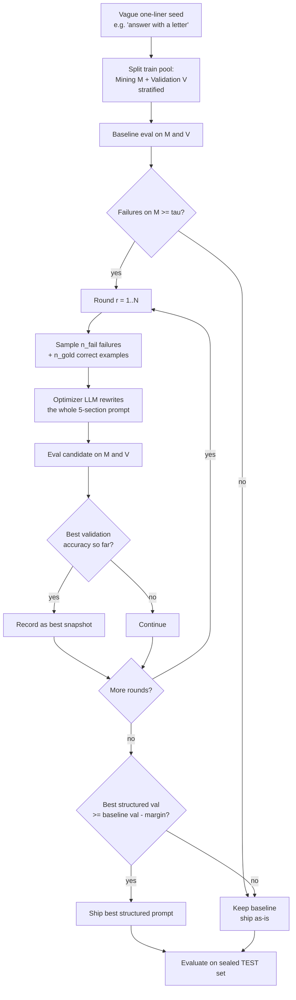
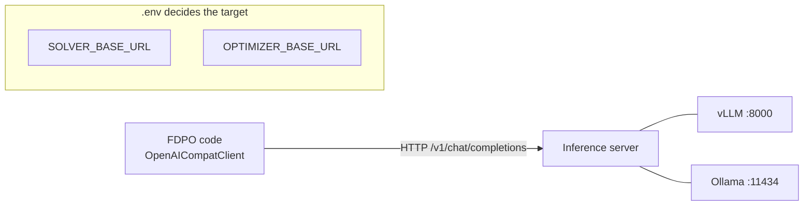

# FDPO — Project Briefing (for the meeting with Prof. Tarek Mahmud)

**Date:** 2026-08-02 · **Prepared for:** advisor meeting · **Status:** research
prototype with reproducible results on Azure gpt-4o-mini; ready to port to open
models at TAMUK.

> **TL;DR — three things to present**
> 1. **The method works where theory says it should.** Our online,
>    regression-safe prompt optimizer (`simple_fdpo`) turns a vague one-liner
>    into a structured, chain-of-thought prompt and lifts **LegalBench-hearsay
>    +8.5 pp (3/3 seeds, zero variance)** and the **reasoning-amenable MMLU
>    subjects** (math **+5.6**, philosophy **+4.0**, econometrics **+2.0**).
> 2. **We found a clean, novel empirical law** — a *double dissociation*:
>    chain-of-thought **helps computational subjects and hurts factual-recall
>    subjects**. This (plus "the model self-selects reasoning by subject" and
>    "near-ceiling subjects are downside-only") is the scientific contribution
>    and the seed of an **empirical/comparative-study paper**.
> 3. **It's ready to move to TAMUK open models** (Llama via Ollama/vLLM) with
>    **no code changes — only a `.env` edit**, where determinism + more headroom
>    should make the gains larger and the confidence intervals trustworthy.

---

## Table of contents
1. [The method in one picture](#1-the-method-in-one-picture)
2. [Results to date](#2-results-to-date)
3. [Key scientific findings (the paper material)](#3-key-scientific-findings)
4. [Paper direction: an empirical/comparative study](#4-paper-direction)
5. [Algorithm deep-dive: rounds & the "minimum mistakes" threshold](#5-algorithm-deep-dive)
6. [Running at TAMUK on Ollama/vLLM](#6-running-at-tamuk)
7. [Current status & immediate next steps](#7-current-status)
8. [Open questions for the meeting](#8-open-questions)

---

## 1. The method in one picture

`simple_fdpo` = **Feedback-Driven Prompt Optimization**. Start from a vague
one-liner; iteratively rewrite it into a structured 5-section prompt using the
solver's *own failures* as feedback; keep the version that best generalizes on a
held-out validation slice.



**Design choices that matter:**
- **Held-out validation gate** (train → Mining + Validation + sealed Test) —
  standard 3-way split; the accept decision never sees test.
- **5-section schema** (System Role, Context, Task Details, Constraints, Output
  Format) — the optimizer *builds* structure from a one-liner.
- **Separate solver and optimizer models** (gpt-4o-mini solver, gpt-4.1
  optimizer) — no circular evaluation.

---

## 2. Results to date

All on **gpt-4o-mini** (solver) + **gpt-4.1** (optimizer), Azure `eastus2`,
temperature 0, 3 seeds.

### 2.1 LegalBench-hearsay — the clean win
Vague one-liner → FDPO-enriched prompt, validation-gated:

| Metric | Old gate (train-failure) | New gate (validation) |
|---|---|---|
| Seeds shipping a structured prompt | 1 / 3 | **3 / 3** |
| Test delta per seed | +17.0 / −5.1 / 0.0 | **+8.5 / +8.5 / +8.5** |
| Run-to-run spread | 22.1 pp | **0.0 pp** |

Baseline 62.7% → **71.2%**. The validation gate fixed a real bug (old gate
reverted 2/3 seeds to an empty prompt) and collapsed variance.

### 2.2 MMLU — per-subject (neutral one-liner baseline, 50 train / 66 test, 3 seeds)

| Subject (type) | Baseline | Final | Δ | Note |
|---|---:|---:|---:|---|
| college_mathematics (compute) | 76.8 | 82.3 | **+5.6** | FDPO discovered CoT |
| philosophy (reasoning) | 77.3 | 81.3 | **+4.0** | |
| econometrics (compute) | 66.7 | 68.7 | +2.0 | |
| high_school_biology (recall, ceiling) | 87.9 | 88.4 | +0.5 | near ceiling |
| professional_law (recall) | 53.0 | 52.0 | −1.0 | ~3 pp understated by content filter |
| computer_security (recall, 92% ceiling) | 92.4 | 83.8 | **−8.6** | over-reasoning regression |
| **MACRO-AVERAGE** | **75.7** | **76.1** | **+0.4** | flat — see §3 |

**Honest framing:** the MMLU *overall* is flat because the reasoning gains are
cancelled by one near-ceiling regression (security). This is a *fixable
mechanism issue* (§5), not a failure of the idea — and it's exactly what makes
the findings in §3 interesting.

---

## 3. Key scientific findings
*(These are the novel, defensible contributions.)*

### 3.1 Chain-of-thought is a double dissociation
The *same* switch from a direct-answer prompt to a CoT prompt flips the sign of
the result by subject type:

| Subject | Direct-answer prompt | Chain-of-thought prompt |
|---|---:|---:|
| mathematics (compute) | **−5.3** | **+5.6** |
| econometrics (compute) | −4.0 | +2.0 |
| professional_law (recall) | **+9.3** | **−1.0** |
| computer_security (recall) | **+2.0** | **−8.6** |

- Computational subjects **need a scratchpad** → CoT helps, direct hurts.
- Recall subjects are **hurt by CoT** → the small model over-thinks and
  *second-guesses answers it already recalled correctly*.

### 3.2 The model self-selects reasoning by subject
With the *same* neutral prompt, baseline output length varies enormously:

| Subject | Baseline output (tokens) | Interpretation |
|---|---:|---|
| mathematics | **434** | reasons spontaneously — it can't help it |
| econometrics | 38 | some working |
| philosophy / biology / law / security | 4–12 | answers directly |

The base model has a *good instinct*. Forcing uniform CoT **overrides** it and is
what breaks the recall subjects.

### 3.3 Near-ceiling subjects are downside-only ("break more than you fix")
`computer_security` churn (baseline 61/66 correct):

| Seed | Recovered (wrong→right) | Regressed (right→wrong) |
|---|---:|---:|
| 0 / 1 / 2 | **0 / 0 / 0** | 5 / 4 / 8 |

Zero fixes, 4–8 breaks — the same 5 hard questions stay wrong every seed
(they need *knowledge*, not reasoning).

### 3.4 The acceptance gate is the current weak point
The lenient gate + a **noisy 17-item validation** shipped the security
regressor (its validation baseline was 0.667 vs a true 0.924). *If the gate had
held security at baseline, the macro would be ~+1.9 instead of +0.4.*

### 3.5 Platform artifacts are understood and bounded
- **Content filter**: 48 blocks total, **all** in professional_law (4.8%), **0**
  elsewhere; balanced baseline-vs-final so the **delta is unbiased** (we now
  exclude blocked calls from the denominator and report `n_blocked`).
- **Rate limiting**: `--max-workers 8` overran Azure; **3** is safe.
- **Non-determinism ~5 pp** at temp 0 — the main reason to move to open models.

---

## 4. Paper direction
**An empirical/comparative study: "When does prompt optimization actually help?"**

### 4.1 Two ways to frame it (decide with Prof. Mahmud)

| | **Framing A — Empirical study** | **Framing B — New method** |
|---|---|---|
| Thesis | *"When does prompt optimization help?"* | *"FDPO: a regression-safe online prompt optimizer"* |
| FDPO's role | one instrument among several | the contribution |
| Others' role | co-equal comparators | baselines to beat |
| Reviewer risk | low — novelty is the analysis, not a leaderboard | higher — "did you beat SOTA?" |
| Novelty | high — the field lacks a *when/why* characterization | moderate — crowded method space |

Both share the **same spine** — our findings:
- CoT is subject-conditional (double dissociation, §3.1).
- Models self-select reasoning; forcing it uniformly backfires (§3.2).
- Headroom + task type predict the gain; near-ceiling = downside-only (§3.3).
- The acceptance gate, not the rewrite, governs safety (§3.4).

Most prompt-opt papers report a single aggregate win and never explain the
per-subject mechanics — that gap is our opening under **either** framing. My
lean is **A** (lower risk, more novel), but the results support both.

### 4.2 What a comparative study needs
| Axis | Minimum for a credible paper |
|---|---|
| **Optimizers compared** | FDPO + 2–3 representative baselines: e.g. **APE** (search), **OPRO/ProTeGi** (feedback), **TextGrad** (gradient-style), **DSPy** (compiler). Plus trivial baselines: zero-shot, few-shot CoT. |
| **Datasets** | ≥3 with different task *types*: LegalBench (recall/legal), MMLU subjects (mixed), GSM8K (compute). This is what surfaces the dissociation. |
| **Models** | ≥2: an open model (Llama-3-8B) + one frontier (gpt-4o-mini). Headroom argument needs both. |
| **Seeds & stats** | ≥3 seeds, mean ± std, paired significance tests. |
| **Ablations** | rounds (2 vs 3), threshold `tau`, output-format (direct vs CoT), validation size. |

### 4.3 Effort & risk
- **Feasible at TAMUK**: FDPO is drop-in; the other optimizers vary in
  integration cost (DSPy/TextGrad are heavier; APE/OPRO are light).
- **Main risk**: reproducing baselines faithfully. Mitigation — use each
  method's official implementation where possible; report our config exactly.
- **Novelty is in the analysis, not the leaderboard**, which de-risks the
  "did you beat SOTA" reviewer question.

### 4.4 Related work already surveyed in the repo
See `Docs/literature_survey.md`, `Docs/related_works.md`,
`Docs/prompt_optimization_literature_study.md` — cover APE, OPRO, ProTeGi/APO,
TextGrad, DSPy, MPO, PE2, EvoPrompt, "Knowing How to Edit," Trace2Policy.

---

## 5. Algorithm deep-dive
**Rounds and the "minimum number of mistakes" (`tau`) — where to improve.**

### 5.1 Current settings

| Knob | Flag | Default | Used in experiments |
|---|---|---:|---:|
| Optimizer rounds | `--simple-max-rounds` | 1 | **3** |
| Min failures to trigger | `--tau` | 5 | **3** (per-subject MMLU) |
| Failures shown to optimizer | `--n-fail` | 100 | 100 |
| Correct examples shown | `--n-gold` | 10 | 10 |
| Validation fraction | `--simple-val-frac` | 0.35 | 0.35 |
| Accept leniency | `--accept-margin` | 1.0 (lenient) | 1.0 |
| Solver / optimizer temp | — | 0.0 / 0.7 | 0.0 / 0.7 |

### 5.2 What each round does
1. Mine the currently-failing mining examples → sample `n_fail` failures +
   `n_gold` correct examples.
2. Optimizer rewrites the whole prompt.
3. Evaluate the candidate on **validation** (held out).
4. Keep it only if it's the best validation score so far.

3 rounds = 3 optimizer calls + 3 candidate evals; we ship the **best-of-3 on
validation**.

### 5.3 Do we need 3 rounds? → probably 2 is enough
- In our runs, **round 1 was frequently the best-validation round** (hearsay
  shipped R1 on 2/3 seeds). Extra rounds mostly re-explored.
- **Recommendation:** ablate **2 vs 3 rounds** on TAMUK (deterministic → clean
  signal). If 2 captures ≈ the same accuracy, drop to 2 → **-33% optimizer
  cost and wall-time**.

### 5.4 The `tau` knob is the principled fix for the security regression
`tau` = minimum baseline failures on the mining set before we bother optimizing.
This is exactly the "minimum number of mistakes" lever you asked about — and it
is **failure-count-based, not an accuracy threshold** (which we agreed was not
general).

With 33 mining examples:

| Subject | Baseline failures (≈) | tau=3 (used) | tau=5 (proposed) |
|---|---:|---|---|
| computer_security (92%) | ~3 | **optimizes → −8.6** | **skips → 0** ✅ |
| high_school_biology (88%) | ~4 | optimizes → +0.5 | skips → 0 |
| mathematics (77%) | ~8 | optimizes → +5.6 | optimizes → +5.6 |
| law / philosophy / econ | 8–15 | optimize | optimize |

**Raising `tau` from 3 → 5** makes the near-ceiling subjects *skip optimization*
(too few mistakes to justify the risk), which would have **prevented the −8.6**
and lifted the macro to **~+1.8** — without any accuracy-threshold hack.

> **Two concrete tuning proposals for the meeting:**
> (a) `--tau 5` (or scale `tau` to ~15% of mining size) → auto-skip near-ceiling.
> (b) `--simple-max-rounds 2` → same accuracy, cheaper. Confirm both by ablation.

---

## 6. Running at TAMUK
**On Ollama or vLLM with Llama — code changes required: essentially none.**

### 6.1 How it connects (why no code change)
The client already speaks the OpenAI protocol to *any* server. It picks Azure
vs. plain OpenAI purely from `.env`:



The code branches: **if `api_version` is set → AzureOpenAI, else →
`OpenAI(base_url=...)`**. So pointing at Ollama/vLLM is a config change only.

### 6.2 The `.env` change (the ONLY code-side change)
```env
# Remove / leave unset all AZURE_OPENAI_* variables, then:
SOLVER_MODEL=llama3:8b-instruct
SOLVER_BASE_URL=http://localhost:11434/v1     # Ollama; vLLM = :8000/v1
SOLVER_API_KEY=dummy                          # any non-empty string

OPTIMIZER_MODEL=llama3:8b-instruct            # or a larger model on :8001
OPTIMIZER_BASE_URL=http://localhost:11434/v1
OPTIMIZER_API_KEY=dummy

JUDGE_MODEL=llama3:8b-instruct                # unused by simple_fdpo
JUDGE_BASE_URL=http://localhost:11434/v1
JUDGE_API_KEY=dummy
```
> ⚠️ If any `AZURE_OPENAI_*` var is set, the client tries to build an Azure
> client and vLLM/Ollama will reject the `api_version` parameter.

### 6.3 Scripts to run (in order)
```bash
# 0. one-time
curl -fsSL https://ollama.com/install.sh | sh
ollama pull llama3:8b-instruct                # server listens on :11434
uv sync                                       # Python 3.12 + deps
uv run python -m pytest -q                    # expect all green (offline)

# 1. dry-run (mock client, no server) — proves the pipeline
uv run python -m scripts.run_experiment --dry-run --method simple_fdpo \
    --dataset legalbench_hearsay --n-train 10 --n-test 6

# 2. tiny real run against Ollama (~a minute)
uv run python -m scripts.run_experiment --method simple_fdpo \
    --dataset legalbench_hearsay --n-train 10 --n-test 6 --tau 3 --seed 0 \
    --budget-usd 0 --phase test_scratch

# 3. replicate hearsay (3 seeds)
for seed in 0 1 2; do
  uv run python -m scripts.run_experiment --method simple_fdpo \
    --dataset legalbench_hearsay --n-train 40 --n-test 59 --tau 5 \
    --simple-max-rounds 3 --seed $seed --split-mode stratified --budget-usd 0
done

# 4. MMLU per subject (repeat --subjects for each of the 6)
for seed in 0 1 2; do
  uv run python -m scripts.run_experiment --method simple_fdpo --dataset mmlu \
    --prompt-file prompts/mmlu_oneliner.md --subjects computer_security \
    --n-train 50 --n-test 66 --tau 5 --simple-max-rounds 3 --seed $seed \
    --split-mode balanced --max-workers 32 --budget-usd 0 --phase mmlu_llama_computer_security
done
```
Notes: set `--max-workers` to match vLLM's `--max-num-seqs` (big speedup); Ollama
has no batching (slower). `--budget-usd 0` disables the cost guard (no price
table for local models). Full detail in `Docs/running_on_local_gpu.md`.

### 6.4 Why open models should look *better* than Azure
- **Determinism** removes the ~5 pp noise → trustworthy CIs, reliable 17-item
  validation.
- **More headroom** (Llama-3-8B baselines are lower) → larger deltas; MPO
  reported **+4.3 on MMLU** with Llama-3-8B.
- **No content filter** → professional_law runs clean (+~3 pp, fully scored).

---

## 7. Current status
**Latest complete data:** neutral-baseline MMLU (6 subjects) + hearsay (§2).

**Coded but NOT yet validated** (the last pilot didn't finish running):
- **Subject-adaptive optimizer** — tells the optimizer to use CoT for
  computational tasks and stay *direct* for recall tasks (should stop the −8.6).
- **Content-filter accounting** — blocked calls excluded from the denominator;
  `metrics.json` now reports `n_blocked` / `n_evaluated`. ✅ verified in unit +
  a single live law run (law now scored on 64, not 66).

**Immediate next runs (post-meeting):**
1. Validate the two fixes (adaptive optimizer + `tau 5`) on math/law/security.
2. Full 6-subject MMLU with the fixes → expect macro ~+1.5–1.9.
3. Port to TAMUK/Llama and re-run hearsay + MMLU deterministically.

---

## 8. Open questions
*(Things worth deciding with Prof. Mahmud.)*
1. **Paper framing:** position FDPO as a *new method*, or as an *empirical study
   of when prompt-opt helps* (FDPO one of several)? The latter is more novel and
   lower-risk.
2. **Which baselines** can we realistically run at TAMUK (APE, OPRO, ProTeGi,
   TextGrad, DSPy)? Integration cost varies a lot.
3. **Compute budget:** how many GPUs / which Llama sizes? Determines dataset ×
   model × seed scope.
4. **Target venue / deadline?**
5. **Do we keep MMLU** (multi-subject, needs the per-subject story) or lead with
   **LegalBench** (cleaner single-task win) as the headline dataset?
