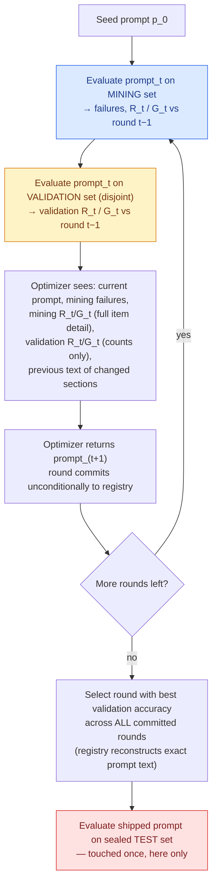

# What Reflective Prompt Optimization Actually Teaches Us: A Double Dissociation in Chain-of-Thought, and a Reproducibility Problem This Literature Under-Reports

**Working draft — for internal/advisor review before venue submission.** All numbers in this
document are taken directly from experiment artifacts (`metrics.json`) or from this project's
own dated internal reports; none are estimated. Citations are given by method name only;
full bibliographic entries should be pulled from `Docs/literature_review.md` /
`Docs/related_works.md` before submission. Target venue class: COLM / EMNLP Findings / NeurIPS
Datasets & Benchmarks (see venue-fit discussion in `Docs/reflect_fdpo_report.md`) — **not** an
SE-specific venue, since no task here is a software-engineering task.

## Abstract

The growing use of LLM-powered applications has made prompt design a first-class engineering
problem: small changes in wording can substantially shift task accuracy, and hand-tuning
prompts does not scale across tasks or models. This has motivated automatic prompt optimization
(APO), in which an LLM iteratively rewrites a task prompt using its own generated feedback on
failures, in place of gradient-based updates. APO methods are almost universally evaluated by a
single before/after accuracy delta per benchmark, sometimes averaged over a small number of
seeds. This aggregate number cannot distinguish an edit that fixed several failures while
breaking none from one that fixed the same failures while silently breaking others, and it does
not verify that gains measured on the data used to guide editing transfer to unseen examples.

We introduce **Promptomizer**, a framework for both optimizing and evaluating prompts, built
around a mechanism we call **Reflective FDPO** (Feedback-Driven Prompt Optimization). Much as a
human prompt engineer would check what an edit broke and fixed before making another change,
Reflective FDPO computes, every round, exactly which examples were recovered and which were
newly broken relative to the previous round — on both the optimizer's own working set and a
disjoint validation set — and feeds this per-item outcome back to the optimizer as the basis for
its next edit. Using Reflective FDPO across five benchmarks (LegalBench-Hearsay, MMLU,
IFEval/IFBench, AIME, and PUPA) and two solver model families, we show that this per-round
visibility surfaces a failure mode a purely aggregate evaluation would miss entirely: validation
and test accuracy can diverge even without memorized wording. In one run, held-out validation
rose from 0.368 to a peak of 0.684 across rounds while a sealed, disjoint test set fell from
0.476 to 0.452; in another, the optimizer's genuinely best-validation round (0.80→0.84) still
produced a 10.2-point test regression (0.816→0.714). These results argue that per-round,
per-item regression tracking should be standard practice in evaluating prompt optimization —
and, more broadly, that outcome-aware reflection and disciplined, evidence-triggered mechanism
revision, the design principles behind Reflective FDPO, are useful lenses for studying **when
and why** prompt optimization works, rather than evidence that any one method, ours included,
universally outperforms prior work.

> **Scope note.** We explicitly do **not** claim "`reflect_fdpo` beats GEPA/MIPROv2/
> ProTeGi/Trace2Policy" anywhere in this document; §6 lists the overclaims we specifically
> guarded against.

## 1. Introduction

The growing use of LLM-powered applications has made prompt design a first-class engineering
problem: small changes in wording can substantially shift task accuracy, and hand-tuning prompts
by trial and error does not scale across tasks or models. This has motivated automatic prompt
optimization (APO), in which an LLM iteratively rewrites a task prompt using its own generated
feedback on failures, in place of gradient-based updates. The line of work has progressed from
token-level, gradient-approximating search over discrete prompts (AutoPrompt), to textual-gradient
beam search over whole-prompt edits (ProTeGi, TextGrad), to evolutionary and population-based
search (EvoPrompt, PromptBreeder), to structured multi-stage and modular pipelines (MIPROv2,
SAMMO, Modular Prompt Optimization), and most recently to reflective, "LLM-as-optimizer"
approaches that treat the model's own critique of its failures as the search signal (GEPA,
Trace2Policy). Across this entire progression, almost every method is still evaluated the same
way: a single before/after aggregate accuracy delta per benchmark, sometimes averaged over a
small number of seeds. This paper argues that this shared evaluation practice obscures something
that matters for anyone trying to use or build on these methods: the aggregate delta cannot
distinguish an edit that fixed several failures while breaking none from one that fixed the same
failures while silently breaking others, and it does not verify that gains measured on the data
used to guide editing transfer to genuinely unseen examples.

Much as a human prompt engineer reviewing an edit would first check what it broke and what it
fixed before making another change, we argue the optimizer itself should be shown this same
per-item outcome, round over round, rather than only a final score. We build **Promptomizer**, a
framework for both optimizing and evaluating prompts, around a mechanism we call **Reflective
FDPO** (Feedback-Driven Prompt Optimization): every round, it computes exactly which examples
were recovered and which were newly broken relative to the previous round — on both the
optimizer's own working set and a disjoint validation set — and feeds this per-item outcome
directly back into the optimizer's next edit. A simpler, non-reflective predecessor mechanism,
**FDPO**, which rewrites the whole prompt from failures alone without this outcome feedback,
serves as this paper's internal baseline throughout.

We present Reflective FDPO and its central finding across five benchmarks — LegalBench-Hearsay
(legal classification), MMLU (multi-subject multiple-choice), IFEval/IFBench (verifiable
instruction-following), AIME (competition mathematics), and PUPA (privacy-conscious delegation) —
using small, inexpensive solver models (GPT-4o-mini, Claude Haiku 4.5) rather than the mid-scale
models used by directly comparable prior work. We are explicit throughout about where our numbers
are, and are not, comparable to those prior results. Making per-round regression visible this way
surfaces a failure mode that a purely aggregate evaluation would miss entirely: **validation and
test accuracy can diverge even without memorized wording.** In one run, held-out validation rose
from 0.368 to a peak of 0.684 across rounds while a sealed, disjoint test set fell from 0.476 to
0.452; in another, the optimizer's genuinely best-validation round (0.80→0.84) still produced a
10.2-point test regression (0.816→0.714). We document this directly rather than as a hypothesis,
and distinguish it explicitly from a separate, previously-documented failure mode in which the
optimizer copies literal wording from the examples it is shown (§3.2) — the divergence cases here
involve no such copying.

As an independent, secondary observation surfaced during these same runs — not this paper's
central claim — we also find that forcing chain-of-thought reasoning is a double dissociation:
the identical intervention improves computational subjects and harms factual-recall subjects,
sharp enough to flip sign. This corroborates published findings (Sprague et al., 2024, "To CoT or
Not to CoT?") that chain-of-thought reasoning benefits math and symbolic tasks but not
knowledge-heavy recall; our contribution here is not the direction of the effect, which is
already established, but concrete, worked examples of it emerging live from an optimizer's own
edits (§5.1).

### 1.1 Research questions

We organize the rest of the paper around four research questions, and state plainly which are
answered by current evidence, which are partially answered, and which remain open — rather than
implying uniform confidence across all four.

- **RQ1 (mechanism value): does exposing the optimizer to the measured outcome of its own
  previous edit, in the way a human prompt engineer would use that information, change
  optimization behavior relative to failure-only feedback?** *Partially answered.* §5.3
  documents two mechanism revisions made specifically because outcome information (validation
  churn already being computed) was being discarded; it does not yet include a fully matched
  FDPO-vs-Reflective-FDPO head-to-head on the same optimizer model across all five benchmarks
  (§4 states this confound explicitly).
- **RQ2 (generalization gap): can improvement on the data used to guide editing diverge from
  improvement on genuinely unseen data, and can per-round regression tracking detect this as it
  happens?** *Answered.* §5 documents two concrete cases where validation rose substantially
  while sealed test fell, neither attributable to memorization.
- **RQ3 (mechanism attribution): which specific components of the mechanism are responsible for
  observed behavior changes?** *Partially answered.* §5.3 attributes two specific revisions to
  specific observed cases; a controlled ablation isolating validation-feedback-only vs.
  full-reflection has not yet been run.
- **RQ4 (generality across solver families): does any of this transfer to open-weight models at
  a scale directly comparable to prior work (Qwen3-8B, Llama)?** *Open.* Not yet run; §7.

### 1.2 Contributions

1. **Reflective FDPO** (§3.3) — an outcome-aware prompt-optimization mechanism that, every
   round, shows the optimizer exactly which items its own previous edit recovered and regressed,
   on both its working set and a disjoint validation set, mirroring how a human prompt engineer
   reviews the consequences of an edit before making another one.
2. **A direct empirical demonstration of the validation/test generalization gap** (§5) — two
   concrete cases where validation accuracy improved substantially, in one case by over 30
   points, while a sealed, disjoint test set regressed, with the optimizer's actual edit text
   inspected and ruled out as memorization.
3. **Two mechanism revisions made in direct, documented response to observed evidence**, each
   reported with the specific case that motivated it and, where applicable, the honest
   complication that followed (§5.3).
4. **A negative-results record treated as first-class evidence, not omitted noise** — an
   optimizer memorization/overfitting crash and its fix (§3.2), an abandoned mechanism version
   with a measured slightly-negative mean effect (§3.2), a permissive-gate counterexample, a
   benchmark (IFBench) where the method regressed rather than helped (§5.4), and a corroborating,
   concretely-illustrated aside on chain-of-thought's double dissociation (§5.1).
5. **Promptomizer** (Appendix A) — a reusable framework for both optimizing and evaluating
   prompts: the per-round recovery/regression formalism itself, an IFBench verifier, a
   GEPA-matched AIME split, and a from-scratch PUPA pipeline reproducing a prior paper's exact
   composite scoring formula, including a round-reconstruction primitive used directly to produce
   the honest null result in §5.3.

## 2. Related Work

We organize prior automatic prompt optimization methods along three axes, following the
categorization developed in our own internal literature review: **(A) when** optimization
happens (offline, before deployment, vs. online/continuous); **(B) what signal** drives the
optimizer (task accuracy alone, LLM-generated critique, human preference, or some combination);
and **(C) mechanism** (discrete search, textual-gradient descent, evolutionary population
search, Bayesian search, or "LLM-as-optimizer" free-form rewriting). `reflect_fdpo` is offline,
accuracy-triggered with raw failure traces as the critique signal, and mechanistically an
LLM-as-optimizer whole-prompt rewriter.

**Discrete/gradient-style search.** AutoPrompt uses gradient-based token search (HotFlip) and
requires white-box gradient access, producing non-human-readable prompts. ProTeGi (APO) and
TextGrad frame optimization as textual-gradient descent with beam search over candidate edits.
GLaPE adds an evolutionary outer loop on top of ProTeGi-style textual gradients specifically to
escape beam-search plateaus.

**Evolutionary/population search.** EvoPrompt evolves a population of prompts via genetic or
differential-evolution operators with no failure examples shown to the optimizer, only scalar
fitness. PromptBreeder co-evolves task-prompts *and* the mutation-prompts that instruct how to
mutate them — a meta-mutation strategy with no direct analogue in our own mechanism.

**Bayesian / compiler-style search.** MIPROv2 (DSPy) jointly searches over instructions and
few-shot demonstrations via Bayesian optimization (Tree-structured Parzen Estimators), driven
purely by scalar validation scores, never raw failure text.

**Modular / section-local rewriting.** SAMMO parses a prompt into a labeled component tree and
beam-searches over it. MPO fixes a 5-section schema (the same section granularity we use) and
applies section-local textual gradients with LLM-based de-duplication, but — by its own
authors' framing, which we adopt directly — has no regression gate, no section-level error
attribution, and shows the critic no failure examples at all; it is evaluated on 2 solver models
and 2 benchmarks with no statistical significance reporting. aPSF auto-discovers prompt structure
via a separate "Architect" model and scores sections by interventional marginal contribution, but
remains offline with no regression gate. Notably, Trace2Policy/EISR — despite superficially
resembling a "modular" method via its clustered-error refinement (MISSING/WRONG/CONFLICT
categories) — is explicit in its own text that it optimizes an externalized, human-readable
rule document, *not* a parametric, sectioned prompt; its regression control is a simple
threshold gate (discard if accuracy drops >2%) with best-snapshot fallback after repeated
stagnation.

**Reflective / genetic-Pareto methods.** GEPA is the closest prior method to ours in spirit: it
reflects on full execution traces (not just a final score) and maintains a Pareto frontier of
candidates across tasks to avoid collapsing to a single greedy trajectory, optionally merging
complementary lineages. Reflexion and Self-Refine perform iterative self-critique with an
explicit memory of past attempts, though on agentic/generative tasks rather than prompt
optimization specifically. Our contribution relative to GEPA specifically is not the existence
of reflection, but *what* is reflected on: we show the optimizer the full, uncapped
recovery/regression churn of its own previous edit on **both** the mining set and a disjoint
validation set every round, plus the literal previous text of every section it changed — a
finer-grained and more literal notion of "effect of my last edit" than a Pareto-tracked scalar
score per task.

**Auxiliary techniques not directly competing on mechanism.** Auto-CoT clusters training
questions and generates one CoT exemplar per cluster as a few-shot demonstration (not an
instruction rewrite). AutoHint summarizes failures into reusable hints appended to the prompt
rather than rewriting its body. CRISPO decomposes critique into aspects (style, precision,
content, format) and aggregates per-aspect suggestions. ETGPO clusters failures into an error
taxonomy filtered by prevalence, emitting one guidance sentence per category.

None of the methods above report a repeated-identical-configuration noise estimate of the kind
in §5.2, nor a task-type-conditioned reversal of a common design choice of the kind in §5.1.

## 3. Method

### 3.1 Problem formulation

Following the paper-faithful formalization we build on, prompt optimization is
`p_new = LLMOptimize(p_old, E_fail, E_gold)`: an optimizer LLM, given the current prompt, a set
of solver failures `E_fail`, and a set of currently-correct examples `E_gold` (to avoid breaking
what already works), returns a full rewritten prompt. Every prompt in our schema has five fixed
sections — System Role, Context, Task Details, Constraints, Output Format — so structural edits
are always well-formed and comparable across rounds. Solver, optimizer, and judge are always
distinct model roles to avoid self-referential evaluation bias (a solver is never also its own
optimizer or judge).

### 3.2 Mechanism evolution: negative results as design evidence

The final mechanism (§3.3) is the product of three earlier designs, each abandoned for a
concrete, measured reason rather than a priori — we report this evolution explicitly because
each abandoned design is itself informative about what does not work in this problem class.

**v1 (section-local, judge-attributed).** The optimizer rewrote one prompt section at a time;
an LLM judge attributed each failure to a specific section via a structured verdict
(`{verdict, critique, section, error_type}`) before any edit was attempted. Retired: judge
attribution was noisy, the resulting edits were too locally scoped to fix failures that spanned
multiple sections, and a strict regression gate rejected over 40% of proposed edits with no
clear trend toward improvement across rounds.

**v2 (whole-prompt bundles, exact-substring edits).** The optimizer proposed `{section, find,
replace}` edits requiring the `find` string to be an exact substring of the current section
text, committed or rejected atomically as a bundle, evaluated against a fixed held-out
validation slice. Retired after three concrete, measured failures: (a) on LegalBench-Hearsay
across 3 seeds × 5 rounds, the mean effect was **−0.7 percentage points** — indistinguishable
from noise and slightly negative in expectation; (b) the regression gate rejected edits that
were net-positive trades (e.g., an edit that recovered 8 items while breaking 3, a net gain of
+5, was rejected because the gate disallowed any trade-off, however favorable); (c) chained
rounds **oscillated rather than compounded** — four successive version deltas of −8.5, +11.9,
and −10.2 percentage points, with no accumulating improvement; and (d) the exact-substring
`find` requirement silently failed whenever the optimizer paraphrased instead of quoting,
roughly doubling API cost relative to v3 for no additional signal.

**v3 (FDPO): single whole-prompt rewrite.** No round loop, no judge, no exact-substring
matching: the optimizer returns a complete replacement markdown prompt in one call, evaluated
against a stratified held-out validation slice, shipped only if the candidate matches or beats
baseline validation accuracy within a configurable margin. This is the version used for the
double-dissociation finding in §5.1. Its main limitation, diagnosed directly from evidence
rather than anticipated, is described in §5.1.4: a lenient accept-margin combined with a small
validation slice can ship a genuine regressor.

**v4 (Reflective FDPO): the mechanism used for §5.2–5.4.** Adds the reflective effect-report
(§3.3) and, after further evidence (§5.3), replaces "keep the single best-validation round" with
"ship the best-of-all-committed-rounds round" and removes an all-or-nothing revert-to-baseline
gate that itself proved to discard as much real signal as it protected.

**A specific overfitting incident, reported as a finding, not a footnote.** In an earlier
system-prompt version that explicitly encouraged the optimizer to include "worked examples" in
the rewritten prompt, the optimizer pasted training cases into the Constraints section nearly
verbatim, memorized the training set, and **test accuracy crashed by 6.8 percentage points**.
The fix was not a code-level filter but an explicit instruction added to the optimizer's own
system prompt: *"Do not copy specific questions, statements, names, or scenarios from the
failures or gold examples into the rewritten prompt. Extract the discriminative structural
feature... prefer scoped, narrow rules over broad single-keyword triggers."* This is, to our
knowledge, a directly-observed instance of an LLM prompt-optimizer overfitting to shown
in-context examples in a way that degrades the very generalization the examples were meant to
support — and it recurred, in a different form, later in the project (§5.3, Reflective FDPO's own
anti-memorization instruction, added after a near-identical failure mode reappeared once
training failures were shown uncapped rather than sampled).

### 3.3 The final Reflective FDPO mechanism

Reflective FDPO operationalizes the analogy from §1: much as a human prompt engineer checks what
their last edit broke and fixed before making another change, the optimizer here is shown the
measured outcome of its own previous rewrite before it is asked to produce the next one.
Algorithm 1 gives the precise procedure; Figure 1 shows the same loop visually, with the three
evaluation touchpoints — mining, validation, and test — marked at exactly the point each one
occurs.

**Algorithm 1: Reflective FDPO**
```
Input:  seed prompt p_0, mining set M, validation set V (disjoint from M and from T),
        sealed test set T, optimizer LLM Opt, solver LLM Solve, max rounds N
Output: shipped prompt p*

 1: s_0 ← Solve(p_0, M)                              // mining outcomes, round 0
 2: v_0 ← Solve(p_0, V)                               // validation outcomes, round 0
 3: registry ← { 0: (p_0, s_0, v_0) }
 4: for t = 1 .. N do
 5:     if t = 1 then
 6:         reflection ← ∅                            // no previous edit yet to report
 7:     else
 8:         R_mine, G_mine ← Recovered/Regressed(s_{t-2}, s_{t-1})
 9:         R_val,  G_val  ← Recovered/Regressed(v_{t-2}, v_{t-1})
10:         reflection ← { changed_sections, R_mine, G_mine,      // mining: full item detail
11:                         |R_val|, |G_val| }                    // validation: counts only
12:     failures ← { i ∈ M : s_{t-1,i} = 0 }
13:     p_t ← Opt(p_{t-1}, failures, reflection)
14:     s_t ← Solve(p_t, M);  v_t ← Solve(p_t, V)
15:     registry[t] ← (p_t, s_t, v_t)                 // commits unconditionally, every round
16: t* ← argmax_{t ∈ registry} accuracy(v_t)
17: p* ← registry[t*].prompt                          // reconstructed from full version history
18: return p*                                         // caller evaluates Solve(p*, T) once
```



*Figure 1: Reflective FDPO's round loop. Mining and validation are both touched every round; the
test set is touched exactly once, after round-selection, and never influences which round ships.*

From round 2 onward, the optimizer is shown, in full and without sampling: every mining-set item
its own previous rewrite recovered or regressed (with the solver's new wrong output for
regressions), the previous text of every section it changed, and every validation-set item
recovered or regressed by that same rewrite — with the same level of detail, on a set the
optimizer does not otherwise see item content from. Every round commits unconditionally (so a
bad round does not block a later good one from being reachable); the final choice of which
round to ship compares all committed rounds by validation accuracy (mining accuracy if no
validation split exists) and reconstructs that round's exact prompt from full version history,
regardless of what committed afterward. The run never reverts to the untouched seed prompt
unless literally no round ever committed.

### 3.4 Evaluation metric: recovery and regression, not only aggregate accuracy

Aggregate accuracy alone cannot distinguish "this edit changed nothing," "this edit fixed
several items and broke none," and "this edit fixed several items while quietly breaking
others" — three qualitatively different outcomes that can share the same net accuracy delta.
We therefore report, for every round and every final result in this paper, the per-item
transition it induced. Let `s_{t,i} ∈ {0,1}` denote whether item `i` is solved correctly under
the prompt produced at round `t`. Define the recovered and regressed sets between consecutive
rounds as

```
R_t = { i : s_{t-1,i} = 0, s_{t,i} = 1 }   (recovered)
G_t = { i : s_{t-1,i} = 1, s_{t,i} = 0 }   (regressed)
N_t = |R_t| − |G_t|                        (net transition)
```

computed independently on the mining set and the validation set every round, and once, at the
end, between the seed baseline and the shipped result on the sealed test set. This is not a new
metric in the sense of requiring new infrastructure — every run's `metrics.json` already reports
`train_confusion`/`test_confusion` with exactly these fields — but we treat it, not aggregate
accuracy, as the primary evidence behind every mechanism decision reported in §3.2 and §5.3:
each abandoned design and each revision is justified by a specific `R_t`/`G_t` pattern, not by a
single accuracy number moving up or down.

## 4. Experimental Setup

| Dataset | Task | Mechanism used | Train → mining/val | Test | Solver(s) | Optimizer / Judge |
|---|---|---|---|---|---|---|
| MMLU (6 subjects) | 4-way MCQA, task-type-diverse | `simple_fdpo` (§5.1); `reflect_fdpo` (§5.4) | 50 → 25/25 | 66 | GPT-4o-mini | GPT-4.1 (§5.1) / GPT-5 (§5.4) |
| LegalBench-Hearsay | binary hearsay classification (FRE 801) | both | 40–50 → ~50/50 | 49–59 | GPT-4o-mini, Claude Haiku 4.5 | GPT-4.1 / GPT-5 |
| IFEval / IFBench | mechanically-verified instruction-following | `reflect_fdpo` | 200 / 40 → 100/100, 20/20 | 200 / 42 | GPT-4o-mini | GPT-5 |
| AIME (2022-24 → 2025) | competition math, integer answer | `reflect_fdpo` | 90 → 58/32 | 30 | GPT-4o-mini, Claude Haiku 4.5, GPT-4.1 | GPT-5 |
| PUPA | privacy-conscious delegation (2-hop pipeline) | `reflect_fdpo` | 60 → 30/30 | 40 | GPT-4o-mini, Claude Haiku 4.5 | GPT-5 (+ GPT-4.1 as fixed untrusted external model) |

Solver, optimizer, and judge are always distinct models. §5.1 results use the earlier
`simple_fdpo` mechanism (GPT-4.1 optimizer); §5.2–§5.4 use `reflect_fdpo` (GPT-5
optimizer/judge) — this is a genuine mechanism-and-optimizer-model confound between the two
result families and is not elided anywhere in this paper. Open-weight solver runs
(Qwen3-8B — matched to GEPA's own open-weight arm for direct comparability — and Llama) are
planned but not yet executed as of this draft; see §7.

## 5. Results

### 5.1 Finding 1 — Chain-of-thought is a double dissociation, not a uniform improvement

Using `simple_fdpo` on six MMLU subjects chosen for task-type diversity, we compare a
direct-answer prompt against a chain-of-thought prompt, holding everything else fixed:

| Subject (type) | Direct-answer Δ | Chain-of-thought Δ |
|---|---:|---:|
| college_mathematics (computational) | −5.3 | **+5.6** |
| econometrics (computational) | −4.0 | +2.0 |
| professional_law (recall) | **+9.3** | −1.0 |
| computer_security (recall, ~92% baseline) | +2.0 | **−8.6** |

The same intervention helps computational subjects and hurts recall subjects — a clean sign
flip, not a magnitude difference. Three sub-findings sharpen why:

**5.1.1 Models self-select reasoning length when not forced.** On an identical neutral
one-line seed prompt, baseline output length varies by two orders of magnitude by subject:
college_mathematics 434 tokens, econometrics 38 tokens, philosophy/biology/law/security 4–12
tokens. The model already reasons more on subjects that need it; forcing uniform CoT overrides
that instinct and is precisely what damages the recall subjects.

**5.1.2 Near-ceiling recall subjects are downside-only under forced reasoning.** On
computer_security (baseline 61/66 correct), forced CoT recovered **zero** of the five
consistently-wrong items across three seeds (they require specific security knowledge, not
reasoning) while regressing 4–8 previously-correct items per seed — the small model talks itself
out of answers it already knew. This is a clean, mechanistically interpretable instance of a
model "reasoning itself into being wrong."

**5.1.3 A macro-average can report "no effect" while hiding two large, opposite effects.** The
6-subject macro-average under `simple_fdpo` (which discovers CoT unprompted, from a neutral
one-liner, for reasoning-amenable subjects) is **+0.4pp** — nearly flat. That flatness is the
sum of computational-subject gains (+5.6, +4.0, +2.0) and a near-ceiling recall regression
(−8.6), not the absence of a real effect. A paper reporting only the aggregate would conclude
"the method roughly breaks even"; the truth is closer to "the method works precisely where
theory predicts, and the aggregate hides it."

**5.1.4 The mechanism that let the regression through was diagnosable and fixable.** The
computer_security regression shipped because a lenient accept-margin, combined with a small
(17-item) validation slice, accepted a candidate whose *measured* validation accuracy (0.667)
was far below the subject's true baseline (0.924) — a validation-noise artifact, not a genuine
signal that the rewrite generalized. Tightening the trigger threshold (`tau`, the minimum
mining-set failure count required before optimization is attempted at all) to skip near-ceiling
subjects — which have too few observed failures to justify the regression risk — is a
failure-count-based fix, not an accuracy-threshold hack, and was estimated (not yet re-verified
under `reflect_fdpo`) to raise the macro-average from +0.4 to roughly +1.8–1.9 by protecting the
near-ceiling subjects while still shipping the computational-subject gains.

### 5.2 Finding 2 — At n≈25–66, single-seed deltas are frequently inside the noise floor

Four `reflect_fdpo` reruns of the **identical** LegalBench-Hearsay configuration (same seed,
same prompt, same split, same model) produced final-test accuracies of 0.735, 0.755, 0.816, and
0.857 — a **12.2-point spread** from LLM sampling variance at "temperature 0" alone, not from
any change in method, data, or seed. Separately, a fully reverted MMLU run — provably the
identical prompt, evaluated once as the seed baseline and again as the final result — still
showed 3 of 66 items flip their answer between the two identical evaluations. Binomial noise
floors (±2√(p(1−p)/n)) at the sample sizes typically used in this literature are large: roughly
±11pp at n=49, ±15pp at n=42, ±18pp at n=30–32, ±12pp at n=66. Every single-seed delta reported
in §5.4 sits partly or fully inside its own noise band.

We surface this as a first-class finding because it applies generally: any paper in this space
reporting a single-seed or few-seed delta at these sample sizes is reporting a number whose
sign, let alone magnitude, may not be stable under a repeat run with nothing else changed. We
are not aware of prior APO papers that report this specific diagnostic (repeated-*identical*-run
spread, as distinct from spread across different optimizer seeds, which conflates optimization
variance with evaluation variance).

### 5.3 Finding 3 — Two mechanism revisions made in direct response to observed evidence

**Revision A: removing the accept-margin gate.** The original `reflect_fdpo` mechanism reverted
an entire run to the untouched seed prompt if the last round's validation accuracy fell below
`baseline − margin`. Removed after a concrete case (AIME, GPT-4.1 solver) where *every* round,
not merely the last, stayed below baseline validation — making the revert attributable to
overall noisy trajectory rather than one unlucky round, and after the noise-floor finding (§5.2)
showed validation comparisons at these sample sizes are dominated by noise the gate could not
distinguish from a genuine regression.

**Revision B: "ship the best committed round" replacing "ship the last round."** An interim
mechanism shipped whichever round was simply last, discarding validation information the
mechanism already computed for free. Two concrete cases motivated the change: an MMLU subject
where the shipped (last) round's validation accuracy (0.800) was below its own baseline (0.840)
yet the shipped edit still improved test accuracy by one net item — a case the *prior*
accept-gate would have reverted entirely, losing a real if modest gain; and a PUPA run where an
earlier round beat the later, shipped round on **both** mining (0.862 vs. 0.828) and validation
(0.633 vs. 0.533) by a wide margin. We report an honest complication: retroactively
re-evaluating that specific PUPA run's earlier round against its own sealed test set found it
scored *slightly lower* than the round that actually shipped (accuracy 0.632 vs. 0.658;
composite score 0.782 vs. 0.799) — a gap well inside the n=38 noise floor. This single case does
not prove the revised selection rule outperforms the old one on held-out data; it demonstrates
only that the revised rule uses information that was otherwise being computed and discarded for
free, which is a defensible design improvement independent of whether it wins on any one
sample. We report this null/ambiguous result deliberately rather than omitting it.

### 5.4 Cross-benchmark results and comparison to prior work

Comparisons below are explicitly **not** head-to-head: our solver models (GPT-4o-mini, Claude
Haiku 4.5) are smaller and cheaper than the models used by the prior methods we cite
(Qwen3-8B, GPT-4.1 Mini, LLaMA-3-8B), baseline construction sometimes differs materially (most
sharply for AIME, see below), and nearly every number on our side is a single seed. We report
them because directional consistency across independently-run methods is still informative, and
because we commit to closing the model-scale gap with Qwen3-8B/Llama runs (§7).

| Benchmark | Prior result (model) | Our result (model) | What differs |
|---|---|---|---|
| LegalBench-Hearsay | Trace2Policy/EISR: 79.7%→93.8% (Claude Haiku 4.5, 1 of 6 models tested) | `reflect_fdpo`: single-seed range 0.735–0.857 across 4 identical-config reruns (Claude Haiku 4.5) | Trace2Policy's own appendix shows one refinement round partly diagnosed from the nominally held-out test set; our test is genuinely sealed. Our own number is dominated by §5.2's noise, not a stable point estimate |
| MMLU | MPO: 57.21%→61.50% (LLaMA-3-8B, full ~57 subjects) | `simple_fdpo`: +0.4pp macro, task-typed (§5.1); `reflect_fdpo`: +2.0pp macro, 5/6 subjects positive (GPT-4o-mini, 6 curated subjects) | Different subject pool (6 curated vs. full MMLU), different model family and scale |
| IFBench | GEPA: 36.90→38.61 (Qwen3-8B); 47.79→**55.95** (GPT-4.1 Mini + Merge) | `reflect_fdpo`: 0.476→0.452 across 2 runs (GPT-4o-mini), net regression, n=42 | Metric-definition equivalence not verified; our checker covers 82 of many constraint types in the raw pool |
| AIME (2022-24→2025) | GEPA baseline 27.33 (Qwen3-8B) / 49.33 (GPT-4.1 Mini); GEPA-optimized 32.00 / 59.33 | `reflect_fdpo`: Claude Haiku 4.5 0.267→0.333 (+6.7pp, validation stayed ≥baseline every round); GPT-4o-mini and GPT-4.1 both reverted | **Verified from the GEPA paper directly:** their baseline is a DSPy `ChainOfThought`-scaffolded system, not a bare instruction. Our baseline is a deliberately bare, vague seed. This — not solver capability alone — plausibly explains most of the baseline gap; only within-method deltas are informative here |
| PUPA | GEPA: 78.57→**94.47/96.46** (GPT-4.1 Mini) | `reflect_fdpo`: mean composite score 0.685→0.799 (GPT-4o-mini, +11.4pp), 0.805→0.843 (Claude Haiku 4.5, +3.8pp, zero test-set regressions) | The one benchmark where our scoring formula — (quality + (1−leakage))/2 — is implemented identically to the source paper's construction, so this comparison is on the same measurement scale by construction, not merely by report. Split size/composition still differs (60/40 pool vs. the official 111/111/221) |

Two solver models on PUPA is itself informative: Claude Haiku 4.5's baseline is already much
stronger out-of-the-box (composite 0.805 vs. GPT-4o-mini's 0.685), leaving less ceiling headroom
— its optimized gain is smaller in absolute composite-score terms despite a comparable accuracy
gain, and its test-set result is unusually clean (three items recovered, zero regressed).

### 5.5 Qualitative analysis of committed edits (worked example; full sweep is future work)

Recovery/regression counts (§3.4) say *how many* items changed; they do not say *what kind* of
edit produced that change. We define nine non-exclusive edit categories — clarification of task
semantics, output-format constraints, explicit edge-case handling, reasoning guidance,
error-specific rules, removal of harmful instructions, contradiction resolution, overfitting to
mining examples, and other — and categorize edits by reading the literal section diff recorded
in each run's version history. We report one fully worked example below rather than a claim of
complete coverage: a systematic categorization across every committed edit in every run in this
paper has not yet been performed and is listed as future work (§7).

**Worked example: PUPA, GPT-4o-mini, the run analyzed in §5.3.** All three committed rounds
edited only the Task Details section.

| Round | Category | Edit (summarized) | Mining `R_t`/`G_t` |
|---|---|---|---|
| 1 | Error-specific rule + edge-case handling | Adds a systematic redaction procedure enumerating PII categories (people, organizations, locations/contact, employment, media) with placeholder substitutions | 6 / 3 |
| 2 | Error-specific rule (tightened) | Adds a hard, categorical rule — never retain any place name at any level, including countries — plus a pre-output "privacy checklist" | 4 / 2 |
| 3 | Edge-case handling | Extends redaction to quoted/forwarded content and adds platform/app names as a sensitive category | 1 / 2 |

Round 3 is the only one of the three with a negative net mining transition (`N_3 = −1`), and it
is also, independently, the round whose validation and test performance were later found to be
weaker than round 2's (§5.3) — consistent with, though not proof of, the same edge-case-specific
edit being the source of the round's shortfall. This single traced example illustrates the
intended use of the taxonomy — connecting a specific edit category to a specific measured
outcome — rather than establishing which categories are reliably good or bad in general, which
would require the full sweep noted above.

## 6. Threats to Validity

We list this section as claims a draft of this paper must *not* make, following an internal
audit conducted specifically to prevent overclaiming:

- *"We are the first to use failures for prompt optimization."* We are not (ProTeGi, GEPA,
  Trace2Policy, and others all condition on failures).
- *"`reflect_fdpo`/`simple_fdpo` always improves prompts."* §5.3 and §3.2 document concrete
  regressions and a diagnosed overfitting crash.
- *"The regression/accept gate prevents regression."* §5.1.4 shows the gate itself shipped a
  regression under noisy validation; §5.3 shows the gate was later removed because it discarded
  real gains at least as often as it caught real regressions.
- *"The method is model-agnostic."* Every result to date is from one or two solver model
  families; §7 commits to closing this specifically.
- *"Six MMLU subjects prove broad benchmark diversity."* Six curated subjects are not full MMLU
  coverage.
- *"The system discovers chain-of-thought unprompted."* True on a neutral seed for the
  `simple_fdpo` results in §5.1, but any later mechanism whose optimizer meta-prompt itself
  instructs task-type-conditioned reasoning use is not demonstrating discovery in the same
  sense — this must be checked and stated per-mechanism, not asserted globally.
- *"The test set is sealed."* True by construction in the code path, but only as reliable as
  the discipline of never re-purposing test data during development — repeated human inspection
  during debugging is a real risk we do not claim to have fully eliminated.
- *"One LLM call."* Every mechanism version here makes multiple calls per round (one optimizer
  call, plus one evaluation call per mining/validation item); "one call" must always be
  qualified as "one **optimizer** call," a distinction several prior papers' cost claims elide
  as well.
- Metric-definition equivalence with GEPA's own IFBench/AIME scoring harness (§5.4) is asserted
  nowhere as verified; it should be treated as an open question, not a matched comparison, until
  independently confirmed.
- Every result outside the four-rerun set in §5.2 is a single seed; §5.2's own finding is the
  reason this matters more than it might otherwise appear.

## 7. Limitations and Future Work

- **A fully matched `simple_fdpo`-vs-`reflect_fdpo` comparison on the same optimizer model
  across all five benchmarks (RQ1)** — the most direct way to isolate the causal contribution of
  outcome-aware reflection itself, as distinct from the other mechanism changes bundled into
  `reflect_fdpo` (uncapped failure/gold sampling, best-of-rounds selection, no accept gate).
  This does not yet exist; §4 already flags the current optimizer-model mismatch between the two
  result families as a confound this comparison would resolve.
- **Multi-seed replication** (≥3 seeds) for every result in §5.4 — the single largest gap given
  §5.2's finding, and the most important item before any of this is submission-ready.
- **A complete qualitative edit-category sweep** (§5.5) across every committed round in every
  run, rather than the one worked example reported — needed before any claim about which edit
  categories are reliably beneficial versus risky.
- **Qwen3-8B and Llama as solver models**, run identically across all five benchmarks. Qwen3-8B
  specifically closes part of the model-scale gap in §5.4 by matching GEPA's own open-weight
  arm exactly; both also remove Azure's measured 3–5pp same-prompt sampling noise (a platform
  artifact, not a finding, but a confound worth removing) and Azure's content-filter false
  positives, which were concentrated entirely in one MMLU subject (professional_law) in earlier
  runs.
- **Resolve whether IFBench's and AIME's prior-reported scores are on the same measurement
  units as ours** (§5.4) — currently an open, unverified question, not an assumption.
- **A fairer AIME baseline** matching GEPA's `ChainOfThought`-scaffolded construction, to
  isolate the mechanism-vs.-baseline-scaffolding confound identified in §5.4 directly, rather
  than inferring it from the paper text alone.
- **`tau`/round-count ablations under `reflect_fdpo`**, re-verifying the failure-count-based fix
  proposed under `simple_fdpo` (§5.1.4) now that the optimization mechanism itself has changed.
- Extend the reflective effect-report mechanism (§3.3) to a genuinely multi-prompt setting
  (PUPA's frozen synthesis step is the first candidate) once single-prompt results are stable
  across seeds and models.

## Appendix A: Reusable infrastructure contributions

- An IFBench verifier covering 82 constraint types across the raw pool's constraint taxonomy.
- An AIME data pipeline matching GEPA's exact train/test temporal boundary (2022–2024 train,
  2025 test).
- A from-scratch PUPA pipeline (redact → untrusted external call → synthesize) with a continuous
  composite score matching the source paper's construction, including a `restore_round()`
  primitive that reconstructs and re-evaluates any historical optimization round's exact prompt
  against a sealed test set after the fact — used directly to produce the honest null result in
  §5.3.
- A capability-matrix comparison (section decomposition / section attribution / failure examples
  shown to optimizer / regression gate / best-snapshot archive / online triggering / judge
  feedback / number of solvers / number of benchmarks) against eight prior methods, available in
  `Docs/related_works.md`, pending an update from the abandoned proposal-era mechanism to
  `reflect_fdpo`.
