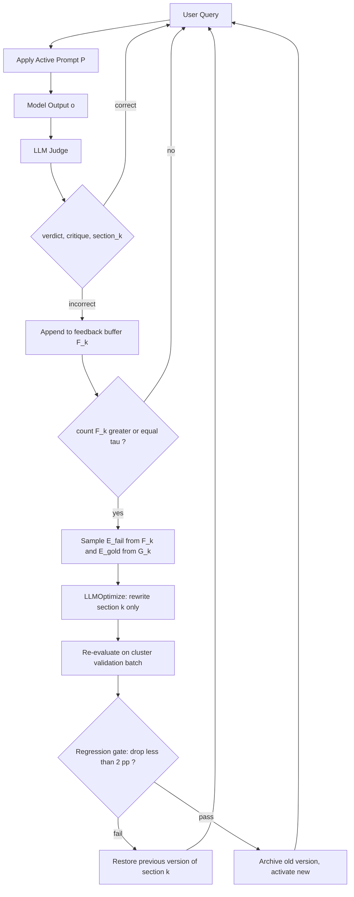
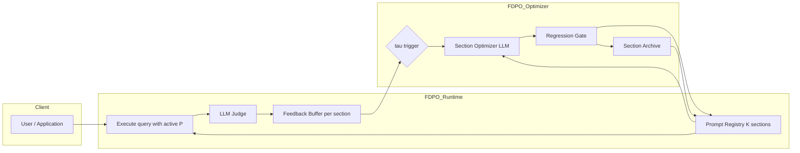
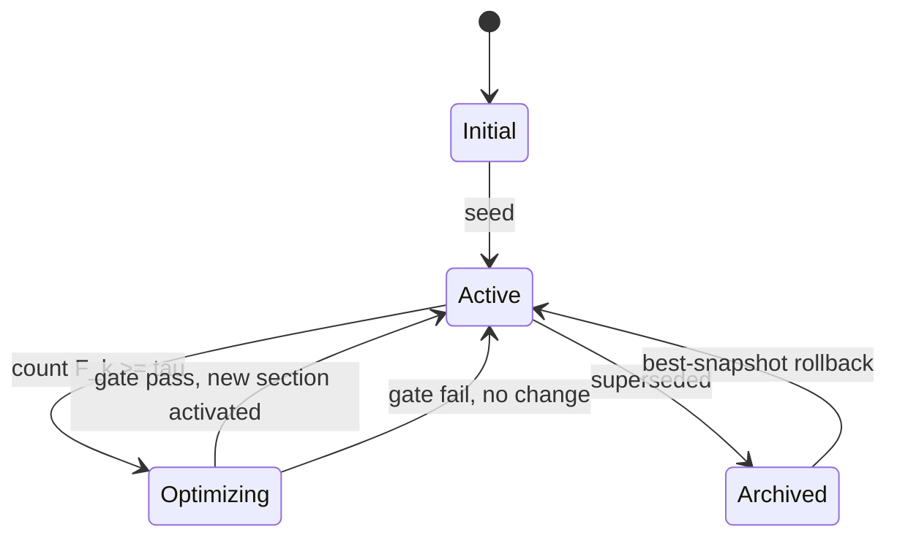
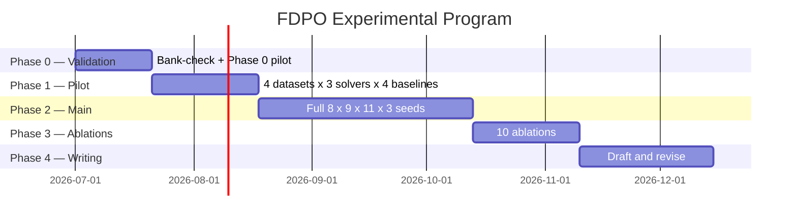

# FDPO: Feedback-Driven Modular Prompt Optimization with Per-Section Regression Control

**Research Proposal — Pre-experiment Discussion**
**Author:** [Author]
**Date:** June 2026
**Status:** Pre-experiment design draft

---

## Abstract

Manual prompt engineering produces fragile, opaque artifacts that degrade
silently when underlying data distributions or task requirements shift.
Automatic prompt optimization (APO) addresses this in principle, but every
published method treats the prompt as a monolithic block of text or, when it
does decompose the prompt, optimizes each component without a mechanism to
prevent regression. The two most recent attempts — MPO (Sharma & Henley, Jan
2026) and aPSF (Liu et al., Apr 2026) — establish the value of section-local
optimization but lack any rollback discipline; Trace2Policy (SF Express, Jun
2026) introduces a strong regression gate but operates on a flat rule
document, not a sectioned prompt.

We propose **FDPO** — *Feedback-Driven Modular Prompt Optimization* — a method
that (i) treats the prompt as a structured object of K semantic sections, (ii)
uses an LLM-as-judge to assign each failure to a specific responsible section,
(iii) accumulates feedback per section until a threshold τ is reached, (iv)
rewrites only the implicated section using LLM-driven optimization conditioned
on failure and gold examples, and (v) applies a per-section regression gate
with best-snapshot rollback before committing the update. A preliminary toy
experiment on a 20-image bank-check field-extraction task shows substantial
qualitative improvement after the first feedback round. We propose a full
experimental program across 8 public benchmarks, 9 solver models, and 11
baselines — including direct head-to-head comparison against MPO, aPSF, and
Trace2Policy — with 10 planned ablations covering the regression gate, the
judge-routing mechanism, the schema choice, and online vs offline operation.

---

## Table of Contents

1. [Motivation](#1-motivation)
2. [Background and Related Work](#2-background-and-related-work)
3. [The FDPO Algorithm](#3-the-fdpo-algorithm)
4. [System Architecture](#4-system-architecture)
5. [Experimental Design](#5-experimental-design)
6. [Projected Results](#6-projected-results)
7. [Preliminary Result: Bank-Check Case Study](#7-preliminary-result-bank-check-case-study)
8. [Compute Scenarios](#8-compute-scenarios)
9. [Risks and Mitigations](#9-risks-and-mitigations)
10. [Timeline](#10-timeline)

---

## 1. Motivation

### 1.1 The problem

Production LLM applications depend on **manually crafted prompts** for every
task. These prompts are:

- **Fragile**: small input distribution shifts produce silent degradation.
- **Opaque**: when accuracy drops, there is no principled way to identify
  *which part* of the prompt is responsible.
- **Brittle to update**: any rewrite intended to fix one failure mode often
  introduces new failures (the "whack-a-mole" effect, formally documented by
  Trace2Policy's R5 crash: 90% → 70% accuracy after a single rule edit).

### 1.2 Why existing APO methods are not enough

| Method family | Limitation |
|---|---|
| Monolithic rewriters (APE, OPRO, ProTeGi, TextGrad, PromptWizard) | Optimize the full prompt as a single text block; localized failures trigger global rewrites; no failure attribution. |
| Modular optimizers (SAMMO, MPO, aPSF) | Optimize per-section, but **no regression gate**. Section updates are committed blindly and can break previously-correct cases. |
| Regression-safe iterative methods (Trace2Policy / EISR) | Strong regression gate and rollback, but operate on a flat rule list — no semantic section decomposition. |
| Human-feedback methods (PLHF, APOHF, GATE) | Require explicit human ratings or pairwise preferences; not scalable; offline only. |

### 1.3 What FDPO contributes

FDPO is the first method to combine, in a single mechanism:

1. **Configurable per-section schema** — fixed (MPO-style), auto-discovered
   (aPSF-style), or task-specific.
2. **Judge-routed section attribution** — every failure receives a structured
   `(verdict, critique, responsible_section)` annotation from an LLM judge.
3. **Per-section regression gate with rollback** — a section update is
   committed only if it does not break previously-correct cases for *that
   section's failure cluster*.
4. **Online τ-triggered operation** — optimization runs continuously during
   deployment, triggered when accumulated feedback per section crosses a
   threshold.

### 1.4 Why this is the right time

Three June-2026 papers (Trace2Policy, MPO, aPSF) independently arrived at
**parts** of this design but none combined them. The synthesis is timely and
defensible.

---

## 2. Background and Related Work

A compact summary follows; the comprehensive treatment is in
[literature_survey.md](literature_survey.md) and the detailed competitor
analysis is in [related_works.md](related_works.md).

### Table 2.1 — Direct competitors at a glance

| Method | arXiv | Section decomposition | Judge-routed attribution | Regression gate | Online | Solver models | Benchmarks |
|---|---|---|---|---|---|---|---|
| MPO (Sharma & Henley, 2026) | [2601.04055](https://arxiv.org/abs/2601.04055) | ✓ fixed 5 | ✗ | ✗ | ✗ | 2 | 2 |
| aPSF (Liu et al., 2026) | [2604.06699](https://arxiv.org/abs/2604.06699) | ✓ auto | partial | ✗ | ✗ | several | several |
| SAMMO (Schnabel & Neville, 2024) | [2404.02319](https://arxiv.org/abs/2404.02319) | ✓ tags | ✗ | ✗ | ✗ | several | several |
| Trace2Policy (SF Express, 2026) | [2606.10457](https://arxiv.org/abs/2606.10457) | ✗ flat rules | ✗ | **✓ whole-doc** | partial | 6 | 5 |
| PromptWizard (Microsoft, 2024) | [2405.18369](https://arxiv.org/abs/2405.18369) | ✗ | ✗ | ✗ | ✗ | several | 45 |
| ProTeGi (Pryzant et al., 2023) | [2305.03495](https://arxiv.org/abs/2305.03495) | ✗ | ✗ | ✗ | ✗ | 1 | 4 |
| TextGrad (Yuksekgonul et al., 2024) | [2406.07496](https://arxiv.org/abs/2406.07496) | ✗ | ✗ | ✓ graph-node | ✗ | 4 | 6 |
| **FDPO (this proposal)** | — | **✓ configurable** | **✓** | **✓ per-section** | **✓ τ-trigger** | **9** | **8** |

---

## 3. The FDPO Algorithm

### 3.1 Conceptual overview

A prompt $P$ is represented as an ordered collection of $K$ sections:

$$
P = \{s^{(1)}, s^{(2)}, \ldots, s^{(K)}\}
$$

Default schema (MPO-aligned, configurable):

| $k$ | Section | Purpose |
|---|---|---|
| 1 | System Role | Persona, identity, authority cues |
| 2 | Context | Background and grounding facts |
| 3 | Task Details | Specification of the work to be done |
| 4 | Constraints | Rules, restrictions, forbidden patterns |
| 5 | Output Format | Schema, structure, formatting rules |

Each section maintains its own **registry**: an active version, an archive of
prior versions, and a feedback buffer $F^{(k)}$. Optimization is triggered
independently per section when $|F^{(k)}| \geq \tau$.

### 3.2 Mermaid — runtime loop



### 3.3 Pseudocode — Algorithm 1

```
Algorithm 1: FDPO — Feedback-Driven Modular Prompt Optimization

Input :
    P  = (s^(1), ..., s^(K))             # active prompt sections
    F  = (F^(1), ..., F^(K))             # per-section feedback buffers
    G  = (G^(1), ..., G^(K))             # per-section gold-example pools
    J                                    # LLM-as-judge model
    O_opt                                # optimizer LLM
    tau                                  # feedback threshold
    rho                                  # regression gate threshold (e.g., 0.02)
    K_arch                               # archive depth per section

Output:
    P*                                   # updated prompt
    H                                    # per-section history

For each incoming (query x, output o):
    (v, c, k) <- J(x, o, P, reference)            # judge: verdict, critique, section
    If v == "incorrect":
        F^(k) <- F^(k) ∪ {(x, o, c)}

For each section k in {1..K}:
    If |F^(k)| >= tau:
        E_fail <- SampleFailureExamples(F^(k), n_fail)
        E_gold <- SampleGoldExamples(G^(k),   n_gold)
        s_new <- LLMOptimize(O_opt, s^(k), E_fail, E_gold)

        # Per-section regression gate
        V_batch <- RegressionBatch(k)             # cases this section affects
        acc_old <- Evaluate(P,             V_batch)
        P_test  <- ReplaceSection(P, k, s_new)
        acc_new <- Evaluate(P_test,        V_batch)

        If acc_new < acc_old - rho:
            # Reject the update
            Log(k, "regression_gate_fail", acc_old, acc_new)
        Else:
            ArchivePromptSection(k, s^(k), K_arch)
            ActivatePromptSection(k, s_new)
            Log(k, "committed", acc_old, acc_new)

        # Best-snapshot fallback: restore best version after 3 stagnant rounds
        If StagnantRounds(k) >= 3:
            RestoreBestSnapshot(k)

        F^(k) <- {}                              # clear buffer

Return P, H
```

### 3.4 The LLM-as-judge component

The judge replaces both human-feedback collection and gold-label execution.
For each `(query, output, reference)` triple it produces:

```
{
  "verdict":   "correct" | "incorrect",
  "critique":  "<one or two sentences>",
  "section":   1 | 2 | 3 | 4 | 5 | "multiple" | "none",
  "error_type": "MISSING" | "WRONG" | "CONFLICT"   (borrowed from EISR)
}
```

Section attribution is the **novel** element. The judge's prompt asks it
explicitly: *"Which section of the prompt (System Role / Context / Task /
Constraints / Output Format) is most responsible for this failure? If
multiple are responsible, return 'multiple'. If none, return 'none'."*

For `"multiple"` attributions, FDPO can be configured to:
- (M1) replicate the feedback across all named sections,
- (M2) route to the section judged "dominant" by a follow-up call,
- (M3) hold the feedback in a shared buffer until either resolves.

This is one of the planned ablations.

### 3.5 Generalization — the "section" abstraction

The algorithm is agnostic to what a section means:

| Instantiation | "Section" =                                  | Use case |
|---|---|---|
| **Per-section** (default, MPO-aligned) | Semantic block (Role/Context/Task/...) | Reasoning, classification, QA |
| **Per-field** | Output slot (e.g., `payee_name`, `amount`) | Structured extraction (bank checks) |
| **Per-module** | A module in a pipeline (`Retrieve`, `Rerank`) | RAG, agentic workflows |
| **Per-task** | Whole prompt for one task in a benchmark | Cross-benchmark evaluation |

The bank-check toy result uses *per-field*; the public-benchmark experiments
will use *per-section*.

---

## 4. System Architecture

### 4.1 Mermaid — full pipeline



### 4.2 Mermaid — per-section registry state machine



### 4.3 Components and responsibilities

| Component | Inputs | Outputs | Model |
|---|---|---|---|
| Execute | query, active P | model output | Solver (under test) |
| LLM Judge | query, output, reference | verdict, critique, section, error_type | Strong LLM (GPT-4o / Claude Sonnet) |
| Feedback Buffer | judge annotations | per-section feedback set $F^{(k)}$ | — |
| Section Optimizer | $s^{(k)}$, $E_{\text{fail}}$, $E_{\text{gold}}$ | $s^{(k)}_{\text{new}}$ | Strong LLM (GPT-4o / Claude Sonnet) |
| Regression Gate | $P_{\text{old}}$, $P_{\text{new}}$, $V_{\text{batch}}$ | commit / reject | Solver (under test) |
| Section Archive | committed versions, drop events | restored snapshot | — |

---

## 5. Experimental Design

### 5.1 Datasets — 8 benchmarks covering reasoning, code, classification, extraction

| ID | Dataset | Domain | Train / Test | Metric | Why included |
|---|---|---|---|---|---|
| D1 | **GSM8K** | Math reasoning | 7,473 / 1,319 | Exact Match | APO gold standard; missing from MPO |
| D2 | **BBH** (6 subtasks: Geometry, Causal, Penguins, Object-Counting, Epistemic, Temporal) | Mixed reasoning | ~250 / 250 per task | Accuracy | Stresses Task and Constraints sections |
| D3 | **ARC-Challenge** | Multi-choice science | 1,119 / 1,172 | Exact Match | Head-to-head with MPO |
| D4 | **MMLU** (subset of 6 subjects) | Knowledge | ~3,000 / 1,400 | Accuracy | Head-to-head with MPO |
| D5 | **HumanEval** | Code generation | 0 / 164 | Pass@1 | Stresses Output Format and Constraints |
| D6 | **HotPotQA** | Multi-hop QA | 500 / 200 | EM + F1 | Stresses Context section |
| D7 | **LegalBench** (definition_classification + hearsay) | Legal reasoning | ~500 / 200 | Accuracy | Head-to-head with Trace2Policy |
| D8 | **Bank-check field extraction** (in-house) | Structured extraction | 20 + collected | Field-level accuracy | Production realism; uses *per-field* instantiation |

### 5.2 Models — solver, optimizer, judge

#### 5.2.1 Solver models (the model being prompted)

| Tier | Model | Size | Why |
|---|---|---|---|
| Open small | Llama-3-8B-Instruct | 8B | Matches MPO |
| Open small | Mistral-7B-Instruct | 7B | Matches MPO |
| Open small | Qwen3-8B-Instruct | 8B | Strong recent open model |
| Open large | Llama-3-70B-Instruct | 70B | Tests scaling |
| Open large | Qwen3-32B-Instruct | 32B | Tests scaling |
| Closed | GPT-4o-mini | — | MIPROv2 default |
| Closed | GPT-4o | — | Frontier |
| Closed | Claude-3.5-Sonnet | — | Strong reasoner |
| Closed | Gemini 2.5 Flash | — | Matches APEX |

#### 5.2.2 Optimizer and judge models

| Role | Model | Rationale |
|---|---|---|
| Optimizer LLM (rewrites sections) | GPT-4o **or** Claude-3.5-Sonnet | Dual-LLM discipline; optimizer ≠ solver |
| LLM Judge (binary + critique + section) | GPT-4o **or** Claude-3.5-Sonnet | Same model class as optimizer; ablate independently |
| Stronger-judge ablation | Llama-3-70B-Instruct | Tests open-model judge feasibility |

### 5.3 Baselines — 11 methods

| # | Baseline | Why |
|---|---|---|
| B1 | Manual / zero-shot CoT | Cheapest mandatory baseline |
| B2 | Few-shot CoT | Standard reference |
| B3 | APE (Zhou et al., 2022) | Foundational APO |
| B4 | ProTeGi (Pryzant et al., 2023) | Closest mechanism ancestor |
| B5 | TextGrad (Yuksekgonul et al., 2024) | MPO's only baseline; gradient family |
| B6 | OPRO (Yang et al., 2023) | LLM-as-optimizer family |
| B7 | PromptWizard (Microsoft, 2024) | Iterative refinement SOTA |
| B8 | MPO (Sharma & Henley, 2026) | **Direct modular competitor** |
| B9 | aPSF (Liu et al., 2026) | **Direct auto-discovery competitor** |
| B10 | Trace2Policy / Auto-EISR (SF Express, 2026) | **Direct regression-gate competitor** |
| B11 | APEX (Wang et al., 2026) | Data-aware comparison |

### 5.4 Metrics

#### 5.4.1 Primary metrics

| Metric | Definition | Reported how |
|---|---|---|
| Accuracy / EM / F1 / Pass@1 | Standard per dataset | Mean ± std over 3 seeds; bootstrap 95% CI |
| Pareto front (accuracy × cost) | Accuracy vs. tokens consumed | Curve per method |

#### 5.4.2 Novel metrics introduced by FDPO

| Metric | Definition | Why it matters |
|---|---|---|
| **Regression rate** | % of previously-correct cases broken by an update, per round | Trace2Policy gate threshold = 2%; tracks the failure mode MPO ignores |
| **Section-attribution accuracy** | When the judge says "section $k$ is broken," does fixing only $k$ recover the failure (vs. fixing any random section)? | Validates the judge-routing mechanism; **no prior method reports this** |
| **Time-to-stabilization** | Number of optimization rounds until $\Delta\text{accuracy} < \epsilon$ for 3 consecutive rounds | Operational metric for production |
| **Cost per accuracy point** | Optimizer + judge tokens consumed per percentage-point of accuracy gained | Fair comparison to MIPROv2's three tiers (light/medium/heavy) |

#### 5.4.3 Reporting discipline

- **3 random seeds**, mean ± standard deviation.
- **McNemar's paired test** vs. each baseline for every "FDPO > baseline" claim.
- **Bootstrap 95% CIs** on all main accuracy numbers.
- **Cost line-items** per experiment: API \$, tokens, wall-clock.

### 5.5 Planned ablations

| # | Ablation | Tests | Closes which MPO drawback |
|---|---|---|---|
| A1 | Modular FDPO vs. monolithic FDPO (single-block rewrite) | Whether section decomposition helps | — |
| A2 | With/without judge-routed section attribution | The novel mechanism | MPO D2 |
| A3 | With/without per-section regression gate | Operational core | MPO D1 |
| A4 | With/without failure examples fed to optimizer | Validates failure-driven signal | MPO D3 |
| A5 | Fixed 5-section schema vs. auto-discovered (aPSF-style) | Schema choice | MPO D4 |
| A6 | With/without de-duplication step | MPO's claim | MPO D11 |
| A7 | Different judge models (GPT-4o / Claude Sonnet / Llama-3-70B) | Judge sensitivity | MPO D10 |
| A8 | Threshold $\tau \in \{5, 10, 25, 50, 100\}$ | Sensitivity to trigger frequency | — |
| A9 | Regression-gate threshold $\rho \in \{0.01, 0.02, 0.05, 0.10\}$ | Gate sensitivity | Trace2Policy fixed at 0.02 |
| A10 | Online τ-trigger vs. offline batch | Online vs. offline | MPO D12 |
| A11 | LLM-judge feedback vs. gold-label feedback (head-to-head) | Validates the self-supervised path | — |

---

## 6. Projected Results

All numbers below are **projected ranges**, not measured. They are calibrated
against published numbers from each baseline and a conservative additivity
estimate: FDPO is expected to add 1–4 pp over MPO from the section-attribution
mechanism, 1–2 pp from the regression gate (by avoiding rounds that would
have hurt), and another 1–2 pp from failure-example conditioning.

### 6.1 Projected accuracy by dataset (vs. zero-shot CoT)

| Dataset | Zero-shot CoT | Best published baseline | **FDPO (projected)** | Expected Δ over CoT |
|---|---|---|---|---|
| GSM8K (D1) | ~75% (GPT-4o-mini) | OPRO 83% | 84–88% | +9 to +13 pp |
| BBH avg (D2) | ~62% (GPT-4o-mini) | GEPA 71% | 69–74% | +7 to +12 pp |
| ARC-Challenge (D3) | ~75% (Llama-3-8B) | MPO 79.1% | 79–82% | +4 to +7 pp |
| MMLU (D4) | ~57% (Llama-3-8B) | MPO 61.5% | 62–65% | +5 to +8 pp |
| HumanEval (D5) | ~65% (GPT-4o-mini) | TextGrad 71% | 70–75% | +5 to +10 pp |
| HotPotQA (D6) | ~38 EM (GPT-4o-mini) | MIPROv2 47 EM | 45–50 EM | +7 to +12 pp |
| LegalBench hearsay (D7) | ~74% (Opus 4.6) | Trace2Policy v_EISR 90% | 86–92% | +12 to +18 pp |
| Bank-check (D8) | qualitative-only baseline | — | TBD | TBD (preliminary positive) |

### 6.2 Projected gain over MPO and Trace2Policy directly

| Comparison | Expected Δ |
|---|---|
| FDPO − MPO (on MPO's reported benchmarks: ARC + MMLU) | +1 to +3 pp |
| FDPO − aPSF (on overlapping reasoning benchmarks) | +1 to +3 pp |
| FDPO − Trace2Policy (on LegalBench hearsay) | −1 to +2 pp (parity expected; FDPO's strength is on tasks with rich semantic structure, not flat rule lists) |

### 6.3 Projected ablation effect sizes

| Ablation | Expected effect on accuracy |
|---|---|
| Remove section attribution (A2) | −2 to −4 pp |
| Remove regression gate (A3) | −1 to −3 pp over long runs; +/−0 short runs |
| Remove failure examples (A4) | −3 to −5 pp |
| Auto-discovered schema (A5) | 0 to +1 pp, but ~50% token savings |
| Threshold τ too small (5 examples) | unstable; ±3 pp variance |
| Threshold τ too large (100 examples) | slow convergence; no upper-bound penalty |

---

## 7. Preliminary Result: Bank-Check Case Study

### 7.1 Setup

- **Task:** field-level extraction from bank-check images (payee name, amount,
  date, account number, signature presence). Per-field instantiation of FDPO.
- **Data:** 20 manually-labeled bank-check images.
- **Solver:** GPT-4o-mini (vision).
- **Judge:** GPT-4o-mini (text only, given extracted fields vs. reference).
- **Initial prompts:** hand-crafted, one per field.

### 7.2 Observed behavior

After a single round of feedback collection and per-field rewrite:

- Qualitative improvement on previously-failing checks (visible to inspection).
- The per-field rewrites localized to the failing field; other fields'
  prompts were not modified — matching the design intent.
- No regression observed on previously-correct checks (small $n$; not a
  statistical claim).

### 7.3 What this preliminary result shows and does not show

| Shows | Does NOT show |
|---|---|
| The mechanism *runs end-to-end* in a real extraction setting | Statistical significance ($n = 20$) |
| Per-field isolation works in practice | Generalization to public benchmarks |
| Hand-crafted prompts have room to improve from feedback | Comparison against MPO / aPSF / Trace2Policy |

### 7.4 Role in the full proposal

The bank-check result is the *existence proof* that the mechanism is
implementable, not the *evidence* that it works at scale. The 8-benchmark
experimental program is what establishes the latter.

---

## 8. Compute Scenarios

Three tiered budgets are presented; the choice depends on resource
availability. All assume the standard reporting discipline (3 seeds, 8
datasets, 9 solvers, 11 baselines, 10 ablations).

### 8.1 Compute tiers

| Tier | Solver models | Judge / Optimizer | Cost estimate (full experimental program) | GPU |
|---|---|---|---|---|
| **Tier A (low)** | Open small only (Llama-3-8B, Mistral-7B, Qwen3-8B) | Gemini Flash + Llama-3-70B | $200 – $400 | 1 × A100 |
| **Tier B (mid)** | Tier A + GPT-4o-mini + Gemini 2.5 Flash | GPT-4o + Claude Sonnet | $1,000 – $2,000 | 2 × A100 |
| **Tier C (high)** | All 9 solvers | GPT-4o + Claude Sonnet (with retries) | $3,000 – $6,000 | HPC access |

### 8.2 Cost decomposition (Tier B, mid)

| Item | Estimate |
|---|---|
| 8 datasets × 9 solvers × 11 baselines × 3 seeds, ~200 evaluation calls each | ~475K API calls |
| Optimizer calls (per round, per section, average 5 rounds × 5 sections) | ~25 calls per run |
| Judge calls (per query during optimization) | ~75 calls per run |
| Total optimizer + judge tokens | ~80M tokens |
| GPT-4o-mini @ \$0.15/M input + \$0.60/M output | ~\$30 input + \$120 output ≈ **\$150** |
| GPT-4o @ \$2.50/M input + \$10/M output (for strong optimizer/judge) | ~\$300 + \$1200 ≈ **\$1500** |
| Open-model inference (Llama-3-70B, Qwen3-32B) on A100 | ~80 GPU-hours = ~\$200 (if rented) |
| **Total Tier B** | **\~\$1,800** |

### 8.3 Phased budget — start small

| Phase | Scope | Cost | Purpose |
|---|---|---|---|
| Phase 0 (now) | Bank-check toy + GSM8K + ARC on 2 solvers | <\$50 | Validate mechanism end-to-end |
| Phase 1 | 4 datasets × 3 solvers × 4 baselines, 1 seed | \~\$200 | Pilot; pick best baseline configurations |
| Phase 2 | Full 8 × 9 × 11 × 3 seeds | \~\$1,800 | Headline numbers |
| Phase 3 | All 10 ablations | \~\$600 | Defensive depth |
| **Total** | | **\~\$2,650** | |

---

## 9. Risks and Mitigations

| # | Risk | Likelihood | Impact | Mitigation |
|---|---|---|---|---|
| R1 | LLM-judge has systematic bias (e.g., verbosity preference) | High | High | Validate judge against 100–200 human annotations; require Cohen's κ ≥ 0.7; ablate with multiple judge models (A7) |
| R2 | Section attribution by judge is unreliable | Medium | High | Ablation A2 isolates this; if attribution is no better than random, FDPO collapses to MPO + regression gate (still a contribution) |
| R3 | Per-section regression gate is too conservative — never commits anything | Low | Medium | Adjust $\rho$ via A9; Trace2Policy reports 2% works; we will sweep 1%, 2%, 5% |
| R4 | Threshold $\tau$ too task-sensitive | Medium | Medium | Ablation A8 sweeps $\tau$; report as hyperparameter |
| R5 | De-duplication erases meaningful section content | Medium | Medium | Ablation A6 isolates this; we can disable de-dup as the default |
| R6 | Compute budget overruns | Medium | High | Phased rollout (Phase 0 → 1 → 2 → 3); cap each phase at its budget; fall back to Tier A if needed |
| R7 | MPO / aPSF / Trace2Policy do not provide reproducible code | Medium | High | All three have either code (Trace2Policy will release upon publication; SAMMO at microsoft/sammo) or sufficiently detailed pseudocode; reimplement faithfully; report any deviations |
| R8 | FDPO underperforms MPO on MPO's benchmarks (ARC + MMLU) | Low | High | Even ties on these would be acceptable given FDPO's much broader scope; the contribution is the *operational regime* (online, regression-safe), not raw accuracy on multi-choice QA |
| R9 | "No free lunch" — section-wise updates conflict over time | Medium | Medium | The regression gate is exactly the mechanism for catching this; ablation A3 proves the point |

---

## 10. Timeline

### 10.1 Mermaid Gantt — proposed phases



### 10.2 Phase-by-phase milestones

| Phase | Milestone | Exit criterion |
|---|---|---|
| Phase 0 | End-to-end FDPO runs on GSM8K + ARC | Mechanism produces non-zero gain on at least one dataset |
| Phase 1 | Best configurations selected for each baseline | Tier B costs validated; no engineering surprises |
| Phase 2 | All 8 × 9 × 11 × 3 numbers reported | Headline accuracy ± std for every cell |
| Phase 3 | All 10 ablations reported | Section-attribution accuracy > random; regression-gate effect ≥ 1 pp over long runs |
| Phase 4 | Submission-ready draft | Internal review by professor |

---

## 11. Discussion Points for the Professor

Open questions for the meeting:

1. **Schema choice for the main experiments** — commit to MPO's fixed 5-section schema, or run both fixed and auto-discovered (aPSF-style) and present as a design space? Recommendation: fixed for headline, auto-discovered as ablation A5.
2. **Target venue** — NLP top-tier (ACL/EMNLP/NAACL), ML top-tier (NeurIPS/ICLR), or COLM (newer, friendly to empirical APO work)?
3. **Compute tier** — start at Tier A (≤\$400) or commit to Tier B (\~\$2,000) up front? Tier A risks under-powered comparisons; Tier B requires buy-in.
4. **Reproducibility of MPO / aPSF / Trace2Policy** — should we reimplement or wait for official code? Risk of misrepresenting baselines if we reimplement.
5. **Bank-check case study** — keep as preliminary motivator, or expand to a full per-field study (would require 200–500 labeled checks)?
6. **Position the contribution as a *method* or a *system*?** The synthesis (modular + judge-routed + regression-gated + online) is methodological; the threshold/registry/rollback is systemic.

---

## Appendix A — Glossary

| Term | Meaning |
|---|---|
| Section ($s^{(k)}$) | A semantic block of the prompt (Role, Context, Task, Constraints, Output Format) |
| $K$ | Number of sections in the active schema |
| Feedback buffer ($F^{(k)}$) | Accumulated failure annotations attributed to section $k$ |
| Threshold ($\tau$) | Number of accumulated failures before triggering optimization |
| Regression gate ($\rho$) | Max accuracy drop tolerated before rejecting a section update |
| Judge | LLM that produces (verdict, critique, responsible section) for each output |
| Section attribution | The judge's identification of *which* section caused a failure |
| Best snapshot | The highest-accuracy version of a section across its history |
| Archive | Per-section storage of prior versions (depth $K_{\text{arch}}$) |

---

## Appendix B — Companion Documents

- [literature_survey.md](literature_survey.md) — comprehensive 30+ method academic survey
- [related_works.md](related_works.md) — short, table-heavy quick reference on direct competitors
- [prompt_optimization_literature_study.md](prompt_optimization_literature_study.md) — original source material

---

*End of proposal.*
