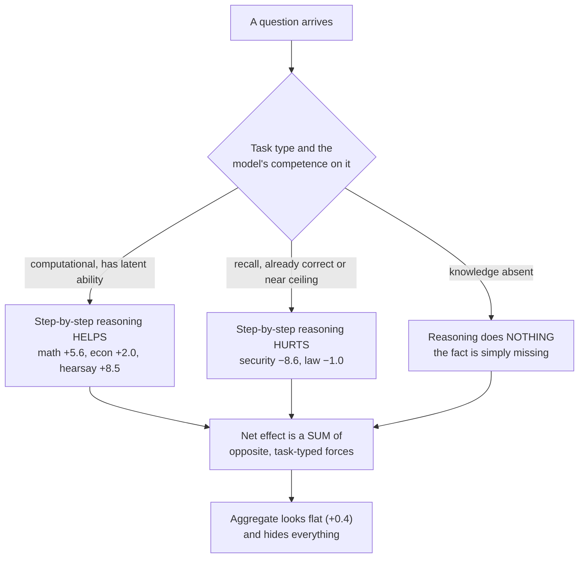
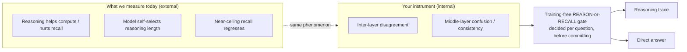
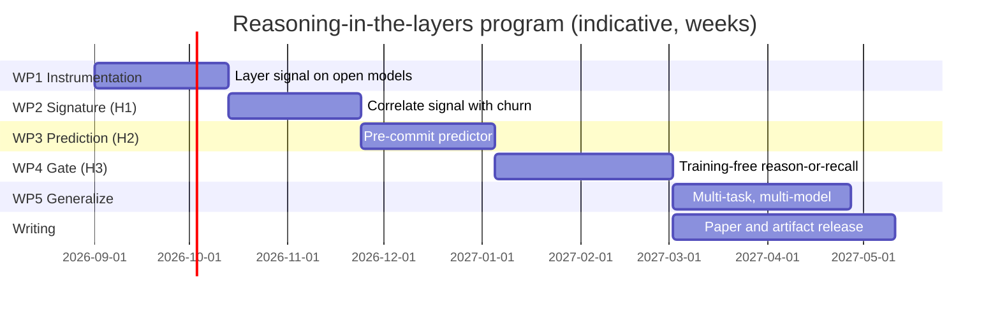

# Reasoning in the Internal Process of LLMs

### When step-by-step reasoning helps, when it hurts, and whether the model's own layers know in advance

**A research pitch** · **Date:** 2026-08-04 · **Status:** working prototype with
reproducible, real-data results on multiple task families; ready to extend to
open-weight models with internal-layer access.

**Prepared for:** Prof. K. P. Subbalakshmi (Suba), Dept. of E.C.E., Stevens
Institute of Technology — *InfinityLab / Trustworthy Machine Learning*.

---

> **The one-paragraph pitch.** Step-by-step reasoning is treated as a universal
> good — "let's think step by step" is bolted onto every prompt. Our experiments
> show it is **not** universal: the *same* switch from direct-answer to
> chain-of-thought (CoT) **helps computational tasks and hurts factual-recall
> tasks**, because a smaller model forced to reason **talks itself out of answers
> it already recalled correctly**. We can measure this reliably from the
> *outside* (accuracy, output length, per-item churn). What we cannot yet see is
> the *inside*: the internal-layer signature of a model over-reasoning itself into
> a wrong answer. Your **CoCoA** work shows that factuality has exactly such an
> internal signature — **inter-layer disagreement** in the middle layers. We
> propose to unify the two: **read the model's internal layers to predict, per
> question, whether step-by-step reasoning will help or hurt — and gate it,
> training-free.** This turns a fragile prompt heuristic into a trustworthy,
> model-intrinsic reasoning-control mechanism.

---

## Table of contents

1. [The core problem: reasoning is not free](#1-the-core-problem)
2. [What we have already established (real data)](#2-what-we-have-already-established)
3. [The missing half: an internal process we cannot yet see](#3-the-missing-half)
4. [The bridge to your work: inter-layer disagreement](#4-the-bridge-to-your-work)
5. [Proposed research program](#5-proposed-research-program)
6. [Why this fits InfinityLab / Trustworthy ML](#6-why-this-fits)
7. [What already exists — de-risking the program](#7-what-already-exists)
8. [Milestones and deliverables](#8-milestones-and-deliverables)
9. [The ask](#9-the-ask)
10. [References](#10-references)

---

## 1. The core problem

**Reasoning is not free, and it is not universally good.** The field's default
assumption is that eliciting an explicit reasoning trace ("show your work",
"think step by step") can only help or, at worst, do nothing. Our data
contradicts this directly. On knowledge tasks, forcing a small model to reason
step by step **destroys** accuracy it already had — not by a little, but by up to
**−8.6 percentage points** on a single subject — because the model uses the extra
tokens to **overturn a correct answer it had already recalled**.

This is a *reasoning-reliability* problem, and it is a *trustworthiness* problem:
the model produces a fluent, confident rationalization that is worse than the
answer it would have given if left alone. It is the reasoning-time analogue of
hallucination — the model is not missing knowledge, it is **destabilizing itself
by reasoning**.

The scientific questions we want to fund:

- **Q1 — Characterization.** *When* does step-by-step reasoning help versus hurt,
  as a function of task type and the model's own competence on the item?
- **Q2 — Mechanism.** Does the "reasoning hurts here / helps there" behavior have
  a measurable **internal-layer signature** — i.e., can the model's intermediate
  representations tell us, *before we commit to an answer*, whether reasoning is
  consolidating toward a consistent answer or destabilizing a correct one?
- **Q3 — Control.** Can that internal signal drive a **training-free "reason or
  answer directly" gate** that captures reasoning's upside where it exists and
  suppresses its downside where it does not?

We already have strong, reproducible answers to **Q1**. **Q2 and Q3** are the
program we are pitching — and they are exactly where your inter-layer methods
provide the missing instrument.

---

## 2. What we have already established

All numbers below are from a working system on real benchmarks. Solver model:
`gpt-4o-mini`; prompt-rewriter: `gpt-4.1`; temperature 0; 3 seeds; held-out test
sets. These are *transferable findings*, not a single lucky run.

### 2.1 Finding 1 — Step-by-step reasoning is a **double dissociation**

The *same* change — from a direct-answer prompt to a chain-of-thought prompt —
**flips the sign of the result depending on the task type**:

| Subject (type) | Direct-answer prompt | Chain-of-thought prompt |
|---|---:|---:|
| college_mathematics (compute) | **−5.3** | **+5.6** |
| econometrics (compute) | **−4.0** | **+2.0** |
| professional_law (recall) | **+9.3** | **−1.0** |
| computer_security (recall, ~92% ceiling) | **+2.0** | **−8.6** |

- **Computational tasks need a scratchpad.** Denying them one starves them
  (math −5.3, econ −4.0); allowing CoT unlocks latent ability (+5.6, +2.0).
- **Recall tasks are *hurt* by CoT.** Elaborate "weigh every option, watch for
  traps, consider exceptions" reasoning makes the model **second-guess answers it
  already had right** (law, security regress).

*Caveat we state up front:* the two columns come from different prompt families
(a shared direct-output prompt vs. per-subject CoT prompts), so there are
confounds; but baselines match, the sign-flip is consistent across all three
seeds, and the prompt text confirms output-format (reason vs. don't) is the
salient driver. Tightening this into a clean, single-variable manipulation is
part of the proposed work (§5).

### 2.2 Finding 2 — Models **self-select** reasoning, and forcing it overrides a good instinct

Given the *same* neutral prompt, the baseline output length varies enormously by
subject — the model is *choosing* how much to reason:

| Subject | Baseline output (tokens) | Interpretation |
|---|---:|---|
| mathematics | **434** | reasons spontaneously — it cannot help it |
| econometrics | 38 | some working |
| philosophy / biology / law / security | 4–12 | answers directly |

The model already has a *good instinct* about when to reason. Forcing uniform CoT
**overrides that instinct** — and overriding it is precisely what breaks the
recall subjects. This is the behavioral hint that the decision "to reason or not"
is **already latent inside the model** before it emits a token.

### 2.3 Finding 3 — Near-ceiling recall tasks are **downside-only** (self-inflicted regression)

`computer_security` at a 92% baseline (61/66 correct), per-item churn across all
three seeds:

| Seed | Recovered (wrong→right) | Regressed (right→wrong) |
|---|---:|---:|
| 0 | **0** | 5 |
| 1 | **0** | 4 |
| 2 | **0** | 8 |

Forcing reasoning **fixed zero** hard questions (the same 5 stay wrong every seed
— they need *knowledge*, not reasoning) and **broke 4–8** previously-correct ones.
The arithmetic is unforgiving: `0 gained − (4…8) lost = net loss`. **The model
reasons itself out of answers it already had.** This is the cleanest behavioral
instance of the internal instability we want to catch at its source.

### 2.4 Finding 4 — Where reasoning genuinely helps, it helps a lot and reproducibly

When there is real headroom *and* the task is reasoning-amenable, eliciting
step-by-step reasoning delivers large, stable gains:

| Task | Baseline | With elicited reasoning | Δ | Reproducibility |
|---|---:|---:|---:|---|
| LegalBench-hearsay (rule application) | 62.7 | **71.2** | **+8.5** | 3/3 seeds, **0.0 pp** spread |
| college_mathematics (compute) | 76.8 | **82.3** | **+5.6** | 3/3 seeds positive |
| philosophy (reasoning) | 77.3 | **81.3** | **+4.0** | 3/3 seeds positive |
| econometrics (compute) | 66.7 | 68.7 | +2.0 | 2/3 seeds positive |

The hearsay result is the headline **zero-variance** win: a vague one-liner
rewritten into a structured, reasoning-eliciting prompt lifts accuracy **+8.5 pp
on every seed with no run-to-run spread**.

### 2.5 Finding 5 — The net aggregate is *flat*, and that is the whole point

Averaged across six MMLU subjects, the reasoning gains and the reasoning losses
**cancel**:

| Subject (regime) | Baseline | Final | Δ |
|---|---:|---:|---:|
| college_mathematics (helps) | 76.8 | 82.3 | **+5.6** |
| philosophy (helps) | 77.3 | 81.3 | **+4.0** |
| econometrics (helps) | 66.7 | 68.7 | +2.0 |
| high_school_biology (ceiling) | 87.9 | 88.4 | +0.5 |
| professional_law (recall) | 53.0 | 52.0 | −1.0 |
| computer_security (near-ceiling recall) | 92.4 | 83.8 | **−8.6** |
| **MACRO-AVERAGE** | **75.7** | **76.1** | **+0.4** |

A paper that reported only "+0.4, roughly flat" would **miss the entire story**.
The flatness is a *sum of large, opposite, task-typed effects*. **The
contribution is not a leaderboard number — it is the law that governs the sign of
the effect**, and (proposed) the internal signal that predicts it.

### 2.6 A clean summary of the behavioral law

---

## 3. The missing half

Everything in §2 is measured **from the outside** — accuracy deltas, output
length, per-item recover/regress churn. These are *symptoms*. The **cause** is an
internal process: when the model is forced to reason over a fact it had already
recalled, something inside it **destabilizes** — it revisits, re-weighs, and
overturns a representation that was, at some layer, already correct.

We cannot currently see that. Our instrument stops at the output. And that is a
real limitation for three reasons:

1. **We can only diagnose reasoning failures *after* they cost accuracy.** By the
   time we see the regression, the tokens are already emitted.
2. **Our safety mechanism is coarse.** Today we gate reasoning with a held-out
   *validation set* — and a small, noisy validation slice can be
   **unrepresentative**: on `computer_security` the true baseline was 92.4% but a
   17-item validation draw read as low as **66.7%**, so the gate happily shipped a
   prompt that then regressed the real test by **−6 to −12 pp** on every seed.
   A behavioral gate is only as good as the sample it sees.
3. **We treat "reason vs. don't" as a *prompt-level* decision** (one policy for
   the whole subject), when Finding 2 says it is really a *per-question* decision
   the model is already making internally.

What we need is an instrument that reads the **internal process** of reasoning —
per question, before we commit — and tells us whether reasoning is consolidating
or destabilizing the answer. That instrument is the core of your recent work.

---

## 4. The bridge to your work

Your paper — **"Listen to the Layers: Mitigating Hallucinations with Inter-Layer
Disagreement"** (Subbalakshmi, Ujjal, Mangichetty, Soofi; arXiv:2602.09486) —
establishes the exact primitive we are missing:

- **Central hypothesis (yours):** a generated span's **factuality correlates with
  its representational instability across the model's internal layers**.
- **CoCoA (Confusion- and Consistency-Aware) decoder:** a **training-free**
  decoding method that quantifies middle-layer instability with two intrinsic
  metrics and **penalizes high internal confusion**, steering the model toward
  internally consistent, factually grounded outputs.
- **CoCoA-SIG:** a self-information-gated variant that *dynamically* targets
  high-surprise, unstable generations.
- **Breadth:** validated across QA, summarization, **mathematical reasoning**, and
  code generation, on **Llama-3, Qwen-2.5, and Mistral** — model-intrinsic, no
  retraining.

Our behavioral finding and your internal signal are, we believe, **two views of
the same phenomenon**:

| Our external observation | Your internal quantity |
|---|---|
| Forced reasoning makes the model **second-guess a correct recall** | Rising **inter-layer disagreement / internal confusion** in the middle layers |
| The model **self-selects** how much to reason (Finding 2) | An intrinsic, layer-resolved "confidence/consistency" state present before decoding |
| Reasoning **helps** computational items | Reasoning trace **reduces** instability — layers converge toward a consistent answer |
| Reasoning **hurts** recall items | Reasoning trace **raises** instability — layers diverge, a stable answer is overturned |

This yields a concrete, testable unification and a control mechanism built from
your primitive.

---

## 5. Proposed research program

**"Reading reasoning from the layers: an intrinsic signal for when to think step
by step."**

### 5.1 Hypotheses

- **H1 (signature).** The behavioral double dissociation (§2.1) has an
  internal-layer signature: over a forced reasoning trace, **inter-layer
  disagreement decreases on items where reasoning helps and increases on items
  where reasoning hurts.**
- **H2 (prediction).** The internal signal, measured on the **prompt / early
  tokens alone**, predicts per item whether reasoning will help or hurt —
  outperforming any purely behavioral or task-label heuristic.
- **H3 (control).** A **training-free gate** that routes each question to
  "reason" vs. "answer directly" based on the internal signal **recovers
  reasoning's upside while eliminating its downside** — turning the flat +0.4
  macro (§2.5) into the sum of the *positive* terms only.

### 5.2 Work packages

**WP1 — Instrument the internal process.** Port measurement of inter-layer
disagreement / middle-layer confusion (the CoCoA family of metrics, plus
logit-lens / early-exit next-token distributions and entropy trajectories) onto
open-weight solvers with full hidden-state access (Llama-3, Qwen-2.5, Mistral —
the same families in your study). Log, per item, the layer-resolved signal for
**(a)** direct answering and **(b)** forced step-by-step reasoning.

**WP2 — Test the signature (H1).** On the *same items* we have already
characterized behaviorally (math, econometrics, philosophy, biology,
professional_law, computer_security, hearsay, GSM8K), correlate the internal
signal's trajectory with the recover/regress outcome. Deliver the first
**layer-level account of why reasoning hurts recall** — the mechanistic companion
to the behavioral law.

**WP3 — Predict before committing (H2).** Build a lightweight predictor that
reads the internal signal on the prompt / first few tokens and outputs
`P(reasoning helps this item)`. Compare against strong baselines: task label,
output-length self-selection (Finding 2), and behavioral-validation gating.

**WP4 — The training-free reason-or-recall gate (H3).** Wrap WP3 into an
inference-time controller — intrinsic, no retraining, in the exact spirit of
CoCoA — and evaluate end-to-end. **Target:** convert the +0.4 macro into
≈ **the sum of the positive terms** (math +5.6, philosophy +4.0, econ +2.0,
hearsay +8.5) by **suppressing** the −8.6 / −1.0 regressions the gate now lets
through.

**WP5 — Generalize across tasks and models.** Extend beyond multiple-choice to
the open-ended tasks in your study (QA, summarization, code) and confirm the
signal is model-intrinsic across all three model families, not a single-model
artifact.

### 5.3 Evaluation

| Axis | Plan |
|---|---|
| **Models** | Llama-3, Qwen-2.5, Mistral (open weights, full layer access). |
| **Tasks** | Our existing suite (MMLU per-subject, LegalBench-hearsay, GSM8K) + your open-ended set (QA, summarization, code) for WP5. |
| **Reasoning conditions** | direct-answer · forced CoT · **gated** (ours). |
| **Internal metrics** | inter-layer disagreement / confusion (CoCoA family), logit-lens layer trajectories, entropy/self-information. |
| **Behavioral metrics** | accuracy, per-item recover/regress churn, output length, calibration. |
| **Stats** | ≥3 seeds, mean ± std, paired significance on per-item flips. |

### 5.4 Why open-weight models are essential (not optional)

The entire program requires **reading internal layers** — hidden states,
per-layer logits, attention. Closed commercial APIs (e.g. Azure `gpt-4o-mini`,
which produced our current results) expose **only the output**, plus two
artifacts that confirm the need to move: a content filter that silently blocked
**48 calls (4.8%), all concentrated in professional_law and 0 elsewhere**, and
**~5 pp non-determinism at temperature 0** that makes small held-out gates
unreliable. Open weights remove all three limits **and** are the only way to
obtain the internal signal at the center of this proposal — the same setting your
CoCoA experiments already run in.

---

## 6. Why this fits

- **It is trustworthy-ML in the truest sense.** Over-reasoning that overturns a
  correct recall is a **reliability failure** — a self-inflicted, fluent
  rationalization. Catching it from the model's own internal state is directly in
  the spirit of *trustworthy models from trustworthy internal signals*.
- **It reuses and extends your primitive.** Inter-layer disagreement moves from
  *mitigating hallucination in decoding* (CoCoA) to *governing when a model
  should reason at all* — a new, high-value application of the same idea.
- **It is training-free and model-intrinsic** — the design philosophy of
  CoCoA/CoCoA-SIG — so it inherits the same broad applicability across model
  families with no retraining.
- **The task breadth already matches** (math reasoning, QA, code, classification),
  so the two lines of work compose rather than compete.

---

## 7. What already exists

This is not a from-scratch proposal. A working, reproducible harness de-risks
most of the engineering:

- **A reasoning-eliciting prompt-optimization engine** that turns a vague
  one-liner into a structured, reasoning-eliciting prompt from the model's own
  failures, and **discovers chain-of-thought on its own** on all six MMLU
  subjects with no reasoning instruction in the seed.
- **Full per-item instrumentation.** Every run logs which specific questions
  moved wrong→right (recoveries) and right→wrong (regressions) on train and test
  — this is what produced the per-subject dissociation and the security churn
  table. It is exactly the substrate WP2 needs to correlate with the internal
  signal.
- **A curated multi-task benchmark set already downloaded and wired**: MMLU (6
  subjects), LegalBench-hearsay and contract-NLI, GSM8K, ARC-Challenge — with
  loaders, deterministic splits, and a seed/temperature-controlled runner.
- **Reproducibility discipline**: fixed test sets across seeds, held-out
  measurement, anti-memorization constraints on the optimizer, and a documented
  ~5 pp API noise floor we know how to remove by moving to open weights.
- **The behavioral characterization (§2) is done** — the program starts at WP1
  (instrumentation), not at square one.

Total compute cost of the entire behavioral study to date: **≈ $3** — the
expensive, uncertain part (does this effect even exist and reproduce?) is already
paid down.

---

## 8. Milestones and deliverables

**Concrete deliverables**

1. **An empirical law paper** — *"When does step-by-step reasoning help? A
   task-typed double dissociation"* — publishable on the behavioral results
   alone (§2), strengthened by the internal signature (WP2).
2. **A mechanism result** — the first **layer-level account of reasoning-induced
   regression** ("the model reasons itself out of a correct recall"), built on
   your inter-layer-disagreement primitive.
3. **A method** — a **training-free reason-or-recall gate**, evaluated
   end-to-end, plus an open-source release of the harness and internal-signal
   probes.

---

## 9. The ask

We are seeking support and collaboration to execute WP1–WP5:

- **Compute:** GPU access sufficient to run Llama-3 / Qwen-2.5 / Mistral with
  full hidden-state logging on the task suite above (the internal-signal
  measurement is the compute-dominant step).
- **Student/researcher support** to carry the instrumentation and analysis.
- **Advisory collaboration** on the internal-layer methodology, where your
  CoCoA/CoCoA-SIG work is the foundation and natural point of contact.

In return the program contributes: a fully characterized, reproducible behavioral
law; an existing multi-task harness with per-item instrumentation; and a new,
high-visibility application of inter-layer signals — reasoning control — that
extends your line of work rather than duplicating it.

---

## 10. References

- K. P. Subbalakshmi, S. H. Ujjal, V. K. T. Mangichetty, N. J. Soofi.
  **"Listen to the Layers: Mitigating Hallucinations with Inter-Layer
  Disagreement."** arXiv:2602.09486, 2026. (CoCoA / CoCoA-SIG — training-free,
  inter-layer-disagreement decoding.)
- InfinityLab, Stevens Institute of Technology — Prof. K. P. Subbalakshmi
  (Trustworthy Machine Learning).
- Supporting internal documents (this repository): behavioral synthesis
  (`empirical_findings.md`), per-subject MMLU report (`report_mmlu_cot.md`),
  pilot report and method (`report.md`, `fdpo_mechanism.md`).

---

*All quantitative results in §2 are from executed runs on the datasets named,
solver `gpt-4o-mini`, 3 seeds, held-out test sets. The internal-layer results in
§5 are the proposed work.*
