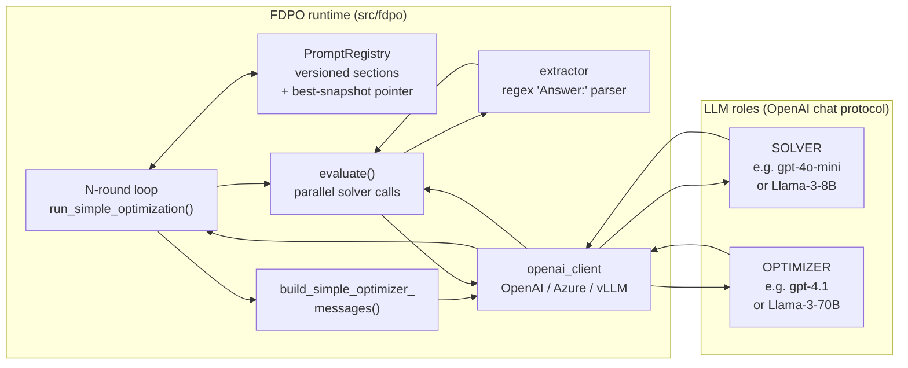
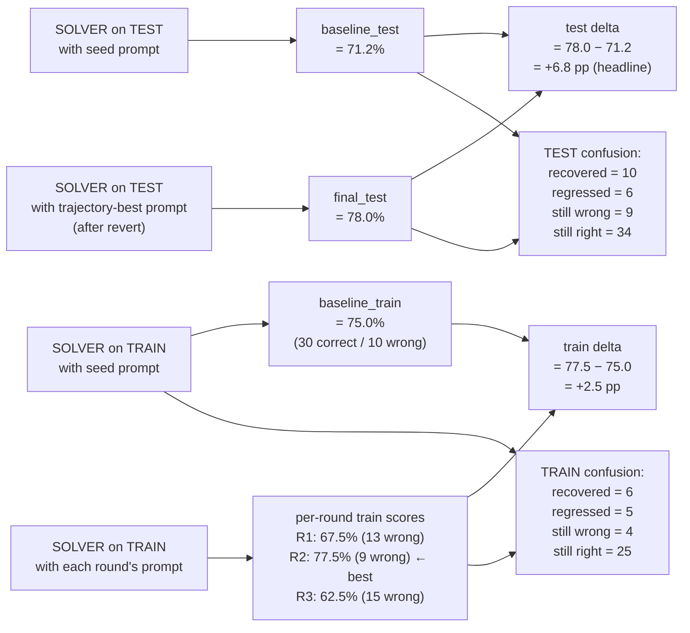

# simple_fdpo — Architecture

**Purpose**: visual, component-level view of how the `simple_fdpo`
method is put together. This complements
[fdpo_mechanism.md](fdpo_mechanism.md), which describes the *process*
(what happens in what order). This document describes the *architecture*
(which components exist and how they talk to each other).

---

## 1. The architecture

Six runtime components talking to two external LLM roles.



The runtime knows nothing about *where* the LLMs live — the `openai_client`
layer resolves that at construction time from `.env`. Swapping Azure for a
local vLLM server is an `.env` change, not a code change.

---

## 2. The six components explained

### 2.1 `PromptRegistry` — the versioned prompt store

- Holds the current prompt as five named sections (System Role, Context,
  Task Details, Constraints, Output Format).
- Every commit creates a new version of each edited section, keeping the
  old version archived. Nothing is deleted.
- Tracks a **trajectory-best pointer**: the version of each section that
  was active when the run scored the best training accuracy so far.
- `restore_best_snapshot()` reverts every section's active pointer to
  its trajectory-best.

State it carries between rounds:
- `active_version[section]` — what the solver currently uses
- `run_best_versions[section]` — the trajectory-best pointer
- `run_best_acc` — the training accuracy of the trajectory-best

### 2.2 `evaluate()` — the parallel solver runner

- Takes a prompt + a batch of examples + a dataset name.
- Calls the SOLVER role for each example in parallel (up to
  `--max-workers`, default 8).
- Each solver response goes through the extractor to pull the answer.
- Returns per-example rows plus an aggregate accuracy.

Called three or more times per run:
- Once on the test batch with the seed prompt (baseline test).
- Once on the train batch with the seed prompt (baseline train).
- Once on the train batch after each committed rewrite (per-round eval).
- Once on the test batch at the end with the trajectory-best prompt
  (final test).

### 2.3 `build_simple_optimizer_messages()` — the optimizer prompt builder

- Takes the current markdown, a list of failure records, a list of
  correctly-solved examples, and the dataset name.
- Constructs a system message with the dataset-specific task description
  substituted in.
- Constructs a user message that lays out the full current prompt, the
  failures, and the correct examples.
- Returns a two-message list ready for the OPTIMIZER role.

### 2.4 The N-round loop — `run_simple_optimization()`

- Owns the trajectory: baseline → round 1 → round 2 → ... → round N.
- For each round: get current failures from the registry's active
  prompt, call the optimizer, parse the returned markdown, commit the
  edit to the registry, re-evaluate on train, update the trajectory-best
  pointer if this round beat it.
- After the last round: call `restore_best_snapshot()` if the currently
  active prompt is not the trajectory-best.

### 2.5 The extractor — `eval/extractor.py`

- Reads a solver response as text.
- Uses per-dataset regex rules to pull out the answer.
- LegalBench-hearsay: match `Answer: (Yes|No)`.
- MMLU / ARC: match `Answer: ([A-D])`.
- GSM8K: match a final integer.
- If no match: the row is scored as wrong, no exception raised. Silent
  failures happen and are counted honestly.

### 2.6 The client layer — `clients/openai_client.py`

- Wraps the `openai` Python SDK.
- Chooses `OpenAI` or `AzureOpenAI` based on whether `api_version` is
  set in the `.env`.
- Retries with exponential backoff on rate limits, timeouts, and
  transient errors.
- Catches Azure `content_filter` `BadRequestError` and returns an empty
  completion (counts as wrong) so one filter hit does not kill the run.
- Tracks tokens and cost through `utils/budget.py`.

---

## 3. One round in detail (sequence diagram)

The exact sequence of calls the runtime makes during a single
optimizer round, in wall-clock order:

```mermaid
sequenceDiagram
    autonumber
    participant Loop as run_simple_optimization()
    participant Reg as PromptRegistry
    participant Eval as evaluate()
    participant Solver as SOLVER role<br/>(gpt-4o-mini or Llama)
    participant Extract as extractor
    participant OptBuild as build_simple_<br/>optimizer_messages()
    participant Opt as OPTIMIZER role<br/>(gpt-4.1 or Llama-70B)
    participant Parse as parse_markdown()

    Loop->>Reg: active_prompt()
    Reg-->>Loop: 5 sections (dict)
    Loop->>OptBuild: build messages(current_md, failures, golds, dataset)
    OptBuild-->>Loop: [system_msg, user_msg]
    Loop->>Opt: complete(messages, temp=0.7, max_tokens=2000)
    Opt-->>Loop: rewritten markdown as text
    Loop->>Parse: parse the markdown
    Parse-->>Loop: new sections dict (or ValueError → skip round)
    Loop->>Reg: prompt_with_edits(changed_sections)
    Reg-->>Loop: candidate prompt (dict)
    Loop->>Eval: evaluate(candidate_prompt, train_batch)
    par per-example parallel calls
        Eval->>Solver: complete(system=prompt, user=question) × 40
        Solver-->>Eval: 40 responses
    end
    Eval->>Extract: parse "Answer: X" from each response
    Extract-->>Eval: per-example predictions
    Eval-->>Loop: EvalResult (accuracy + rows)
    Loop->>Reg: commit_bundle(changed, round=N, gate)
    alt this round beat the trajectory-best
        Loop->>Reg: record_round(passed=True, acc=new_train_acc)
        Note over Reg: trajectory-best pointer<br/>updated to this round
    end
```

Notice what's absent from the diagram: there is no call to the SOLVER
on the **test batch** during a round. Test is only touched at step 0
(baseline) and step N+1 (final), never mid-loop.

---

## 4. Data flow — where every number comes from

The four numbers we report in `metrics.json` per run, and which
component computed each:



**The train delta and test delta are computed independently.** They can
disagree, and when they do, we report both honestly. On seed 0 today:

- Train delta: +2.5 pp (small — R2 fixed 6 items but broke 5)
- Test delta: **+6.8 pp** (larger — R2's abstract reasoning
  scaffolding generalized well)

A big train-test gap in either direction is diagnostic:
- **Train ≫ Test**: the rewrite overfit the training batch. Look at
  `prompt_current.md` for memorized examples.
- **Train ≪ Test**: the rewrite generalized well and the train batch
  happened to have unlucky examples that didn't reflect the broader
  distribution. Seed 0 today is a mild case of this.
- **Train ≈ Test**: healthy — the rewrite generalizes as expected.

---

## 5. What is NOT in this architecture (and why)

Deliberate absences, worth being explicit about:

- **No judge LLM.** v2's per-section attribution mechanism is retired
  for `simple_fdpo`. The optimizer sees all failures together and does
  its own diagnosis. Saves one LLM call per round.
- **No held-out validation slice.** The rescue gates on the same train
  batch the optimizer sees. This is a deliberate simplification —
  carving out a separate validation slice would reduce the train batch
  further, and on n=40 that's expensive.
- **No find/replace edit format.** The optimizer returns full markdown,
  not structured `{section, find, replace}` patches. Simpler, more
  robust to paraphrasing, no silent no-ops when a substring doesn't
  match.
- **No history window shown to the optimizer.** The optimizer sees only
  the current prompt and failures — not "what previous rounds tried
  and how they scored". This is why higher temperature (0.7) matters
  for multi-round: variety comes from decoding, not from context.
- **No test-set access during the loop.** The rescue mechanism only
  looks at the train batch. Test is measured before and after, never
  during.

---

## 6. Two-sentence summary

**`simple_fdpo` is a loop that (a) evaluates a prompt on training
questions, (b) asks a stronger LLM to rewrite the prompt using the
failures as evidence, and (c) keeps the round that produced the fewest
training failures across N tries. The final rewrite is evaluated on a
held-out test set exactly once and that number is reported.**
