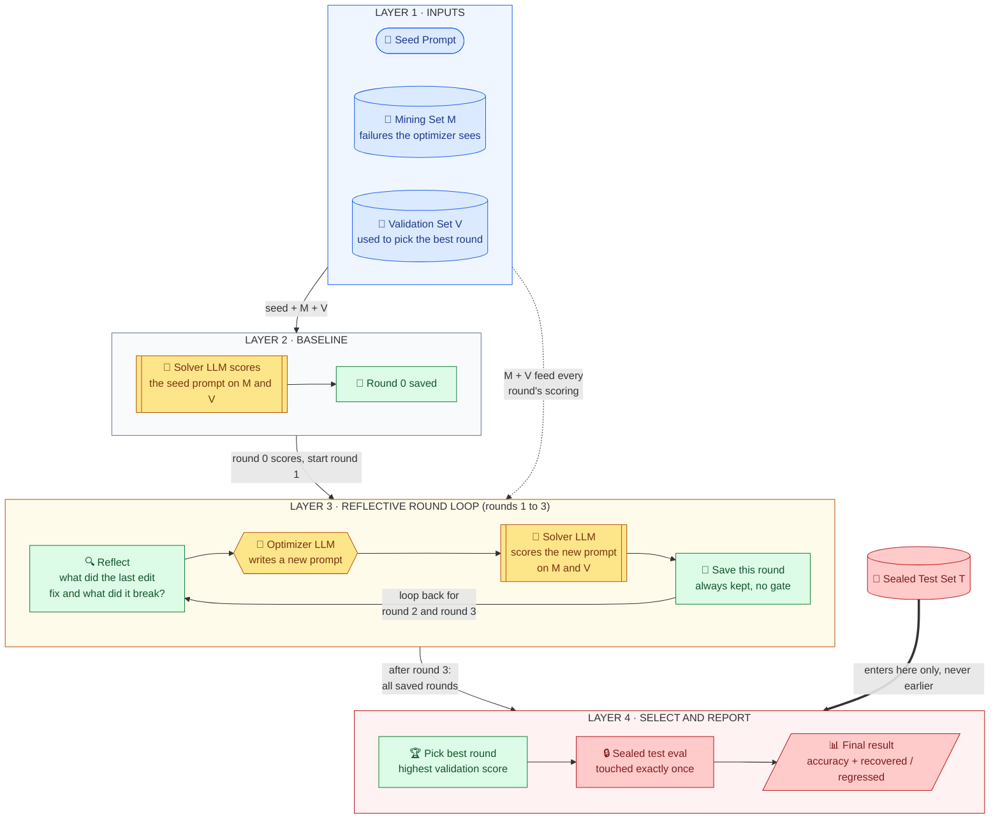

# Reflective FDPO -- Architecture Diagram Spec

Purpose: a blueprint for a hand-drawn (draw.io) figure of Algorithm 1 in
`paper.tex`. This is not the final figure -- it's node/edge/color/layout
instructions plus a quick Mermaid preview so you can see the shape before
redrawing it properly.

---

## Quick preview (renders in VS Code's markdown preview / GitHub)

Four stacked horizontal layers, top to bottom. Each layer is one wide band,
so the whole figure is a wide rectangle that can span a full page width.
Data pools sit in the top layer and are passed down only to the layers that
need them; the sealed Test set bypasses every middle layer and enters only
at the bottom. Layer-to-layer arrows are labeled with what is handed down.
Icons are plain Unicode emoji so they render anywhere; swap for real
icons/logos in draw.io.

**How to read it, top to bottom**: Layer 1 holds the three raw ingredients
(seed prompt, mining set M, validation set V). They are handed down to
Layer 2, which scores the seed prompt to get a round-0 baseline. Layer 3 is
the loop: reflect on what the last edit fixed and broke, the optimizer
rewrites, the solver re-scores, the round is saved no matter what, and an
arrow loops back for rounds 2 and 3. The loop ends when the labeled
"after round 3" arrow leaves Layer 3. Layer 4 picks the best saved round by
validation score and runs the sealed test evaluation once. The thick arrow
from the Test set skips every layer in between and lands only on Layer 4,
which is the visual statement that the test set is never touched earlier.

---

## What to actually draw (draw.io instructions)

Four full-width horizontal bands stacked top to bottom, each with a small
band label on the far left ("1 Inputs", "2 Baseline", "3 Round loop",
"4 Select and report"). Boxes inside a band run left to right. Think
"subway map with four lines," not "flowchart with decision diamonds": no
branching logic belongs in the figure; the `t==1` edge case stays in the
Method prose.

| Band | Contents (left to right) | Icon ideas | Band tint |
|---|---|---|---|
| 1 Inputs | Seed Prompt, Mining Set M, Validation Set V | document/pencil, two database cylinders | Light blue |
| 2 Baseline | Solver scores seed on M and V, Round 0 saved | flask, floppy disk | Light gray |
| 3 Round loop | Reflect, Optimizer rewrites, Solver scores, Save round, plus loop-back arrow | magnifier, robot, flask, floppy disk, circular arrow | Light amber |
| 4 Select and report | Pick best round, Sealed test eval, Final result | trophy, padlock (larger/bolder), bar chart | Light red |

Place the **Sealed Test Set T** cylinder on the far right edge, outside the
bands, vertically aligned with Layer 1. Draw one thick arrow from it
straight down the right margin to Layer 4's "Sealed test eval" box. No other
line touches it.

### Arrows between bands (label every one)

| From | To | Label |
|---|---|---|
| Band 1 | Band 2 | "seed + M + V" |
| Band 2 | Band 3 | "round 0 scores, start round 1" |
| Band 1 | Band 3 (dashed, routed down the left margin) | "M + V feed every round's scoring" |
| Band 3 | Band 4 | "after round 3: all saved rounds" |
| T | Band 4 (thick, down the right margin) | "enters here only, never earlier" |

Inside band 3 (the loop), draw four boxes left to right, connected by thin
arrows. The loop-back arrow curls from the last box (Save) back to the first
(Reflect) and carries the label "loop back for round 2 and round 3". That
label, plus the separate "after round 3" exit arrow into band 4, is what
makes it unambiguous when the loop ends:

1. 🔍 **Reflect** -- magnifying glass icon. One-line label: "what changed?"
2. 🤖 **Optimizer rewrites** -- a robot/gear icon. This is the one LLM call
   in the whole diagram that should look the most prominent (bigger icon,
   bolder border) -- it's the mechanism's actual novelty.
3. 🧪 **Solver re-scores** -- a second flask icon, same style as box 2, so a
   reader visually recognizes "this is the same kind of eval as the
   baseline."
4. 💾 **Save round** -- a floppy-disk/checkmark icon, with a small annotation
   underneath: *"always saved -- never rejected."* This is worth a visual
   contrast cue (e.g., a green checkmark, not a yellow gate/stoplight icon)
   specifically because every retired design in the Method section used a
   reject/rollback gate here instead.

### Data pools: what each one feeds

| Pool | Feeds | Does not touch |
|---|---|---|
| Mining set M | Layer 2 baseline score, Layer 3 scoring every round (and it supplies the failures the optimizer reads) | Layer 4 |
| Validation set V | Layer 2 baseline score, Layer 3 scoring every round, and Layer 4's choice of best round | the optimizer's inputs beyond counts |
| Sealed Test set T | Layer 4 sealed test eval, once | Layers 1 to 3 entirely |

That asymmetry (M and V feed several layers, T feeds exactly one box, only
at the very end) is the second most important idea in the figure, after the
robot/optimizer box. Make the T arrow thick and a different color (the red
from the Layer 4 tint) so it reads as a separate lane.

### Sizing for a paper figure

Four stacked bands with 3 to 4 boxes each gives roughly a 2:1 width-to-height
rectangle, which suits a `figure*` spanning both columns at the top of a
page. If only single-column width is available, keep the four bands but
shrink each band's label text and let the loop band (the widest) wrap its
four boxes into a 2x2 grid; the layering still reads the same top to bottom.

---

## One-line captions to put under the final figure (pick one)

- "Reflective FDPO: every round is saved, no matter what; the best one is
  chosen afterward by validation score; the sealed test set is touched
  exactly once."
- "The optimizer sees what its own last edit broke and fixed before writing
  the next version -- the sealed test set stays untouched until the very
  end."

