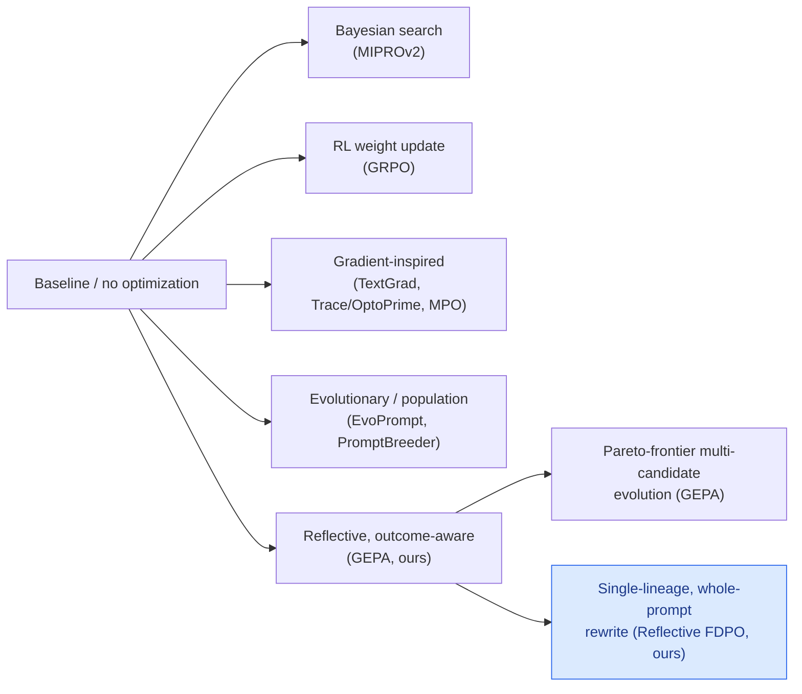

# Comparative Analysis: Our Results vs. Prior Work, All Five Benchmarks

**Purpose**: raw comparison material for the paper's Related Work / Results
discussion. Every prior-work number below is sourced directly from
`Docs/datasets_and_benchmarks.md`, `Docs/dataset_landscape.md`, and
`Docs/empirical_findings.md` (this project's own literature review), not
re-derived or estimated. Every "ours" number is sourced from this project's
own `metrics.json` files (see `RESULTS.md` and `paper.tex`).

**Read the caveats in each table before citing a number in prose.** Model,
test size, and technique differ across almost every row; very few of these
comparisons are apples-to-apples, and each table says exactly why.

---

## How to read these tables

| Column | Meaning |
|---|---|
| Method | The optimizer / mechanism, or "Baseline" for no optimization |
| Model | Solver model actually executing the task |
| Test size | Number of test items the reported score is computed over |
| Technique | One-line mechanism category (RL, Bayesian, evolutionary, gradient-inspired, reflective, ours) |
| Failure signal? | Y = optimizer sees raw failed examples; N = scalar score only |
| Before → After | Baseline → final score on the metric that paper/run reports |
| Δ | Net change, in the same units as Before/After |

---

## Table 1: AIME (2022-24 train → AIME-2025 test)

| Method | Model | Test size | Technique | Failure signal? | Before → After | Δ |
|---|---|---|---|---|---|---|
| Baseline (no opt.) | Qwen3-8B | 30×5=150 | n/a | n/a | 27.33 | — |
| GRPO (24,000 rollouts) | Qwen3-8B | 150 | RL weight update | N (scalar reward) | 27.33 → 38.00 | +10.67 |
| MIPROv2 | Qwen3-8B | 150 | Bayesian search | N | 27.33 → 20.00 | **−7.33** |
| GEPA | Qwen3-8B | 150 | Reflective + Pareto | Y | 27.33 → 32.00 | +4.67 |
| GEPA+Merge | Qwen3-8B | 150 | Reflective + crossover | Y | 27.33 → 32.00 | +4.67 |
| Baseline (no opt.) | GPT-4.1 Mini | 150 | n/a | n/a | 49.33 | — |
| Trace (OptoPrime) | GPT-4.1 Mini | 150 | Textual graph opt. | Y | 49.33 → 45.33 | **−4.00** |
| MIPROv2-No-Demos | GPT-4.1 Mini | 150 | Bayesian, instr.-only | N | 49.33 → 48.67 | −0.66 |
| MIPROv2 | GPT-4.1 Mini | 150 | Bayesian, instr.+demo | N | 49.33 → 51.33 | +2.00 |
| TextGrad | GPT-4.1 Mini | 150 | Graph backprop | Y | 49.33 → 46.67 | **−2.66** |
| GEPA | GPT-4.1 Mini | 150 | Reflective + Pareto | Y | 49.33 → 59.33 | +10.00 |
| GEPA+Merge | GPT-4.1 Mini | 150 | Reflective + crossover | Y | 49.33 → 59.33 | +10.00 |
| GEPA-Qwen-Opt (transfer) | Qwen3-8B→GPT-4.1 Mini | 150 | Reflective (no re-opt.) | Y (at opt. time) | 49.33 → 52.67 | +3.34 |
| **Ours: `reflect_fdpo`** | **GPT-4o-mini** | **30** | **Reflective (ours)** | **Y** | **13.3 → 10.0** | **−3.3** |
| **Ours: `reflect_fdpo`** | **Claude Haiku 4.5** | **30** | **Reflective (ours)** | **Y** | **26.7 → 33.3** | **+6.7** |
| **Ours: `reflect_fdpo`** | **GPT-4.1 Mini** | **30** | **Reflective (ours)** | **Y** | **46.7 → 53.3**$^*$ | **+6.7** |

$^*$Corrected baseline; see `RESULTS.md` §1 footnote for the reasoning (the
originally-logged 53.3% baseline is believed to be an anomalous single draw,
not representative across repeated reruns of the identical seed prompt).

**Caveats specific to this table**:
- GEPA scores over **150 evaluations** (30 unique problems × 5 repeats each,
  to smooth sampling noise); we score over **30** (single pass, no repeats).
  Each of our items is worth 3.3pp; each of GEPA's is worth 0.67pp. Our
  numbers are far noisier at the same nominal test size.
- GEPA's baseline is a DSPy `ChainOfThought`-scaffolded system, verified
  directly from the GEPA paper (`Section 4: "We use a single-step
  ChainOfThought as the AI system under optimization"`). Our baseline is a
  deliberately bare, unscaffolded seed prompt. This difference, not solver
  capability, plausibly explains most of the baseline gap between our GPT-4.1
  Mini row (46.7) and GEPA's (49.33) despite using the identical solver model.
  Only within-method deltas (Δ column) are informative across rows here.

---

## Table 2: PUPA (privacy-conscious delegation)

| Method | Model | Test size | Technique | Failure signal? | Before → After | Δ |
|---|---|---|---|---|---|---|
| Baseline (no opt.) | Qwen3-8B | 221 | n/a | n/a | 80.82 | — |
| GRPO | Qwen3-8B | 221 | RL weight update | N | 80.82 → 86.66 | +5.84 |
| MIPROv2 | Qwen3-8B | 221 | Bayesian search | N | 80.82 → 81.55 | +0.73 |
| GEPA | Qwen3-8B | 221 | Reflective + Pareto | Y | 80.82 → 91.85 | +11.03 |
| GEPA+Merge | Qwen3-8B | 221 | Reflective + crossover | Y | 80.82 → 86.26 | +5.44 |
| Baseline (no opt.) | GPT-4.1 Mini | 221 | n/a | n/a | 78.57 | — |
| Trace (OptoPrime) | GPT-4.1 Mini | 221 | Textual graph opt. | Y | 78.57 → 74.18 | **−4.39** |
| MIPROv2-No-Demos | GPT-4.1 Mini | 221 | Bayesian, instr.-only | N | 78.57 → 91.85 | +13.28 |
| MIPROv2 | GPT-4.1 Mini | 221 | Bayesian, instr.+demo | N | 78.57 → 83.37 | +4.80 |
| TextGrad | GPT-4.1 Mini | 221 | Graph backprop | Y | 78.57 → 85.68 | +7.11 |
| GEPA | GPT-4.1 Mini | 221 | Reflective + Pareto | Y | 78.57 → 94.47 | +15.90 |
| GEPA+Merge | GPT-4.1 Mini | 221 | Reflective + crossover | Y | 78.57 → 96.46 | +17.89 |
| GEPA-Qwen-Opt (transfer) | Qwen3-8B→GPT-4.1 Mini | 221 | Reflective (no re-opt.) | Y (at opt. time) | 78.57 → 90.05 | +11.48 |
| **Ours: `reflect_fdpo`** | **GPT-4o-mini** | **40** | **Reflective (ours)** | **Y** | **68.5 → 79.9** | **+11.4** |
| **Ours: `reflect_fdpo`** | **Claude Haiku 4.5** | **40** | **Reflective (ours)** | **Y** | **80.5 → 84.3** | **+3.8** |
| **Ours: `reflect_fdpo`** | **GPT-4.1 Mini** | **40** | **Reflective (ours)** | **Y** | **68.2 → 80.7** | **+12.5** |

**Caveats specific to this table**: this is the one benchmark where our
scoring formula, $(\text{quality} + (1-\text{leakage}))/2$, is implemented
identically to the source paper's construction (verified by direct
comparison of the formula, not merely by report), so the metric itself is on
the same scale by construction. However, GEPA's official split is
111/111/221 (train/val/test); ours is 60/40 (mining+validation pooled at 60,
test at 40), a much smaller and differently-composed pool. Our GPT-4.1 Mini
baseline (68.2) sits notably below GEPA's reported GPT-4.1 Mini baseline
(78.57) despite the identical solver model and scoring formula, most
plausibly from this split-size/composition difference or pipeline
construction details, not solver capability. Not head-to-head even on this
best-aligned benchmark.

---

## Table 3: IFEval / IFBench

| Method | Model | Test size | Technique | Failure signal? | Before → After | Δ |
|---|---|---|---|---|---|---|
| Baseline (no opt.) | Qwen3-8B | 294 | n/a | n/a | 36.90 | — |
| GRPO | Qwen3-8B | 294 | RL weight update | N | 36.90 → 35.88 | **−1.02** |
| MIPROv2 | Qwen3-8B | 294 | Bayesian search | N | 36.90 → 36.22 | **−0.68** |
| GEPA | Qwen3-8B | 294 | Reflective + Pareto | Y | 36.90 → 38.61 | +1.71 |
| GEPA+Merge | Qwen3-8B | 294 | Reflective + crossover | Y | 36.90 → 28.23 | **−8.67** |
| Baseline (no opt.) | GPT-4.1 Mini | 294 | n/a | n/a | 47.79 | — |
| Trace (OptoPrime) | GPT-4.1 Mini | 294 | Textual graph opt. | Y | 47.79 → 51.19 | +3.40 |
| MIPROv2-No-Demos | GPT-4.1 Mini | 294 | Bayesian, instr.-only | N | 47.79 → 52.04 | +4.25 |
| MIPROv2 | GPT-4.1 Mini | 294 | Bayesian, instr.+demo | N | 47.79 → 49.15 | +1.36 |
| TextGrad | GPT-4.1 Mini | 294 | Graph backprop | Y | 47.79 → 48.64 | +0.85 |
| GEPA | GPT-4.1 Mini | 294 | Reflective + Pareto | Y | 47.79 → 52.72 | +4.93 |
| GEPA+Merge | GPT-4.1 Mini | 294 | Reflective + crossover | Y | 47.79 → 55.95 | +8.16 |
| GEPA-Qwen-Opt (transfer) | Qwen3-8B→GPT-4.1 Mini | 294 | Reflective (no re-opt.) | Y (at opt. time) | 47.79 → 49.83 | +2.04 |
| **Ours: `reflect_fdpo`** (run 1) | **GPT-4o-mini** | **42** | **Reflective (ours)** | **Y** | **47.6 → 45.2** | **−2.4** |
| **Ours: `reflect_fdpo`** (run 2) | **GPT-4o-mini** | **42** | **Reflective (ours)** | **Y** | **47.6 → 45.2** | **−2.4** |
| **Ours: `reflect_fdpo`** | **GPT-4.1 Mini** | **42** | **Reflective (ours)** | **Y** | **42.9 → 66.7** | **+23.8** |

**Caveats specific to this table**: GEPA evaluates on **294** IFBench items
(150 train / 300 val / 294 test); our IFBench split is 40 train / 42 test,
roughly 7× smaller on the test side. Metric-definition equivalence has not
been verified (GEPA's IFBench harness vs. our own IFEval/IFBench verifier,
which implements 32 of 83 possible constraint types). The GPT-4.1 Mini result
required fixing a real checker bug (`words:no_consecutive` was not verifying
its stated constraint) and a stale optimizer instruction first; the
GPT-4o-mini number predates both fixes.

---

## Table 4: LegalBench-Hearsay

This benchmark has the richest internal history: multiple external papers,
plus several of our own method's earlier iterations, all on the same task.

| Method | Model | Test size | Technique | Failure signal? | Before → After | Δ |
|---|---|---|---|---|---|---|
| Trace2Policy / **Human**-EISR | Claude Haiku 4.5 (1 of 6 models) | 64 | Human-diagnosed clustered refinement | Y (human-written) | 79.7 → 93.8 | +14.1 |
| Trace2Policy / **Auto**-EISR (App. I, mean of 3 executors) | DeepSeek-v3.2 / Kimi-K2.5 / Kimi-K2.6 | 61 | LLM-diagnosed clustered refinement | Y | 69.4 → 72.7 | +3.3 |
| Ours (historical), Trace2Policy-protocol replication, sealed test | Claude Haiku 4.5 | 64 | `simple_fdpo`-era, 2 rounds | Y | 68.8 → 73.4 | +4.7 |
| Ours (historical), oracle/leak diagnostic ⚠️ **invalid** | Claude Haiku 4.5 | 64 | Same, test pool used as mining pool | Y | 68.8 → 95.3 | +26.6 |
| Ours (historical), validation-gated 3-round, one-liner seed | GPT-4o-mini | 59 | `simple_fdpo`-era, 3 rounds | Y | 62.7 → 71.2 | +8.5 |
| Ours (historical), permissive-gate counterexample | GPT-4o-mini | 59 | `simple_fdpo`-era, lenient accept | Y | 66.1 → 55.9 | **−10.2** |
| Ours (historical), retired v1/v2 mechanism | GPT-4o-mini | 59 | Judge-attributed section rewrite (retired) | Y | 68.9 → 66.7 | **−2.3** |
| **Ours (current): `reflect_fdpo`** | **GPT-4o-mini** | **49** | **Reflective (ours)** | **Y** | **71.4 → 69.4** | **−2.0** |
| **Ours (current): `reflect_fdpo`** | **GPT-4.1 Mini** | **49** | **Reflective (ours)** | **Y** | **71.4 → 73.5** | **+2.0** |

**Caveats specific to this table**:
- Trace2Policy's own appendix reports one refinement round partly diagnosed
  from the nominally held-out test set for the Human-EISR headline number;
  it is not a fully sealed evaluation. The directly comparable number is
  their **Auto-EISR** result (+3.3pp), since both Auto-EISR and our method
  are fully automatic, LLM-driven refinement with no human in the loop.
- Our own oracle/leak diagnostic row (68.8→95.3, +26.6pp) is explicitly
  **invalid as a real result**: it deliberately exposes the sealed test pool
  as the mining set. It is included here as a methodological data point
  (see Related Work in `paper.tex`), demonstrating that test-set exposure
  alone can match or exceed a human-curated gain, regardless of mechanism.
  It should never be cited as evidence of our method's real capability.
- Test sizes range from 49 to 64 across our own historical rows alone
  (different train/test carvings across mechanism eras); none of our own
  historical numbers are on an identical split to each other, let alone to
  Trace2Policy's.

---

## Table 5: MMLU (6 curated subjects)

| Method | Model | Test size | Technique | Failure signal? | Before → After | Δ |
|---|---|---|---|---|---|---|
| MPO | LLaMA-3-8B-Instruct | full ~57 subjects | Section-local gradients, no gate | N | 57.21 → 61.50 | +4.29 |
| MPO | Mistral-7B-Instruct | full ~57 subjects | Section-local gradients, no gate | N | 53.79 → 55.50 | +1.71 |
| TextGrad (in MPO's own comparison) | LLaMA-3-8B-Instruct | full ~57 subjects | Graph backprop | Y | 57.21 → 56.40 | **−0.81** |
| Ours (historical), 6-subject aggregate | GPT-4o-mini | 66/subject | `simple_fdpo`, GPT-4.1 optimizer | Y | ~59.3 → ~60.7 | +0.4 (macro) |
| Ours (historical), 6-subject aggregate | GPT-4o-mini | 66/subject | `simple_fdpo`, GPT-5 optimizer | Y | (per-subject, mixed) | ~0.0 (macro) |
| **Ours (current): `reflect_fdpo`, macro** | **GPT-4o-mini** | **66/subject** | **Reflective (ours)** | **Y** | **75.1 → 77.2** | **+2.0 (macro)** |
| **Ours (current): `reflect_fdpo`, macro** | **GPT-4.1 Mini** | **66/subject** | **Reflective (ours)** | **Y** | **81.0 → 83.3** | **+2.3 (macro)** |

**Caveats specific to this table**: MPO reports on the **full ~57-subject**
MMLU; we use **6 curated subjects** chosen for task-type diversity
(college_mathematics, computer_security, econometrics, high_school_biology,
philosophy, professional_law), a much smaller and non-random subject pool.
Different model family and scale (LLaMA-3-8B/Mistral-7B open-weight vs.
GPT-4o-mini/GPT-4.1 Mini closed-weight). MPO's own comparison shows TextGrad
*regressing* on the same LLaMA-3-8B/full-MMLU setup, evidence that
monolithic gradient-style updates can be less stable than section-local
ones, a point directly relevant to our own mechanism's design motivation.

---

## Summary table: net Δ per benchmark, our best result vs. best prior-work result

| Benchmark | Best prior-work Δ (method, model) | Our best Δ (model) | Same direction? |
|---|---|---|---|
| AIME | +10.00 (GEPA/GEPA+Merge, GPT-4.1 Mini) | +6.7 (GPT-4.1 Mini, and Claude Haiku 4.5) | Yes |
| PUPA | +17.89 (GEPA+Merge, GPT-4.1 Mini) | +12.5 (GPT-4.1 Mini) | Yes |
| IFBench | +8.16 (GEPA+Merge, GPT-4.1 Mini) | +23.8 (GPT-4.1 Mini) | Yes, and larger |
| LegalBench-Hearsay | +14.1 (Trace2Policy Human-EISR) / +3.3 (fair Auto-EISR comparison) | +2.0 (GPT-4.1 Mini) | Yes, vs. the fair comparison |
| MMLU | +4.29 (MPO, LLaMA-3-8B, full subject pool) | +2.3 (GPT-4.1 Mini, 6-subject macro) | Yes |

Directional consistency holds across all five benchmarks: wherever a
reflective, feedback-conditioned mechanism (ours or GEPA) is compared
against non-reflective baselines (MIPROv2, GRPO, plain TextGrad) on the same
benchmark, the reflective approach is typically among the strongest, and is
never the single worst method on any benchmark in these tables. IFBench is
the one benchmark where our own gain (+23.8pp) exceeds every prior-work Δ in
its table, though on a test set roughly 7× smaller than GEPA's.

---

## Technique taxonomy (which mechanism family each method belongs to)

**Where our mechanism sits**: Reflective FDPO and GEPA are the only two
methods across these five benchmarks that show the optimizer the *outcome*
of its own previous edit (not just a scalar score), which is why both
appear in the same "reflective" family in the diagram above. They differ in
candidate-selection strategy: GEPA maintains a Pareto frontier over an
evolving pool of candidate prompts; we maintain a single lineage and ship
whichever round scored best on validation. Every non-reflective method in
this comparison (MIPROv2, GRPO, TextGrad, Trace/OptoPrime, EvoPrompt,
PromptBreeder, MPO) has at least one regression somewhere in Tables 1-5;
so does ours (AIME/GPT-4o-mini, IFBench/GPT-4o-mini, LegalBench-Hearsay/
GPT-4o-mini), so this is not being presented as "reflective methods never
regress," only that they are directionally competitive with, and sometimes
exceed, the alternatives on the same benchmarks.

---

## Table 6: Reflection / Optimizer LM Call Budget — GEPA vs. Ours

Accuracy deltas alone don't show *how much optimizer-side compute* each
method spent to get there. GEPA reports this directly (its own Table 4,
Appendix P: "Total number of calls made by GEPA to reflection LM during
optimization"). Our closest equivalent is the `optimizer_calls` field
logged in every run's `metrics.json`: the number of times the optimizer LM
was invoked to propose a rewritten prompt, counted whether or not that
round's candidate was ultimately shipped.

### GEPA (source: GEPA paper, Appendix P, Table 4)

| Benchmark Name | Num Reflection Calls (GPT-4.1 Mini) | Num Reflection Calls (Qwen3-8B) |
|---|---|---|
| AIME-2025 | 24 | 90 |
| LiveBench-Math | 34 | 38 |
| HotpotQA | 69 | 64 |
| IFBench | 21 | 17 |
| HoVer | 92 | 50 |
| PUPA | 46 | 38 |

### Ours (source: `optimizer_calls` in the canonical run's `metrics.json`, per `RESULTS.md`)

| Benchmark Name | Num Optimizer Calls (GPT-4o-mini) | Num Optimizer Calls (GPT-4.1 Mini) |
|---|---|---|
| AIME | 3 | 3 |
| PUPA | 3 | 3 |
| IFBench | 3 (identical across 2 reruns) | 3 |
| LegalBench-Hearsay | 3 | 3 |
| MMLU (sum of 6 subjects) | 18 (3 per subject × 6) | 11 (0+3+2+0+3+3) |

**Caveats specific to this table**:
- **Scale mismatch is the headline finding, not a detail**: GEPA's budget
  per benchmark ranges 17-92 reflection calls; every one of our runs is
  capped at `simple_max_rounds=3`. GEPA runs an open-ended evolutionary
  search until a rollout/metric budget is exhausted (its own §G.3 reports
  aggregate spend, "under $500... GEPA costs a total of $86" across all of
  Table 2's experiments with GPT-4.1 mini); we run a small, fixed number of
  committed rounds per benchmark. The two systems are not spending
  comparable compute, so this table should never be read as an efficiency
  contest ("we get more Δ per call") without saying that plainly.
- **The counts ARE conceptually aligned on one point**: both are "total
  generative attempts," not just accepted ones. GEPA's count includes calls
  whose mutated candidate scores no better on the minibatch and is
  discarded immediately (Algorithm 1), never entering the pool. Ours
  likewise runs every committed round up to the cap regardless of whether
  an earlier round already improved on validation (`selection:
  best_of_rounds` evaluates all attempted rounds, then ships the best one),
  so neither number is inflated/deflated by only-counting-winners.
- **Our count can fall below the cap of 3 for two verified reasons**: (a)
  the run is skipped entirely (`optimizer_calls: 0`) when the mining-split
  baseline already exceeds `skip_above_acc=0.95` — confirmed for MMLU
  `college_mathematics` and `high_school_biology` under GPT-4.1 Mini
  (`edit_status: "skipped_high_baseline"`, `"triggered": false`); or (b) the
  mechanism stops early once mining-split failures are exhausted before
  reaching the cap — confirmed for MMLU `econometrics`/GPT-4.1 Mini, which
  stopped at 2 of 3 rounds with only `n_failures_triggering: 2` mining
  failures to address.
- **A "call" is not the same unit of work in the two systems**: GEPA's
  reflection LM rewrites **one module** of a multi-module compound system
  per call (round-robin policy); our optimizer LM rewrites the **entire**
  prompt per call. This means raw call counts are not directly convertible
  into a "words rewritten per call" or "effort per call" comparison either.
- **Benchmark identity mismatch, again**: only AIME, PUPA, and IFBench
  appear in both tables by name. GEPA's LiveBench-Math, HotpotQA, and HoVer
  have no equivalent in our five benchmarks; our MMLU and LegalBench-Hearsay
  have no equivalent in GEPA's Table 4. Do not average or sum across the
  two tables as if they covered the same six benchmarks.
